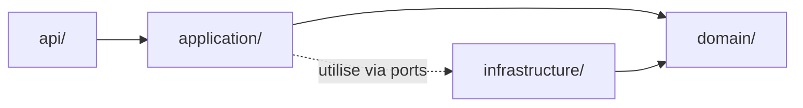

# Architecture hexagonale (Python)

Règle commune aux 3 projets Python de la solution. Objectif : le **domaine métier ne
dépend d'aucun framework** (FastAPI, SQLAlchemy, SDK Azure...). Les frameworks dépendent
du domaine, jamais l'inverse.

## Structure attendue

```
<projet>/
├── app/
│   ├── domain/           # Cœur métier — AUCUN import externe (pas de FastAPI, pas de SDK)
│   │   ├── models.py      # Entités / value objects
│   │   └── ports.py       # Interfaces abstraites (Protocol ou ABC)
│   ├── application/       # Cas d'usage — orchestrent le domaine via les ports
│   │   └── use_cases/
│   ├── infrastructure/    # Implémentations concrètes des ports (adapters)
│   │   ├── postgres/
│   │   └── azure_openai/
│   └── api/                # Point d'entrée FastAPI — adapte HTTP vers un use case
│       ├── routes/
│       └── schemas/         # DTOs Pydantic, jamais réutilisés comme entités domaine
```

## Règle de dépendance



- `domain/` ne connaît **rien** d'extérieur : ni FastAPI, ni SQLAlchemy, ni Azure SDK.
- `application/` orchestre le domaine, dépend uniquement des **ports** (`domain/ports.py`), jamais d'une implémentation concrète.
- `infrastructure/` implémente les ports (ex: `PgVectorRepository` implémente `VectorStorePort`).
- `api/` ne contient aucune logique métier — elle traduit une requête HTTP en appel de use case et le résultat en réponse.

## Analogie ASP.NET

| Python (hexagonal) | ASP.NET (Clean Architecture) |
|---|---|
| `domain/ports.py` (Protocol/ABC) | Interface C# (`IVectorStorePort`) |
| `infrastructure/postgres/` | Implémentation concrète injectée via DI |
| `application/use_cases/` | Services applicatifs |
| Injection via constructeur + factory FastAPI (`Depends`) | `services.AddScoped<IVectorStorePort, PgVectorRepository>()` |

## Conventions

- Un port = une interface Python typée (`Protocol` préféré à `ABC` — plus léger, duck-typing explicite).
- Aucune entité de `domain/` n'est exposée directement en API : toujours un DTO Pydantic dédié dans `api/schemas/`.
- Les tests du domaine et de l'application ne mockent **que les ports**, jamais des détails d'implémentation infrastructure.
