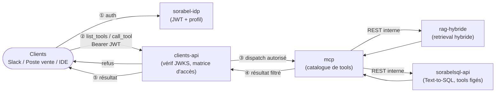

# Sorabel — Contexte solution

## Vision

Sorabel Data Gateway : point d'accès unifié aux données de l'entreprise (documentation
technique + données transactionnelles) pour des clients internes hétérogènes (bot Slack
support, poste de vente, IDE développeur), via un **unique serveur MCP** gouverné par une
matrice d'accès centralisée (profil × tool × collections/tables).

Deux capacités métier composent la gateway :
- **RAG documentaire hybride** (dense + BM25 + reranking) sur le corpus technique (fiches
  produit, manuels, procédures SAV) — porté par `rag-hybride`.
- **Text-to-SQL gouverné** en lecture seule sur les données transactionnelles (stock,
  commandes) — porté par `sorabelsql-api`.

Le tout exposé via `mcp` (catalogue de tools), sécurisé par `sorabel-idp`
(authentification, JWT) et `clients-api` (vérification, matrice d'accès,
audit), avec `frontend` comme interface(s) cliente(s) restant à définir.

## Exigences du cahier des charges (E1–E6)

| ID | Périmètre | Exigence |
|---|---|---|
| E1 | RAG & attribution | Chaque réponse documentaire cite ses sources ; refus explicite si le corpus ne contient pas la réponse (pas d'hallucination) |
| E2 | Retrieval hybride | Gérer aussi bien les lookups exacts par référence (`REF-8842`) que les requêtes en langage naturel |
| E3 | Text-to-SQL lecture seule | SQL généré strictement read-only, restreint aux tables autorisées par profil, journalisé |
| E4 | Architecture MCP unifiée | Un seul serveur MCP pour tous les clients, gouverné par une matrice d'accès centralisée |
| E5 | Auditabilité & masquage | Tout appel (autorisé ou refusé) journalisé ; colonnes sensibles masquées selon le profil |
| E6 | Évaluation du RAG | Gain du retrieval hybride + reranking mesuré et documenté vs recherche vectorielle simple |

## Projets et responsabilités

| Projet | Stack / archi | Rôle dans la gateway | Exigences servies |
|---|---|---|---|
| `sorabel-idp` | Python, hexagonale | Authentification, émission JWT (claim `sorabel_profile`) | — (support de E4/E5) |
| `clients-api` | C#, clean architecture | Point d'entrée : vérification JWT (JWKS), matrice d'accès, filtrage `list_tools`/`call_tool`, journalisation | E4, E5 |
| `mcp` | Python, hexagonale | Serveur MCP : catalogue des tools (composite `answer_question` + briques), orchestration vers `rag-hybride`/`sorabelsql-api` en REST interne | E4 |
| `rag-hybride` | Python, hexagonale | Ingestion, hybrid retrieval (dense + BM25), reranking, citations systématiques | E1, E2, E6 |
| `sorabelsql-api` | C#, clean architecture | Text-to-SQL gouverné, tools figés (stock, commandes), masquage colonnes | E3, E5 |
| `frontend` | à déterminer | Interface(s) cliente(s) / administration | — |

> Cartographie proposée à partir des documents de cadrage — à confirmer si la frontière
> exacte Text-to-SQL (génération LLM) diffère entre `mcp` et `sorabelsql-api`.

## Flux global

## Commandes

Le répertoire d'exécution fait partie du contrat : l'outillage est mutualisé à la
racine, mais chaque projet Python garde son propre paquet `app`.

| Commande | Depuis |
|---|---|
| `pip install -e ".[dev]"` | `src/` |
| `docker compose up -d --wait postgres` | `src/` |
| `ruff check .` / `ruff format .` | `src/` (couvre tous les projets) |
| `pytest` | le répertoire du projet (`cd rag-hybride`) |
| `mypy app` | le répertoire du projet |
| `alembic upgrade head` | le répertoire du projet |

`pytest` et `mypy` s'exécutent projet par projet : les trois projets Python exposent
tous un paquet de premier niveau `app`, qui entrerait en collision lors d'une
exécution unique depuis la racine.

## Règles transverses

@.claude/rules/git-conventions.md
@.claude/rules/security.md
@.claude/rules/api-contracts.md

## Règles d'architecture par stack

- Projets Python hexagonaux (`sorabel-idp`, `mcp`, `rag-hybride`) → @.claude/rules/python-hexagonal.md
- Projets C# clean architecture (`clients-api`, `sorabelsql-api`) → @.claude/rules/csharp-clean-architecture.md

## Documentation de cadrage

Les documents conceptuels détaillés (non importés automatiquement — volumineux, à
consulter à la demande) :
- `docs/architecture/MCP.md` — catalogue des tools, matrice d'accès, séquences auth
- `docs/architecture/Text2SQL_Sorabel.md` — pipeline Text-to-SQL, garde-fous, golden dataset
- `docs/architecture/Advanced_RAG.md` — ingestion, chunking, hybrid retrieval, évaluation

Chaque projet a son propre `CLAUDE.md` pour le contexte métier local.
