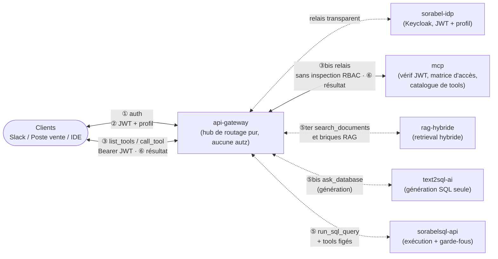

# Sorabel — Contexte solution | Context v1.1 | Mis à jour : 2026-09-04

Sorabel Data Gateway : point d'accès unifié aux données de l'entreprise (documentation
technique + données transactionnelles) pour des clients internes hétérogènes (bot Slack
support, poste de vente, IDE développeur), via un **unique serveur MCP** gouverné par une
matrice d'accès centralisée (profil × tool × collections/tables). Système à auditabilité
stricte : aucune réponse spéculative, aucun accès non journalisé.

## Non-négociables

- **[E4] Un seul point d'entrée MCP.** Toute logique d'autorisation vit exclusivement
  dans `mcp` (matrice profil × tool × collections/tables). `api-gateway` ne doit **jamais**
  contenir de logique d'autorisation.
- **[E1] Zéro hallucination documentaire.** Chaque réponse RAG **doit** citer ses sources.
  Si le corpus ne contient pas la réponse, le système **doit** refuser explicitement —
  ne jamais fabriquer une citation ou une réponse.
- **[E2] Retrieval hybride obligatoire.** Le retrieval **doit** gérer aussi bien les
  lookups exacts par référence (`REF-8842`) que les requêtes en langage naturel.
- **[E3] SQL strictement read-only.** Le SQL généré **doit** être lecture seule et
  restreint aux tables autorisées par profil. `text2sql-ai` génère, **ne doit jamais**
  exécuter. `sorabelsql-api` exécute, **ne doit jamais** générer.
- **[E5] Auditabilité totale.** Tout appel — autorisé ou refusé — **doit** être journalisé.
  Les colonnes sensibles **doivent** être masquées selon le profil ; ne jamais les
  exposer en clair.
- **[E6] RAG mesuré, pas supposé.** Le gain du retrieval hybride + reranking **doit**
  être mesuré et documenté vs recherche vectorielle simple, pas affirmé sans preuve.

## Stack & projets

| Projet | Stack / archi | Rôle dans la gateway | Exigences servies |
|---|---|---|---|
| `sorabel-idp` | Keycloak, conteneurisé | Authentification, émission JWT (claim `sorabel_profile`) — pas d'archi applicative custom, pas de Makefile | support E4/E5 |
| `api-gateway` | C#, clean architecture | Hub de routage pur (analogie YARP/Ocelot) : proxy vers `mcp`/`text2sql-ai`/`sorabelsql-api` — **aucune logique d'autorisation** | support E4 |
| `mcp` | Python, hexagonale | Serveur MCP : catalogue des tools, matrice d'accès, filtrage `list_tools`/`call_tool`, journalisation | E4, E5 |
| `rag-hybride` | Python, hexagonale | Ingestion, hybrid retrieval (dense + BM25), reranking, citations systématiques | E1, E2, E6 |
| `text2sql-ai` | Python, hexagonale | Agent Text-to-SQL : **génération seule**, à partir du schéma commenté filtré par profil | E3 |
| `sorabelsql-api` | C# + PostgreSQL, clean architecture | **Exécution seule** du SQL, garde-fous, tools figés (stock, commandes), masquage colonnes | E3, E5 |
| `frontend` | à déterminer | Interface(s) cliente(s) / administration | — |

## Anti-patterns

- **Jamais** de logique d'autorisation dans `api-gateway` — c'est précisément la
  régression corrigée par le renommage `authorization-gateway` → `api-gateway`
  (voir Changelog). Toute PR qui y ajoute une vérification de profil/permission est à rejeter.
- **Jamais** de lien direct `mcp` ↔ `rag-hybride` / `text2sql-ai` / `sorabelsql-api`.
  Tout flux, y compris interne, transite par `api-gateway`.
- **Jamais** `text2sql-ai` n'exécute de requête — génération seulement (E3).
- **Jamais** d'archi applicative custom ou de Makefile standard sur `sorabel-idp`
  (service Keycloak à configurer, pas une app développée en interne).
- **Jamais** `pytest`/`mypy` lancés depuis la racine du dépôt : fixtures à chemin
  relatif aujourd'hui, collision du paquet `app` demain (`mcp` et `text2sql-ai`
  exposeront eux aussi un `app` de premier niveau).

## Critères de succès

Une implémentation est prête pour la prod si :

- 100 % des réponses RAG citent des sources vérifiables, tracées jusqu'au document source (E1)
- le système répond par un refus structuré (pas une réponse fabriquée) quand le corpus
  ne couvre pas la question
- le SQL généré passe une validation read-only automatisée **avant** toute exécution (E3)
- 100 % des appels MCP (autorisés et refusés) sont journalisés et rejouables (E5)
- le gain hybride + reranking vs baseline vectorielle simple est documenté avec des
  métriques chiffrées, pas une impression qualitative (E6)

## Protocoles de repli

- **RAG** : score de similarité insuffisant ou corpus muet sur le sujet → réponse
  structurée de refus explicite. Ne jamais combler le vide par une réponse plausible.
- **Text-to-SQL** : SQL généré non strictement read-only, ou touchant une table hors
  périmètre du profil → rejet avant exécution. Ne jamais exécuter « au cas où ».
- **Matrice d'accès MCP** : doute sur l'autorisation (profil × tool × collection/table)
  → refuser par défaut (deny-by-default), journaliser le refus comme un appel normal.

## Activation de rôle par projet

- Sur `rag-hybride` → agir en **Ingénieur RAG** : retrieval hybride, chunking, reranking,
  citations systématiques.
- Sur `text2sql-ai` → agir en **Ingénieur Text-to-SQL** : génération SQL lecture seule à
  partir du schéma filtré par profil, jamais d'exécution.
- Sur `sorabelsql-api` → agir en **Ingénieur Garde-fous SQL** : exécution sécurisée,
  chaîne de garde-fous, masquage de colonnes.
- Sur `mcp` → agir en **Ingénieur Contrôle d'accès** : matrice d'accès, catalogue de
  tools, journalisation.
- Sur `api-gateway` → agir en **Ingénieur Plateforme/Routage** : hub de routage pur,
  zéro logique métier ou d'autorisation.

## Flux global

`api-gateway` est le **hub unique** de tous les flux, y compris les appels *internes*
émis par `mcp` vers ses backends — il n'existe aucun lien direct `mcp` ↔ `rag-hybride` /
`text2sql-ai` / `sorabelsql-api`.

## Commandes

Le répertoire d'exécution fait partie du contrat : l'outillage Python est mutualisé à la
racine (`mcp`, `text2sql-ai`, `rag-hybride`), mais chaque projet garde son propre paquet
`app`. Les projets C# (`api-gateway`, `sorabelsql-api`) et Python suivent des cibles
Makefile standardisées — voir `.claude/rules/makefile-conventions.md`.

| Commande | Depuis |
|---|---|
| `pip install -e ".[dev]"` | racine du dépôt |
| `docker compose up -d --wait postgres` | racine du dépôt |
| `ruff check .` / `ruff format .` | racine du dépôt (couvre tous les projets Python) |
| `pytest` | le répertoire du projet Python (`cd rag-hybride`) |
| `mypy app` | le répertoire du projet Python |
| `alembic upgrade head` | le répertoire du projet Python |
| `dotnet build` / `dotnet test` | le répertoire du projet C# |

## Règles transverses (chargées automatiquement chaque session)

@.claude/rules/git-conventions.md
@.claude/rules/security.md
@.claude/rules/api-contracts.md
@.claude/rules/makefile-conventions.md
@.claude/rules/testing-pyramid.md

## Règles d'architecture par stack

- Projets Python hexagonaux (`mcp`, `rag-hybride`, `text2sql-ai`) → @.claude/rules/python-hexagonal.md
- Projets C# clean architecture (`api-gateway`, `sorabelsql-api`) → @.claude/rules/csharp-clean-architecture.md
- `sorabel-idp` n'hérite d'aucune règle d'architecture ni du Makefile standard (service Keycloak à configurer, pas une app développée en interne)

## Fichiers scopés (le plus proche l'emporte)

Ce fichier racine porte le contrat global (non-négociables, sécurité, contrats d'API).
Chaque projet garde son propre `CLAUDE.md` pour son contexte métier local ; en cas de
règle contradictoire entre la racine et un projet, **le CLAUDE.md le plus proche du
fichier édité l'emporte**. Toute contradiction détectée entre deux niveaux doit être
résolue (pas contournée) avant de merger.

## Documentation de cadrage (non chargée automatiquement — volumineuse, à consulter à la demande)

- `docs/architecture/MCP.md` — catalogue des tools, matrice d'accès, séquences auth, séparation génération/exécution SQL
- `docs/architecture/Text2SQL_Sorabel.md` — pipeline Text-to-SQL, garde-fous, golden dataset
- `docs/architecture/Advanced_RAG.md` — ingestion, chunking, hybrid retrieval, évaluation
- `docs/architecture/organisation-dossier-claude-sorabel.md` — organisation du dossier `.claude/` du monorepo (héritage, Makefiles, mutualisé vs local)

## Changelog

- **v1.1** (2026-09-04) : restructuration selon les 10 principes anti-drift (non-négociables
  en tête, anti-patterns, critères de succès, protocoles de repli, activation de rôle,
  changelog) — pas de changement fonctionnel, clarification et hiérarchisation du contexte.
- **v1.0** : `identity-provider` → `sorabel-idp` (bascule Keycloak) ; `authorization-gateway`
  → `api-gateway` (recentré sur le routage pur, la matrice d'accès reste côté `mcp`) ;
  `tools-api` supprimé et remplacé par `sorabelsql-api` (exécution) ; `text2sql-ai` ajouté
  (génération). Cette séparation génération/exécution donne un point d'inspection entre
  l'étape probabiliste (LLM) et l'étape gouvernée (garde-fous).

### @deprecated (anciens noms — à ne plus utiliser)

- `identity-provider` → renommé `sorabel-idp`
- `authorization-gateway` → renommé `api-gateway` (portée réduite au routage pur)
- `tools-api` → supprimé, remplacé par `sorabelsql-api`
