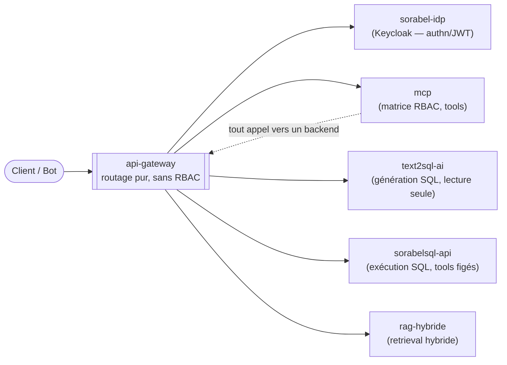

# api-gateway

Hub de routage pur pour la solution **Sorabel Data Gateway**. Analogie .NET : un reverse-proxy
type **YARP/Ocelot**, positionné en hub central — pas un `[Authorize]`, juste un `DelegatingHandler`
géant devant tous les backends.

## Rôle dans l'architecture

`api-gateway` est le **seul** point d'entrée/sortie de la solution : tout flux client, et tout
flux interne entre services, y transite. Il ne décide jamais *qui a le droit de faire quoi* —
il décide seulement *par où ça passe*.



**Ce que `api-gateway` fait :**
- Relaie les requêtes d'authentification vers `sorabel-idp` (Keycloak)
- Relaie `list_tools` / `call_tool` vers `mcp`
- Relaie les appels internes de `mcp` vers `text2sql-ai`, `sorabelsql-api`, `rag-hybride`

**Ce que `api-gateway` ne fait jamais :**
- Inspecter ou valider un JWT (signature, `iss`, `aud`, claims) — c'est `mcp` qui s'en charge
- Lire ou appliquer la matrice d'accès (profil × tool × ressources) — elle vit uniquement dans `mcp`
- Contenir la moindre règle métier

> Détail du flux complet (authn, RBAC, garde-fous SQL) : voir `MCP.md` §6.1.

## Stack technique

| | |
|---|---|
| Langage | C# (.NET) |
| Architecture | Clean Architecture |
| Pattern | Reverse-proxy (type YARP) |
| Déploiement | Docker (obligatoire, cf. convention transverse solution) |

## Démarrage rapide

```bash
make build         # dotnet build
make test          # dotnet test
make lint          # dotnet format --verify-no-changes
make docker-build  # docker build -t api-gateway .
make docker-up     # docker compose up
make docker-down   # docker compose down
```

## Configuration des routes

Les routes sont déclarées de façon déclarative (pas de routage écrit à la main). Pour ajouter
une route, utiliser la commande dédiée plutôt qu'une édition manuelle :

```
/new-route
```

Chaque route backend porte son propre timeout et sa politique de retry (résilience type Polly).

## Documents liés

- [`MCP.md`](../MCP.md) — schéma complet du workflow, flux d'authentification, matrice d'accès
- `CLAUDE.md` (ce dossier) — règles et non-négociables pour Claude Code
- `.claude/rules/routing-proxy.md` — conventions de routage détaillées

## Non-objectifs (rappel)

Le RBAC, l'authentification et l'exécution SQL sont **hors périmètre** de ce projet par design.
Toute contribution ajoutant de la logique d'autorisation ici doit être redirigée vers `mcp/`.
