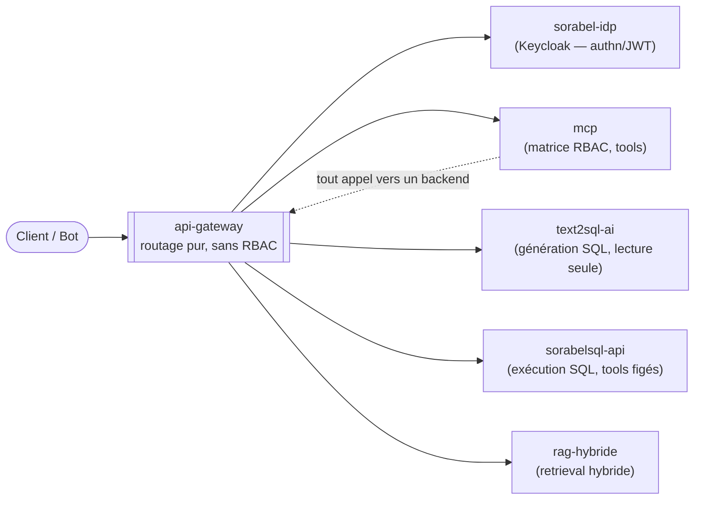

# api-gateway

Hub de routage pur pour la solution **Sorabel Data Gateway**, implémenté avec **YARP**
(`Yarp.ReverseProxy`), positionné en hub central — pas un `[Authorize]`, juste un `DelegatingHandler`
géant devant tous les backends.

## Rôle dans l'architecture

`api-gateway` est le **seul** point d'entrée/sortie de la solution : tout flux client, et tout
flux interne entre services, y transite. Il ne décide jamais *qui a le droit de faire quoi* —
il décide seulement *par où ça passe*.


```mermaid
flowchart LR
    Client(["Client / Bot"]) --> GW[["api-gateway<br/>routage pur, sans RBAC"]]

    GW --> IDP["sorabel-idp<br/>(Keycloak — authn/JWT)"]
    GW --> MCP["mcp<br/>(matrice RBAC, tools)"]
    GW --> T2SQL["text2sql-ai<br/>(génération SQL, lecture seule)"]
    GW --> SQLAPI["sorabelsql-api<br/>(exécution SQL, tools figés)"]
    GW --> RAG["rag-hybride<br/>(retrieval hybride)"]

    MCP -.tout appel vers un backend.-> GW
```

**Ce que `api-gateway` fait :**
- Relaie les requêtes d'authentification vers `sorabel-idp` (Keycloak)
- Relaie `list_tools` / `call_tool` vers `mcp`
- Relaie les appels internes de `mcp` vers `text2sql-ai`, `sorabelsql-api`, `rag-hybride`

**Ce que `api-gateway` ne fait jamais :**
- Inspecter ou valider un JWT (signature, `iss`, `aud`, claims) — c'est `mcp` qui s'en charge
- Lire ou appliquer la matrice d'accès (profil × tool × ressources) — elle vit uniquement dans `mcp`
- Contenir la moindre règle métier

> Détail du flux complet (authn, RBAC, garde-fous SQL) : voir `docs/architecture/MCP.md` §6.1.

## Stack technique

| | |
|---|---|
| Langage | C# (.NET) |
| Architecture | Clean Architecture |
| Librairie de routage | [YARP](https://github.com/microsoft/reverse-proxy) (`Yarp.ReverseProxy`, NuGet) |
| Déploiement | Docker (obligatoire, cf. convention transverse solution) |

## Démarrage rapide

```bash
make build         # dotnet build
make test          # dotnet test (niveaux 1 à 3, sans Docker)
make test-e2e      # tests de bout en bout (démarre les conteneurs)
make lint          # dotnet format --verify-no-changes
make docker-build   # construit l'image Docker
make docker-up      # démarre le service via docker compose
```

### Où vivent les tests

Un projet par niveau de `../.claude/rules/testing-pyramid.md`, tous sous `tests/`
(sur disque **et** dans le dossier de solution `tests` du `.sln`) :

| Projet | Niveau | Lancé par |
|---|---|---|
| `tests/Sorabel.ApiGateway.Domain.Tests/` | 1 — règles pures, aucune I/O | `make test` |
| `tests/Sorabel.ApiGateway.Api.Tests/` | 2 et 3 — WireMock.Net, `WebApplicationFactory` | `make test` |
| `tests/Sorabel.ApiGateway.E2E.Tests/` | 4 — conteneur réel (`[Trait("Category", "E2E")]`) | `make test-e2e` |

`api-gateway` suit la forme **diamant** : socle unitaire fin, niveau 3 dominant —
c'est la conséquence directe du non-négociable « aucune règle métier ne doit fuiter
dans la couche de routage », pas un défaut de couverture.

## Configuration des routes

Les routes sont déclarées de façon déclarative (pas de routage écrit à la main). Pour ajouter
une route, utiliser la commande dédiée plutôt qu'une édition manuelle :

```
/new-route
```

Table complète des routes, clusters et timeouts : `.claude/rules/routing-proxy.md`.

## Documents liés

- [`MCP.md`](../MCP.md) — schéma complet du workflow, flux d'authentification, matrice d'accès
- `CLAUDE.md` (ce dossier) — règles et non-négociables pour Claude Code
- `.claude/rules/routing-proxy.md` — conventions de routage détaillées

## Non-objectifs (rappel)

Le RBAC, l'authentification et l'exécution SQL sont **hors périmètre** de ce projet par design.
Toute contribution ajoutant de la logique d'autorisation ici doit être redirigée vers `mcp/`.
