# Standardisation d'un corpus hétérogène (PDF, HTML, Markdown) et gestion des versions

> **Question** : Comment standardiser un corpus hétérogène (PDF techniques avec tableaux, HTML, Markdown) et gérer les versions multiples d'une même fiche (suppression des doublons, champ de version) ?
>
> **Source** : [The Complete Guide to RAG Architectures: From Naive to Agentic](https://medium.com/@atul4u/the-complete-guide-to-rag-architectures-from-naive-to-agentic-c90c8a87cf56)
>
> Contexte : Sorabel Data Gateway — module RAG technique (E1, E2)
> Pattern de référence : Hybrid RAG (dense + BM25 + reranking)

---

## 1. Principe : un pipeline d'ingestion en 4 étapes

L'idée est la même qu'en C# quand on normalise des DTOs venant de sources hétérogènes derrière une interface commune (`IDocumentParser` → `NormalizedDocument`). Chaque format a son parseur, mais tous convergent vers un **schéma pivot unique**.

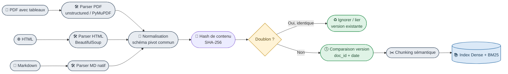

---

## 2. Schéma pivot commun (métadonnées obligatoires)

Chaque document, quel que soit son format d'origine, doit produire la même structure — c'est le **contrat d'interface** du pipeline.

| Champ | Rôle | Exemple |
|---|---|---|
| `doc_id` | Identifiant stable du **document logique** (pas du fichier) | `REF-8842` |
| `version` | Numéro/date de version | `v3 – 2026-01-15` |
| `content_hash` | SHA-256 du texte normalisé | pour dédup exacte |
| `source_type` | Origine | `pdf`, `html`, `md` |
| `source_path` | Chemin/URL d'origine | traçabilité (E1) |
| `title` | Titre du document | pour citation E1 |
| `published_date` | Date officielle | pour trancher entre versions |
| `status` | `active` / `deprecated` | exclu de l'index si deprecated |

Ce schéma alimente directement l'exigence **E1** (citation Titre + Référence + Date) du cahier des charges Sorabel.

---

## 3. Traitement des tableaux PDF (point sensible)

Les tableaux dans les PDF techniques (specs électriques) ne doivent **pas** être aplatis en texte brut — cela casse la sémantique. Deux options :

- **Extraction structurée** (lib type `unstructured` ou `camelot`) → conversion en **Markdown table** dans le chunk (le LLM comprend très bien le Markdown).
- **Chunk séparé "tableau"** avec métadonnée `content_type: table`, pour pouvoir router différemment en retrieval si besoin.

---

## 4. Déduplication et versioning

Deux mécanismes complémentaires :

**a) Déduplication exacte**
`content_hash` identique → même contenu, on ignore le doublon (ex : un PDF re-uploadé sans changement).

**b) Gestion de version** (cas important pour Sorabel : fiches produits mises à jour)
- Même `doc_id`, `content_hash` différent → nouvelle version détectée
- On **ne supprime pas** l'ancienne (traçabilité), on marque `status: deprecated`
- L'index vectoriel ne référence que les documents `status: active`
- Filtre appliqué **avant** le retrieval hybride (pas après), pour ne jamais remonter une fiche obsolète au reranking

```python
import hashlib

def process_document(doc_id: str, content: str, published_date: str, store: dict) -> str:
    content_hash = hashlib.sha256(content.encode()).hexdigest()
    existing = store.get(doc_id)

    if existing and existing["content_hash"] == content_hash:
        return "doublon_ignore"  # (a) déduplication exacte

    if existing:
        existing["status"] = "deprecated"  # (b) ancienne version conservée mais désactivée

    store[doc_id] = {
        "content_hash": content_hash,
        "published_date": published_date,
        "status": "active",
    }
    return "nouvelle_version_indexee"
```

*(Analogie C# : équivalent d'un `Dictionary<string, DocumentRecord>` avec une clé `doc_id`, où `content_hash` joue le rôle d'un `ETag` pour détecter le changement.)*

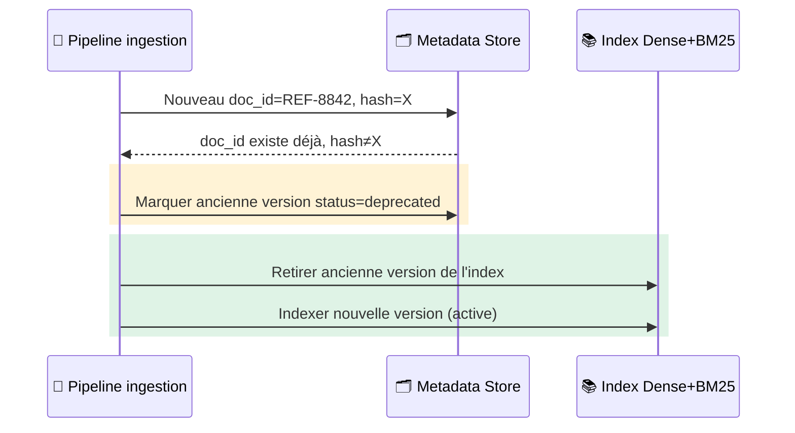

---

## 5. Lien avec le pattern Hybrid RAG

Le pattern Hybrid RAG combine recherche dense + BM25 + reranking. La normalisation en amont conditionne directement la qualité de **ces deux index** :

- Le texte normalisé (sans bruit HTML/PDF, tableaux propres) améliore la précision **dense**.
- Le titre/référence extraits proprement (ex: `REF-8842` isolé, pas noyé dans du texte PDF mal extrait) sont indispensables pour que **BM25** fasse correctement le lookup exact exigé par E2.
- Le filtre `status: active` s'applique **avant fusion RRF**, sinon une vieille version pourrait remonter via un des deux retrievers et fausser le reranking.

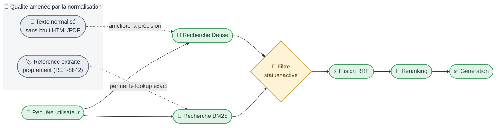

- **Texte normalisé** (haut) → alimente la précision de la recherche **Dense**.
- **Référence extraite proprement** (haut) → permet le lookup exact via **BM25**.
- **Filtre `status=active`** (porte, avant fusion) → écarte les versions obsolètes avant qu'elles n'entrent dans le RRF, pour les deux retrievers à la fois.

> **Point clé** : cette étape de nettoyage/normalisation en amont est souvent sous-estimée, mais elle conditionne une grande partie de la qualité finale du RAG — bien avant le choix de l'algorithme de fusion.

---

# Granularité de chunk et métadonnées pour les fiches techniques Sorabel

> **Question** : Quelle granularité de chunk pour des fiches techniques, et quelles métadonnées (référence produit, version, date, type de document, url) ? En quoi la métadonnée référence produit est-elle décisive ici ?
>
> **Source** : [The Complete Guide to RAG Architectures: From Naive to Agentic](https://medium.com/@atul4u/the-complete-guide-to-rag-architectures-from-naive-to-agentic-c90c8a87cf56)
>
> Contexte : Sorabel Data Gateway — module RAG technique (E1, E2)
> Pattern de référence : Hybrid RAG (dense + BM25 + reranking)

---

## 1. Pourquoi la granularité "classique" (500-1000 tokens) ne convient pas ici

Une fiche technique Sorabel (datasheet disjoncteur, manuel produit) n'est pas un texte narratif homogène : c'est un assemblage de blocs sémantiquement indépendants — caractéristiques électriques, procédure SAV, compatibilités, schéma de câblage. Un chunk trop large mélange plusieurs REF produits ou plusieurs sections sans lien ; un chunk trop petit perd le contexte (une valeur "230V" seule, sans savoir à quelle REF elle appartient, est inutilisable).

**Analogie C#** : c'est le même problème qu'un DTO trop générique (`God Object`) vs trop granulaire (une classe par champ) — on cherche la limite d'agrégat cohérent, comme un **Aggregate Root** en DDD : la fiche produit, pas la phrase, ni le document entier.

## 2. Constat sur le corpus réel : les documents Sorabel sont courts

Avant de fixer une taille, il faut regarder ce que contient réellement le corpus. Sur les 3 documents fournis en exemple :

| Document | Type | Taille totale (~tokens) | Plus petite section | Plus grande section |
|---|---|---|---|---|
| `notice-REF-1903-v1_0.pdf` | Notice d'installation | ~160 tokens | "Entretien" (~25 tokens) | "Consignes de sécurité" (~35 tokens) |
| `note-2024-01-02-reunion-achat-32.md` | Note interne | ~50 tokens | *(document = 1 seul bloc)* | ~50 tokens |
| `proc-demande-duplicata-facture-01-v2_0.html` | Procédure SAV | ~250 tokens | "Conditions" (~30 tokens) | "Étapes" (~90 tokens) |

**Constat** : contrairement à l'hypothèse initiale d'une fiche technique volumineuse (type datasheet disjoncteur avec beaucoup de caractéristiques), la majorité des documents Sorabel sont **courts** — souvent un document entier tient dans ce qui était prévu comme un seul chunk, et certaines sections individuelles (ex: "Entretien", "Conditions") ne font que 25-30 tokens.

## 3. Granularité recommandée : chunking par section, taille adaptative

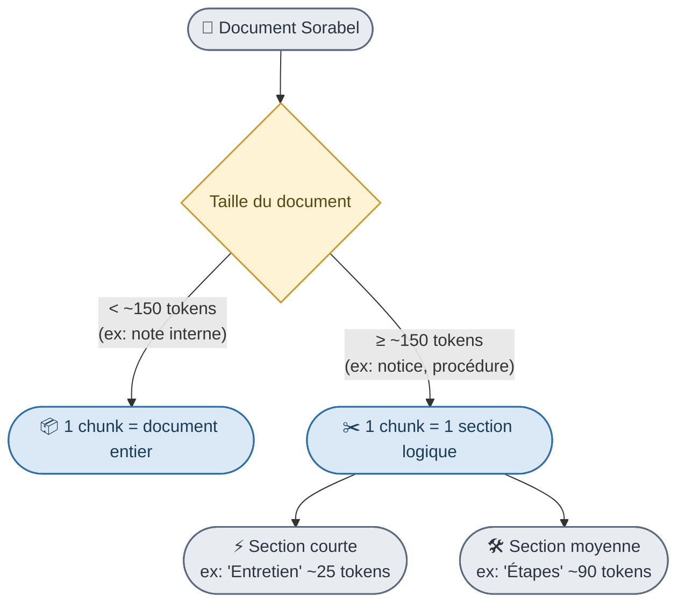

- **Découpage par section logique** (titres, sous-titres du document), pas par nombre de tokens fixe — inchangé sur le principe.
- **Taille cible revue à la baisse : 50-250 tokens** par chunk texte (au lieu de 200-400) — le corpus réel ne contient pas de blocs plus longs ; forcer une taille minimale de 200 tokens obligerait à fusionner artificiellement des sections sans lien (ex: "Conditions" + "Cas hors périmètre").
- **Document court (< ~150 tokens, ex: note de réunion) → 1 seul chunk = le document entier** ; le découper en sous-blocs n'apporterait aucun gain et fragmenterait inutilement un contenu déjà atomique.
- **Un tableau = un chunk entier**, jamais scindé (une ligne de tableau isolée perd son en-tête de colonne) — règle inchangée, applicable dès qu'un document en contient.
- **Chevauchement (overlap)** : à ~10-15% pour les sections moyennes/longues, mais **inutile en dessous de ~50 tokens** (l'overlap ferait doublonner l'essentiel du chunk).
- Chaque chunk **hérite systématiquement** des métadonnées du document parent (voir §4) — c'est ce qui permet de recontextualiser un chunk isolé après retrieval.

> **Point clé** : la granularité n'est pas une constante fixée a priori, mais une règle adaptative bornée par la taille réelle du corpus. Sur Sorabel, cela signifie des chunks nettement plus petits qu'un pipeline RAG "généraliste" — un choix directement guidé par la nature du contenu (fiches courtes, procédures structurées en étapes brèves), pas par une convention arbitraire.

## 4. Métadonnées à attacher à chaque chunk

| Métadonnée | Rôle | Impact retrieval |
|---|---|---|
| `product_ref` | Référence produit (ex: `REF-8842`) | **Filtrage exact + lookup BM25** — voir §4 |
| `version` | Version de la fiche | Écarte les chunks `deprecated` avant recherche |
| `published_date` | Date d'édition | Départage deux versions actives, affichage en citation (E1) |
| `document_type` | `datasheet`, `manuel`, `procedure_sav` | Route la requête vers le bon type de contenu |
| `url` / `source_path` | Lien vers le document source | Citation cliquable (E1), audit (E5) |
| `section_title` | Titre de la section d'origine | Contexte affiché à l'utilisateur, aide au reranking |
| `content_type` | `text` ou `table` | Router différemment si besoin (E2) |

## 4. Pourquoi `product_ref` est la métadonnée décisive

C'est le point central de cette architecture, et il découle directement de l'exigence **E2** du cahier des charges Sorabel (*"le système doit supporter aussi bien la recherche exacte par référence [ex: REF-8842] que la requête en langage naturel"*).

**Trois raisons concrètes :**

1. **Le pont entre BM25 et le filtrage structuré.** Une référence produit (`REF-8842`) est un identifiant exact, pas un concept sémantique — la recherche dense (embeddings) est mauvaise sur ce type de token car elle raisonne en similarité de sens, pas en égalité stricte. C'est exactement le cas d'usage de la recherche **BM25 / lexicale** dans le pattern Hybrid RAG : elle excelle sur le matching exact de termes rares. `product_ref` en métadonnée permet en plus un **filtre structuré** (`WHERE product_ref = 'REF-8842'`) appliqué avant même la recherche vectorielle — beaucoup plus fiable qu'espérer que l'embedding "comprenne" la référence.

2. **Elle regroupe les chunks épars d'une même fiche.** Comme le chunking se fait par section (§2), une fiche produit est éclatée en plusieurs chunks. Sans `product_ref` commun, impossible de recombiner "caractéristiques électriques" + "compatibilités" + "tableau specs" comme appartenant au même produit lors de la génération de réponse.

3. **Elle sert de clé de jointure vers le SQL.** Dans l'architecture Sorabel, la même référence produit existe aussi dans la base relationnelle (stock, prix). `product_ref` devient la **clé pivot** entre le module RAG documentaire et le module Text-to-SQL — un agent peut ainsi enchaîner "quelles sont les specs de REF-8842 ?" (RAG) puis "en a-t-on en stock ?" (SQL) sans réinterpréter une référence en langage naturel à chaque étape.

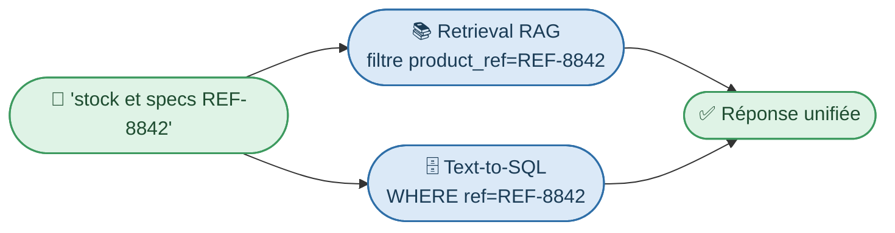

> **En résumé** : sans `product_ref` normalisée et cohérente entre le RAG et le SQL, l'exigence E2 (lookup exact) et la cohérence inter-modules du Data Gateway ne tiennent pas. C'est la métadonnée qui transforme un simple retriever de texte en véritable moteur de connaissance produit.

---

# Dense vs lexical vs hybride : pourquoi `REF-8842` échappe à la recherche sémantique

> **Question** : Pourquoi la recherche dense seule rate-t-elle « REF-8842 » ? Que rattrape la recherche lexicale ? Comment combiner les deux (hybride), et qu'apporte un reranking en plus ?
>
> **Source** : [The Complete Guide to RAG Architectures: From Naive to Agentic](https://medium.com/@atul4u/the-complete-guide-to-rag-architectures-from-naive-to-agentic-c90c8a87cf56)
>
> Contexte : Sorabel Data Gateway — module RAG technique (E1, E2)
> Pattern de référence : Hybrid RAG (dense + BM25 + reranking)

---

## 1. Pourquoi la recherche dense rate `REF-8842`

Un embedding dense capture le **sens** d'un texte, pas ses **tokens exacts**. `REF-8842` n'a pas de sens sémantique intrinsèque — c'est un identifiant arbitraire, comme un `Guid` en C#. Deux conséquences directes :

- Le modèle d'embedding a rarement vu cette référence précise à l'entraînement : il la traite comme un token quasi-aléatoire, proche de n'importe quelle autre suite alphanumérique dans l'espace vectoriel.
- La similarité cosinus entre la requête `"specs REF-8842"` et un chunk contenant `"REF-8843"` (référence voisine mais différente) peut être **presque identique** à celle avec le bon chunk `REF-8842` — le modèle "comprend" qu'il s'agit d'une référence produit, mais ne fait pas la distinction fine entre deux identifiants proches.

C'est exactement le problème du **semantic gap** décrit dans l'article de référence pour la Naive RAG : *"users often phrase questions very differently than how information appears in documents"* — sauf qu'ici, le problème est inversé : ce n'est pas une reformulation, c'est une **similarité artificielle** entre identifiants qui n'ont rien à voir sur le fond.

**Analogie C#** : chercher un objet par `Equals()` sémantique (approximatif) alors qu'on a besoin d'un lookup par **clé primaire exacte** dans un dictionnaire (`Dictionary<string, Product>`). Le dense search fait du "à peu près" là où il faut de l'exact.

## 2. Ce que la recherche lexicale (BM25) rattrape

BM25 fonctionne par **correspondance de termes exacts** pondérée par fréquence/rareté (TF-IDF amélioré) — pas par sens. Pour une référence produit :

- `REF-8842` est un terme **rare** dans le corpus → BM25 lui donne un poids très élevé dès qu'il apparaît tel quel dans la requête et le document.
- Aucune ambiguïté sémantique possible : soit le token est présent, soit il ne l'est pas.

C'est précisément la logique décrite dans l'article : *"BM25 captures exact terms but misses synonyms"* — et ici, on n'a justement pas besoin de synonymes, on a besoin d'exactitude. BM25 est donc le mécanisme naturel pour satisfaire l'exigence **E2** du cahier des charges Sorabel (recherche exacte par référence).

## 3. Combiner les deux : le pattern Hybrid RAG

Le pattern décrit dans l'article combine recherche dense + BM25 en parallèle, puis fusionne les classements — typiquement via **Reciprocal Rank Fusion (RRF)** :

```
score = Σ 1 / (k + rank_i)
```

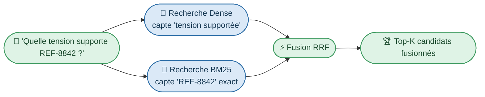

- **Dense** capte l'intention ("quelle tension supporte") même si le document dit "tension nominale" ou "tension d'alimentation" — vocabulaire différent, même sens.
- **BM25** garantit que seuls les chunks mentionnant réellement `REF-8842` (et pas `REF-8843`) remontent en tête.
- La fusion RRF évite d'avoir à choisir arbitrairement un seul moteur : chaque retriever "vote" indépendamment, et un document bien classé par les deux monte mécaniquement en tête.

Dans le code de l'article (LangChain `EnsembleRetriever`), on pondère explicitement les deux retrievers :

```python
ensemble_retriever = EnsembleRetriever(
    retrievers=[dense_retriever, bm25_retriever],
    weights=[0.6, 0.4]  # à calibrer selon le domaine Sorabel
)
```

Pour Sorabel, on pourrait même envisager un poids **dynamique** : si la requête contient un pattern de référence produit détectable (regex `REF-\d+`), on booste temporairement le poids de BM25.

## 4. Ce qu'apporte le reranking en plus

La fusion RRF combine des scores de nature différente (distance cosinus vs score BM25) — c'est une approximation utile mais grossière, pas une évaluation fine de pertinence. Le **reranking** ajoute une étape avec un **cross-encoder** : contrairement aux embeddings classiques qui encodent requête et document séparément, le cross-encoder les évalue **ensemble**, ce qui donne un jugement de pertinence beaucoup plus précis.


Concrètement pour Sorabel, le reranking permet de :
- **Départager finement** deux chunks qui parlent tous deux de `REF-8842` mais où un seul répond vraiment à la question posée (ex: un chunk "compatibilités" vs un chunk "tension nominale" pour une question sur la tension).
- **Filtrer le bruit** ramené par la fusion — RRF peut faire remonter un chunk bien classé par un seul des deux retrievers mais peu pertinent en réalité.
- **Réduire le contexte envoyé au LLM** (E1 : éviter l'hallucination) en ne gardant que les chunks réellement pertinents, ce qui améliore aussi la qualité de citation des sources.

> **En résumé** : dense = comprend l'intention mais confond les identifiants proches ; BM25 = garantit l'exactitude sur `REF-8842` mais ignore les reformulations ; l'hybride combine les deux forces ; le reranking affine le classement final avec un jugement de pertinence conjoint requête/document — c'est cette combinaison complète qui satisfait à la fois E1 (fiabilité des citations) et E2 (recherche exacte + langage naturel) du cahier des charges Sorabel.

---

# Garantir E1 : citations systématiques et refus si pertinence insuffisante

> **Question** : Comment garantir E1 : citations systématiques, et refus quand le score de pertinence est trop bas ?
>
> **Source** : [The Complete Guide to RAG Architectures: From Naive to Agentic](https://medium.com/@atul4u/the-complete-guide-to-rag-architectures-from-naive-to-agentic-c90c8a87cf56)
>
> Contexte : Sorabel Data Gateway — module RAG technique
> Exigence visée : **E1** — *"Every documentary answer must explicitly cite its sources (Title + Document Reference + Date). If the corpus does not contain the answer, the tool must state its inability to answer rather than hallucinating."*

---

## 1. Deux garanties distinctes, un seul mécanisme central

E1 impose en réalité deux comportements :
1. **Toujours citer** (Titre + Référence + Date) quand on répond.
2. **Refuser de répondre** si le corpus ne contient pas l'information — plutôt que d'halluciner.

Le point commun aux deux : il faut un **signal de confiance mesurable** sur chaque chunk retenu. C'est exactement le rôle du **reranking** dans le pattern Hybrid RAG de l'article — le cross-encoder ne fait pas que trier, il produit un **score de pertinence absolu**, exploitable comme seuil de décision.

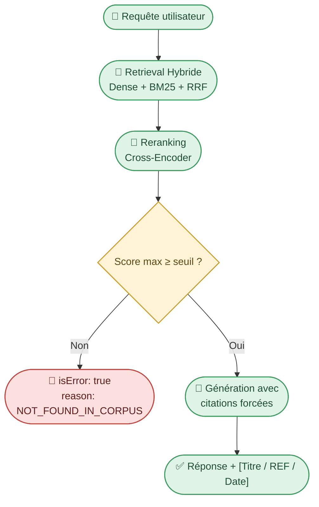

## 2. Garantir la citation systématique

### a) Propagation des métadonnées jusqu'au chunk

Comme vu dans le schéma pivot commun (§2 plus haut), chaque chunk indexé porte déjà `title`, `product_ref` / `doc_id`, `published_date`, `url`. La citation n'est donc pas générée "à la volée" par le LLM (risque d'invention) : elle est **extraite mécaniquement** des métadonnées des chunks effectivement utilisés dans le prompt.

### b) Sortie structurée, pas du texte libre

Comme dans les exemples de l'article utilisant `PydanticOutputParser` (section Adaptive RAG), on force un **schéma de sortie strict** plutôt que de compter sur le LLM pour "penser à citer" :

```python
class RAGAnswer(BaseModel):
    answer: str
    citations: List[Citation]  # obligatoire, non vide si answer non vide
    confidence: str  # "high" / "low" / "insufficient"

class Citation(BaseModel):
    title: str
    reference: str       # doc_id / product_ref
    published_date: str
    url: str
```

Le prompt système impose : *"N'affirme aucun fait sans le faire correspondre à un `citations[]` pointant vers un chunk fourni en contexte."* Un post-traitement peut même **rejeter la réponse** si `citations` est vide alors que `answer` contient du contenu affirmatif — filet de sécurité au-delà du seul prompt engineering.

## 3. Garantir le refus quand la pertinence est trop basse

C'est ici que le principe de **Corrective RAG (CRAG)** décrit dans l'article s'applique directement, même sans aller jusqu'à sa boucle complète de correction. CRAG introduit un **Retrieval Evaluator** qui note chaque document `Correct` / `Incorrect` / `Ambiguous` avant génération — on réutilise cette idée comme **porte de décision binaire** pour Sorabel :

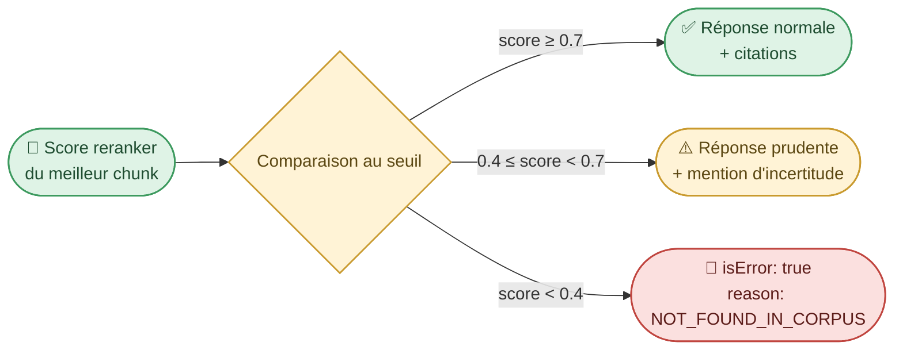

- Le **seuil** est calibré empiriquement sur le corpus Sorabel (c'est justement l'objet de l'exigence **E6** — benchmarker le hybride+reranking vs vecteur seul, ce qui permet aussi de fixer ce seuil avec des données réelles plutôt qu'arbitrairement).
- Contrairement à CRAG "complet" (qui déclenche une recherche web de secours), Sorabel n'a pas vocation à sortir du corpus interne — le cas `score < seuil` déclenche donc un **refus**, pas une recherche alternative, conformément à E1 qui interdit explicitement l'hallucination de repli.
- Le score utilisé est celui du **cross-encoder** (post-fusion RRF), pas le score brut dense ou BM25 : c'est le seul des trois qui évalue conjointement requête et document, donc le plus fiable comme seuil de décision (voir chapitre précédent).
- **Contrat de refus précisé (`MCP.md` §5)** : le refus n'est pas un simple texte — le tool renvoie un `CallToolResult` avec `isError: true` et un champ structuré `reason: NOT_FOUND_IN_CORPUS`, distinct du texte narratif. Le host client doit détecter `isError` **avant** de transmettre le contenu au LLM pour rédaction, afin qu'aucun modèle ne puisse paraphraser une erreur en réponse plausible.

## 4. Où cela s'insère dans l'architecture E1-E6

| Étape | Exigence servie |
|---|---|
| Hybride Dense+BM25 (§ chapitre précédent) | E2 |
| Reranking cross-encoder → score de pertinence | E1 (seuil de refus) + E6 (mesure) |
| Citations extraites des métadonnées, sortie structurée | E1 (attribution) |
| Refus si score < seuil, sans fallback web | E1 (anti-hallucination) |
| Log de chaque requête + score + décision (répondre/refuser) | E5 (auditabilité) |

> **Point clé** : E1 n'est pas qu'une consigne de prompt ("cite tes sources") — c'est une garantie architecturale qui repose sur deux mécanismes concrets du pattern Hybrid RAG : la **traçabilité des métadonnées** jusqu'à la génération, et le **score de reranking** comme porte de décision objective entre répondre et refuser.

---

# Mesurer le gain E6 : sous-ensemble de test, métriques, protocole avant/après

> **Question** : Comment mesurer le gain (E6) : quel sous-ensemble de `questions_rag.jsonl`, quelle métrique de pertinence, avant/après ?
>
> **Source** : [The Complete Guide to RAG Architectures: From Naive to Agentic](https://medium.com/@atul4u/the-complete-guide-to-rag-architectures-from-naive-to-agentic-c90c8a87cf56)
>
> Contexte : Sorabel Data Gateway — module RAG technique
> Exigence visée : **E6** — *"The performance improvement of advanced hybrid retrieval with re-ranking over standard vector search must be measured, benchmarked, and documented."*

---

## 1. Le jeu de test `questions_rag.jsonl` a déjà la bonne structure

Le fichier fourni contient 30 questions réparties en **3 catégories homogènes**, ce qui correspond exactement au découpage attendu pour un benchmark E6 — inutile d'en créer un autre, il suffit de mapper chaque catégorie à la métrique qui l'évalue le mieux.

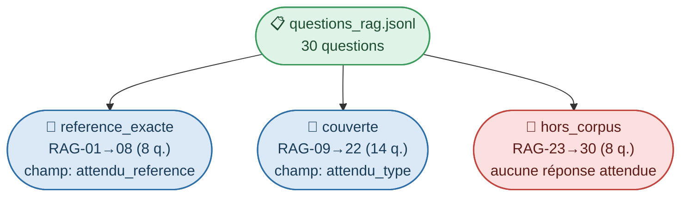

**Analogie C#** : c'est l'équivalent d'une suite de tests unitaires avec trois catégories de cas — *happy path exact* (`reference_exacte`), *happy path flou* (`couverte`), et *cas d'erreur attendu* (`hors_corpus`, qui doit lever une "exception métier" contrôlée, pas planter). E6 revient à faire tourner cette suite deux fois — avant/après refactoring — et comparer les résultats, comme un test de non-régression.

## 2. Une métrique différente par catégorie (le point clé)

Utiliser une seule métrique globale (ex: similarité moyenne) noierait les trois problèmes distincts que le Hybrid RAG résout séparément (voir chapitre "Dense vs lexical vs hybride" plus haut). Il faut donc **trois métriques ciblées** :

| Catégorie | Ce qu'on teste | Métrique | Ce que le pattern hybride doit améliorer |
|---|---|---|---|
| `reference_exacte` (8 q.) | Le système retrouve-t-il le bon `doc_id` pour une REF exacte ? | **Hit Rate@1** : `attendu_reference` = référence du chunk classé n°1 | C'est le cas d'usage typique où BM25 rattrape ce que le dense seul rate (cf. `REF-8842` vs `REF-8843`) |
| `couverte` (14 q.) | Le système retrouve-t-il un chunk du bon `document_type` en langage naturel ? | **Recall@K** (K=5) : `attendu_type` présent dans le top-K, + **MRR** (Mean Reciprocal Rank) pour la position | Gain apporté par le reranking cross-encoder (tri fin après fusion RRF) |
| `hors_corpus` (8 q.) | Le système refuse-t-il correctement plutôt que d'halluciner ? | **Taux de refus correct** : % de questions où le score de reranking passe sous le seuil E1 | Directement lié au chapitre précédent — teste la porte de décision, pas la pertinence |

C'est exactement l'esprit de l'article de référence quand il distingue les rôles : *"Dense vectors capture semantic meaning but can miss exact keyword matches"* — chaque sous-ensemble du jeu de test cible précisément l'un de ces angles morts.

## 3. Protocole avant/après

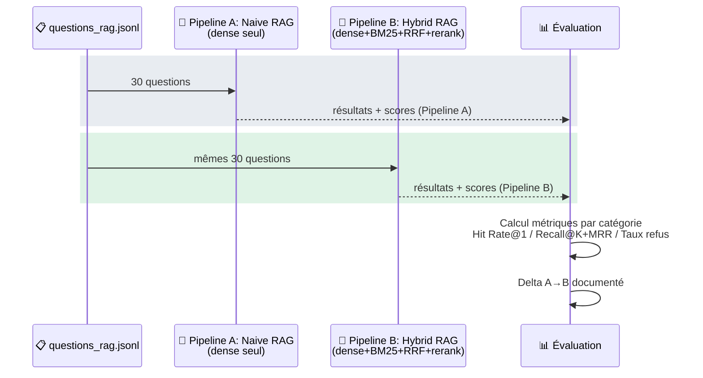

- **Pipeline A (baseline)** : reproduit le "standard vector search" mentionné dans E6 — recherche dense seule, sans BM25 ni reranking. C'est l'implémentation "Naive RAG" du §1 de l'article.
- **Pipeline B (cible)** : le pattern Hybrid RAG complet — Dense + BM25 → fusion RRF → reranking cross-encoder, comme documenté dans les chapitres précédents.
- **Même jeu de 30 questions**, mêmes conditions (même corpus indexé, même `top_k` en entrée), seule la stratégie de retrieval change — condition indispensable pour que le delta mesuré soit imputable au pattern, pas à un biais expérimental.

## 4. Résultat attendu à documenter

| Catégorie | Métrique | Pipeline A (Naive) | Pipeline B (Hybrid) | Δ |
|---|---|---|---|---|
| `reference_exacte` | Hit Rate@1 | *(à mesurer)* | *(à mesurer)* | attendu ↑ fort (BM25 corrige le semantic gap sur REF) |
| `couverte` | Recall@5 / MRR | *(à mesurer)* | *(à mesurer)* | attendu ↑ modéré (reranking affine l'ordre) |
| `hors_corpus` | Taux de refus correct | *(à mesurer)* | *(à mesurer)* | attendu ↑ fort (score de reranking = signal de confiance exploitable, absent en dense seul) |

> **Point clé** : E6 ne demande pas une métrique unique mais **trois preuves ciblées**, chacune isolant un gain spécifique du pattern hybride décrit dans l'article — exactitude sur les références (BM25), qualité de classement sur les requêtes en langage naturel (reranking), et fiabilité du refus (score de reranking comme seuil). Le tableau delta devient la pièce justificative directe de la conformité E6 pour la soutenance.

---

# Livrables intermédiaires (Interim Deliverables)

> Synthèse des trois livrables clés du module RAG technique Sorabel, consolidés à partir des chapitres précédents.

---

## 1. Schéma RAG avancé (Advanced RAG schema)

Vue d'ensemble du pipeline complet — de l'ingestion du corpus hétérogène à la génération de réponse citée.

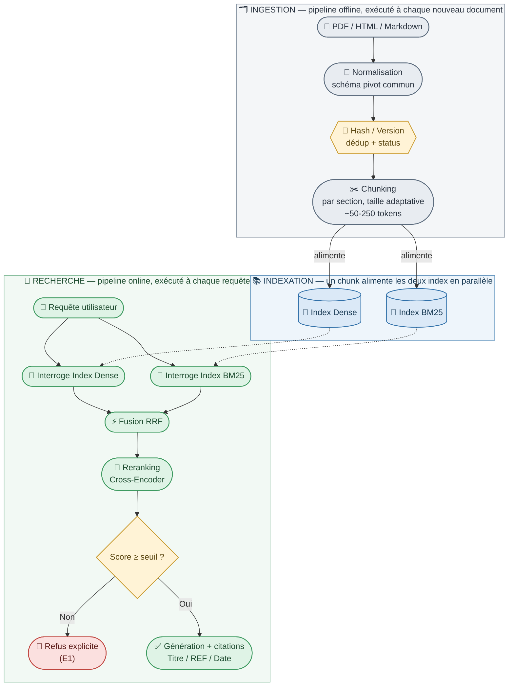

| Étape | Exigence servie |
|---|---|
| Normalisation multi-format | E1, E2 |
| Dédup / versioning | E1 (fiabilité des sources) |
| Index Dense + BM25 | E2 (exact + langage naturel) |
| Fusion RRF + Reranking | E1 (seuil), E2, E6 |
| Décision réponse/refus | E1 |

---

## 2. Modèle de chunk et de métadonnées (Chunk and metadata model)

**Granularité retenue** : découpage par section logique (~50-250 tokens, adaptatif selon la taille réelle des documents Sorabel — souvent courts), document entier conservé en un seul chunk s'il fait moins de ~150 tokens, un tableau = un chunk entier, overlap ~10-15% au-delà de ~50 tokens.

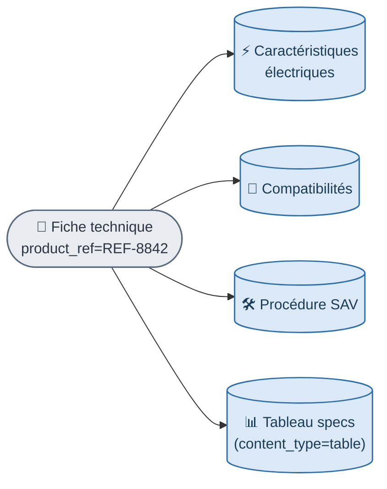

| Métadonnée | Type | Rôle principal |
|---|---|---|
| `doc_id` / `product_ref` | string | Identifiant logique + clé pivot vers le SQL (E2) |
| `version` | string | Distingue les révisions d'une même fiche |
| `content_hash` | string (SHA-256) | Déduplication exacte |
| `published_date` | date | Citation (E1), arbitrage entre versions |
| `document_type` | enum | `datasheet` / `manuel` / `procedure_sav` |
| `content_type` | enum | `text` / `table` |
| `source_type` | enum | `pdf` / `html` / `md` |
| `url` / `source_path` | string | Citation cliquable (E1), audit (E5) |
| `status` | enum | `active` / `deprecated` — filtré avant retrieval |
| `section_title` | string | Contexte affiché, aide au reranking |

---

## 3. Outils MCP exposés (mis à jour suite au cadrage `MCP.md`)

Ici, "outil" est à comprendre au sens MCP : une fonction exposée par le **serveur** Sorabel Data Gateway, que les clients (bot Slack, IDE, poste de vente) peuvent appeler. Le cadrage `MCP.md` a précisé et complété la liste initiale de deux façons : l'ajout du tool composite **`answer_question`**, et une **restriction d'accès par collection** selon le profil du client appelant.

### a) `answer_question` : un tool composite, pas un 6ᵉ outil de plus

`answer_question` n'exécute lui-même aucune génération de texte : il **orchestre** en interne `search_documents` + `get_document_metadata` + `list_document_types`, et retourne le résultat agrégé (chunks + métadonnées + catalogue de sources) — c'est le **LLM du client** (bot Slack, poste de vente) qui rédige la réponse finale à partir de ce résultat. Les briques restent aussi **appelables seules** : c'est ce qui permet à l'IDE développeur de chercher sans jamais générer de réponse rédigée.

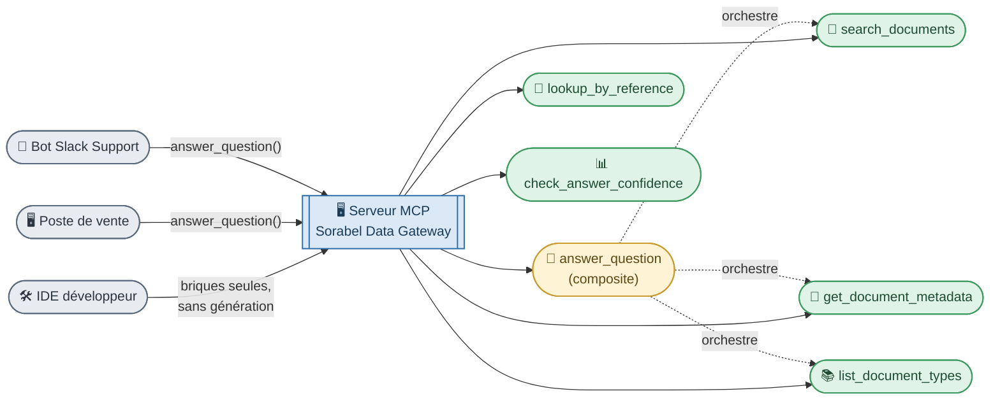

**Analogie C#** : `answer_question` est l'équivalent d'un `IRagService.AnswerQuestionAsync()` qui orchestre `ISearchRepository.SearchAsync()` + `IDocumentRepository.GetMetadataAsync()/ListTypesAsync()`, mais retourne un objet de données agrégé, jamais une chaîne finale — la génération reste dans la couche présentation du client. `search_documents` reste appelable seul, comme on appellerait un repository sans passer par le service qui l'orchestre.

| Outil MCP | Paramètres | Description | Exigence servie |
|---|---|---|---|
| `answer_question` | `query: str` | **Composite** : orchestre `search_documents` + `get_document_metadata` + `list_document_types`, retourne le résultat agrégé sans rédiger de réponse | E1, E2, E6 |
| `search_documents` | `query: str`, `top_k: int` | Recherche hybride (Dense + BM25 + reranking) en langage naturel, retourne les chunks pertinents avec leurs métadonnées | E1, E2, E6 |
| `lookup_by_reference` | `product_ref: str` | Lookup exact d'une fiche par référence produit (ex : `REF-8842`), sans passer par le scoring sémantique | E2 |
| `get_document_metadata` | `doc_id: str` | Retourne titre, version, date, statut d'un document sans son contenu — utile pour vérifier la fraîcheur avant citation | E1 |
| `check_answer_confidence` | `query: str` | Retourne le score de reranking maximal obtenu, sans générer de réponse — permet à un agent client de décider s'il doit interroger d'autres sources | E1 (refus si score bas) |
| `list_document_types` | *(aucun)* | Retourne les catégories de documents disponibles (`datasheet`, `manuel`, `procedure_sav`) pour aider un client à cadrer sa requête | E2 |

> Chaque outil ci-dessus est indépendant de son implémentation interne (parseurs PDF, index vectoriel, moteur BM25, reranker...) : ces briques techniques restent internes au serveur MCP et ne sont jamais exposées directement aux clients — c'est tout l'intérêt de l'architecture MCP unifiée (**E4**).

### b) Collections RAG : une restriction d'accès en amont du retrieval hybride

`document_type` (§2) sert désormais aussi de **clé de partition** : l'index RAG est découpé en *collections* (`datasheet`/`manuel`, `procedure_sav`...), et la matrice d'accès du serveur MCP restreint, par profil, les collections interrogées **avant** même que le retrieval hybride ne s'exécute — un filtre supplémentaire, en amont du filtre `status: active` déjà décrit en §4-5.

| Profil client | Collections RAG accessibles |
|---|---|
| Bot Slack Support | SAV, manuels uniquement |
| Poste Vente / IDE développeur | Toutes |

> **Analogie C#** : comparable à un filtre `WHERE collection_id IN (@allowed)` injecté systématiquement avant la clause de recherche elle-même — comme un *global query filter* EF Core appliqué par profil, jamais laissé au choix du client.


---

# Glossaire

### Exigences IT du cahier des charges Sorabel (E1 → E6)

| ID | Périmètre | Description de l'exigence |
|---|---|---|
| **E1** | RAG & Attribution | Chaque réponse documentaire doit citer explicitement ses sources (Titre + Référence + Date). Si le corpus ne contient pas la réponse, l'outil doit signaler son incapacité à répondre plutôt que d'halluciner. |
| **E2** | Retrieval hybride | La recherche documentaire doit gérer avec précision aussi bien les lookups exacts par référence (ex : `"REF-8842"`) que les requêtes en langage naturel complet (ex : *"Quel disjoncteur pour une alimentation triphasée ?"*). |
| **E3** | Text-to-SQL en lecture seule | Toute requête SQL générée et exécutée doit être strictement en lecture seule, restreinte aux tables autorisées pour le profil demandeur. Chaque requête SQL générée et son jeu de résultats doivent être journalisés pour la transparence. |
| **E4** | Architecture MCP unifiée | Un unique serveur MCP doit servir tous les clients internes. L'accès des clients aux outils, collections vectorielles et tables de base de données doit être strictement gouverné par une matrice de contrôle d'accès centralisée. |
| **E5** | Auditabilité & masquage | Tous les appels (autorisés comme rejetés) doivent être journalisés dans une piste d'audit. Les colonnes sensibles (ex : prix d'achat, marges) doivent être masquées/omises pour les profils non autorisés (ex : Support). |
| **E6** | Évaluation du RAG | Le gain de performance du retrieval hybride avancé avec reranking, par rapport à une recherche vectorielle standard, doit être mesuré, benchmarké et documenté. |

### Concepts RAG (Retrieval-Augmented Generation)

| Terme | Définition |
|---|---|
| **RAG** | Retrieval-Augmented Generation — architecture combinant recherche documentaire et génération LLM pour ancrer les réponses sur des sources réelles |
| **Chunk** | Fragment de document indexé unitairement — une section logique, ou le document entier s'il est court (ici : ~50-250 tokens, taille adaptée au corpus réel Sorabel) |
| **Normalisation** | Conversion de documents hétérogènes (PDF, HTML, Markdown) vers un schéma pivot commun (texte propre + métadonnées uniformes), préalable indispensable à un indexage cohérent, dense comme lexical |
| **Embedding** | Représentation vectorielle dense d'un texte, capturant son sens sémantique |
| **Recherche dense** | Recherche par similarité vectorielle (cosinus) entre embeddings — capte le sens, pas les tokens exacts |
| **Index dense** | Base vectorielle stockant les embeddings de chaque chunk, interrogée par similarité (cosinus) plutôt que par égalité de termes — le pendant de l'index BM25 dans le pattern hybride |
| **BM25** | Algorithme de recherche lexicale (TF-IDF amélioré) — matching par termes exacts pondérés par rareté/fréquence |
| **Recherche hybride (Hybrid RAG)** | Combinaison dense + BM25 (+ éventuellement graphe), fusionnées puis rerankées |
| **RRF (Reciprocal Rank Fusion)** | Stratégie de fusion des classements de plusieurs retrievers : `score = Σ 1/(k + rank_i)` |
| **Reranking** | Étape de tri fin post-fusion via un cross-encoder, qui évalue conjointement requête et document |
| **Cross-encoder** | Modèle qui encode requête + document ensemble (contrairement à l'embedding classique qui les encode séparément) — plus précis, plus coûteux |
| **Semantic gap** | Écart entre la formulation d'une requête utilisateur et le vocabulaire du document source, qui pénalise la recherche dense seule |
| **HyDE** | Hypothetical Document Embeddings — génère une réponse hypothétique avant de l'embedder, pour rapprocher requête et documents dans l'espace vectoriel |
| **CRAG (Corrective RAG)** | Pattern ajoutant une évaluation de pertinence post-retrieval (Correct/Incorrect/Ambiguous) avant génération, avec action corrective si besoin |
| **GraphRAG** | Pattern structurant le corpus en graphe de connaissances (entités/relations) pour répondre à des questions transversales/thématiques |
| **Adaptive RAG** | Pattern routant dynamiquement la requête vers une stratégie de retrieval selon sa complexité (simple / modérée / complexe) |
| **Agentic RAG** | Pattern où un agent LLM autonome choisit et enchaîne les outils de retrieval (ReAct, multi-agents) |
| **Hallucination** | Réponse générée par le LLM non ancrée dans les sources réelles — ce qu'E1 interdit explicitement |
| **Tool composite (haut niveau)** | Tool qui orchestre en interne plusieurs briques (ex. `answer_question` compose `search_documents` + `get_document_metadata` + `list_document_types`) sans lui-même générer de texte |
| **Brique (tool décomposé)** | Tool élémentaire, appelable seul ou via un tool composite, exposant une capacité unique (recherche, métadonnées, catalogue...) |
| **Collection (vectorielle)** | Partition nommée de l'index RAG (ex. par `document_type` : `datasheet`, `manuel`, `procedure_sav`), unité de granularité de la matrice d'accès côté RAG — filtrée par profil client avant même le retrieval hybride |
| **`isError` / `reason`** | Champs du `CallToolResult` MCP signalant un échec structuré (ex. `reason: NOT_FOUND_IN_CORPUS`) — à détecter par le host client avant toute transmission au LLM, pour ne jamais laisser un refus se faire paraphraser en réponse |

### Métriques d'évaluation (E6)

| Terme | Définition |
|---|---|
| **Hit Rate@K** | % de requêtes où le document attendu figure dans les K premiers résultats |
| **Recall@K** | Proportion des documents pertinents effectivement retrouvés dans le top-K |
| **MRR (Mean Reciprocal Rank)** | Moyenne de l'inverse du rang du premier résultat pertinent — pénalise les bonnes réponses mal classées |
| **nDCG** | Normalized Discounted Cumulative Gain — mesure de qualité de classement pondérant la position des résultats pertinents |

### Métadonnées & schéma de données

| Terme | Définition |
|---|---|
| **doc_id** | Identifiant stable d'un document logique (indépendant du fichier physique) |
| **product_ref** | Référence produit Sorabel (ex : `REF-8842`) — clé pivot entre le module RAG et le module Text-to-SQL |
| **content_hash** | Empreinte SHA-256 du contenu normalisé, utilisée pour la déduplication exacte |
| **Hash (opération)** | Fonction qui transforme un contenu (texte, fichier) en une empreinte de taille fixe, unique pour un contenu donné — deux contenus identiques produisent le même hash, la moindre différence produit un hash totalement différent. Utilisé ici pour détecter les doublons exacts et distinguer les versions d'un même document |
| **status (active/deprecated)** | État de version d'un document, filtré avant indexation/retrieval |

### Technologies & bibliothèques citées

| Terme | Définition |
|---|---|
| **LangChain** | Framework Python d'orchestration LLM (retrievers, chains, agents) |
| **LlamaIndex** | Framework Python spécialisé indexation/retrieval pour RAG |
| **LangGraph** | Extension de LangChain pour construire des workflows/agents sous forme de graphe d'états (utilisé pour CRAG) |
| **EnsembleRetriever** | Composant LangChain combinant plusieurs retrievers (ex : dense + BM25) avec pondération |
| **Pydantic** | Bibliothèque Python de validation/sérialisation de données via des modèles typés — utilisée ici pour forcer une sortie structurée (citations obligatoires) |
| **Milvus / Chroma** | Bases de données vectorielles utilisées pour l'indexation dense (et hybride pour Milvus) |
| **unstructured / camelot / PyMuPDF** | Bibliothèques Python d'extraction de contenu structuré (texte, tableaux) depuis des PDF |

### Analogies .NET / C# utilisées dans ce document

| Concept RAG | Analogie C# / .NET |
|---|---|
| Schéma pivot commun multi-format | Interface `IDocumentParser` → DTO normalisé |
| Filtre exact `product_ref` | Lookup par clé primaire dans un `Dictionary<string, Product>` |
| Granularité de chunk = fiche produit | Aggregate Root (DDD) |
| Benchmark avant/après (E6) | Suite de tests de non-régression |
| Recherche dense sur identifiant | `Equals()` approximatif vs recherche par clé exacte |
