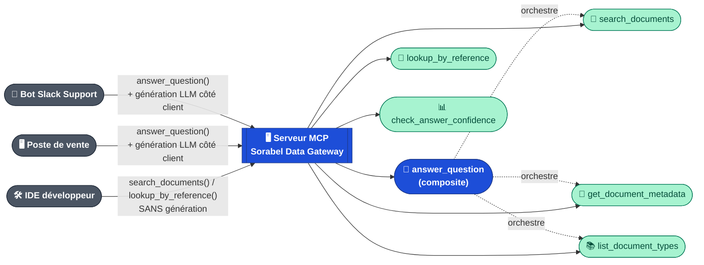
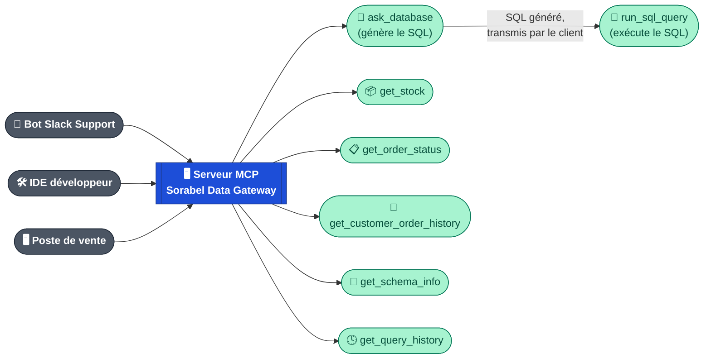
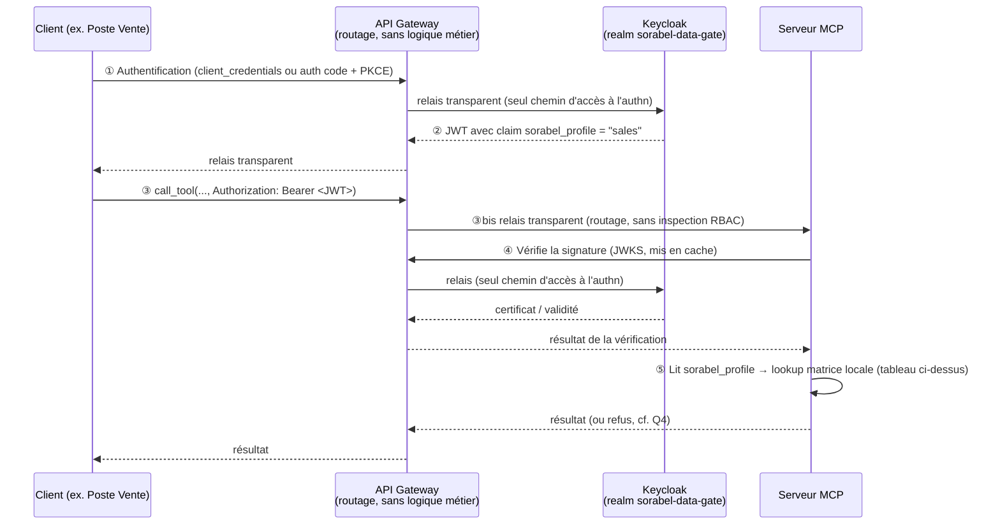
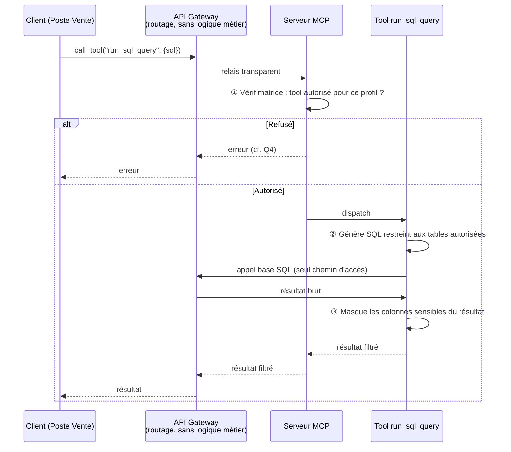
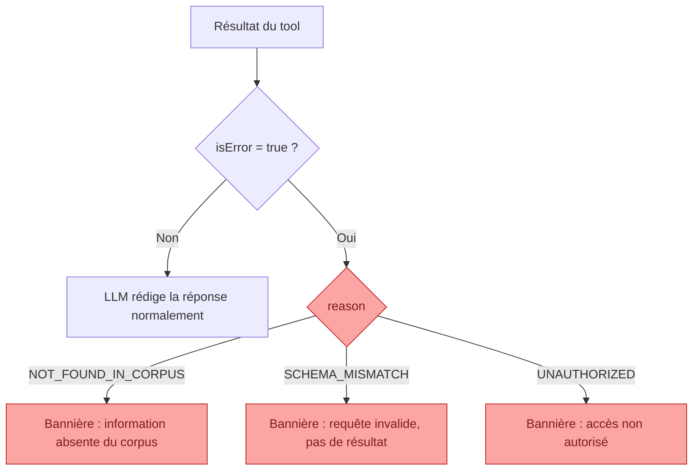
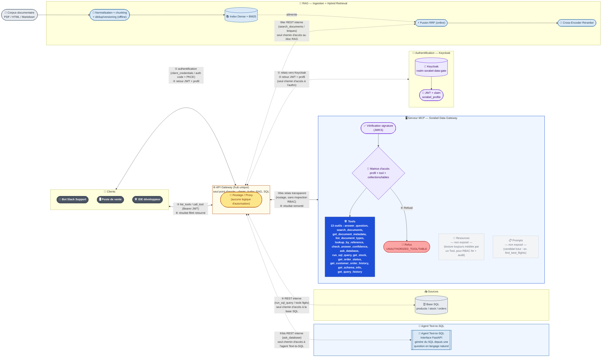
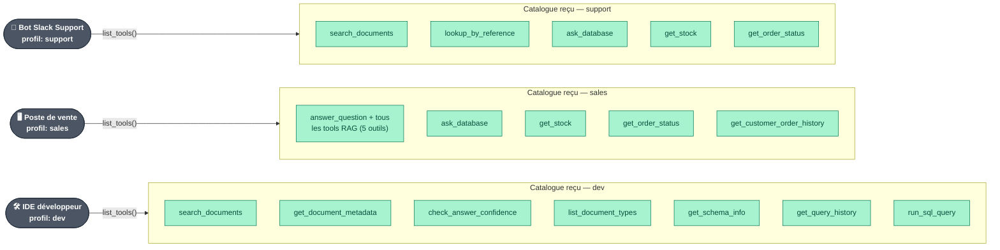

# MCP.md — Sorabel Data Gateway : réponses de cadrage

> Document de travail répondant aux 5 questions posées dans `prompt_MCP.md` (section *Goals*), en s'appuyant sur les fiches MCP déjà produites (primitives, transport, sécurité) et sur les exigences E1–E6 du cadrage DSI.

---

## 1. Quels tools exposer ? Tool haut niveau vs briques décomposées

> **Question posée** : *Le RAG complet (`answerquestion`) mais aussi ses parties décomposées (`searchdocs`, `getdocument`, `listsources`) : à quels clients servent le tool de haut niveau vs les briques (un IDE peut vouloir chercher sans générer) ?*

### Correspondance entre les Goals et la liste de tools retenue

`answer_question` est modélisé comme un **tool composite** : il orchestre en interne `search_documents`, `get_document_metadata` et `list_document_types`, mais ne fait lui-même aucune génération — il retourne le résultat agrégé de ces trois appels (chunks + métadonnées + catalogue de sources), et c'est le **LLM du client** qui rédige la réponse finale à partir de ce résultat.

| Terme des *Goals* | Tool réel retenu | Niveau | Composé de | Génère une réponse rédigée ? |
|---|---|---|---|---|
| `answerquestion` | `answer_question` | **Haut niveau (composite)** | `search_documents` + `get_document_metadata` + `list_document_types` | ❌ Non — agrège le résultat des 3 briques ; la génération se fait côté client |
| `searchdocs` | `search_documents` | Brique | — | ❌ Non |
| `getdocument` | `get_document_metadata` | Brique | — | ❌ Non |
| `listsources` | `list_document_types` | Brique | — | ❌ Non |
| *(non nommé dans les Goals)* | `lookup_by_reference` | Brique | — | ❌ Non |
| *(non nommé dans les Goals)* | `check_answer_confidence` | Brique | — | ❌ Non |

Tous ces tools appartiennent au **module RAG documentaire** (`Advanced_RAG.md`) — aucun n'exécute de SQL ni n'appelle `ask_database` ou `run_sql_query`, qui relèvent du module données traité en Q2. Les briques `search_documents`, `get_document_metadata` et `list_document_types` restent aussi **appelables individuellement**, en dehors de toute composition par `answer_question` — c'est ce qui permet le cas "chercher sans générer" ci-dessous.

### Qui utilise quoi, et le cas IDE (chercher sans générer)

| Client | Tools appelés | Génération de réponse finale |
|---|---|---|
| Bot Slack Support | `answer_question` (composite) | Oui, par le LLM du client, à partir du résultat agrégé |
| Poste Vente | `answer_question` (composite) | Oui, par le LLM du client, à partir du résultat agrégé |
| IDE développeur | `search_documents` / `lookup_by_reference` (briques seules), éventuellement `get_document_metadata` / `check_answer_confidence` | **Non** — passages bruts injectés tels quels dans le contexte de code, sans rédaction |

L'IDE illustre exactement le cas "chercher sans générer" : il appelle les briques directement, sans passer par `answer_question`, et consomme les chunks comme donnée source sans jamais demander de texte de synthèse.

**Analogie .NET** : `answer_question` est l'équivalent d'un `IRagService.AnswerQuestionAsync()` qui **orchestre** `ISearchRepository.SearchAsync()`, `IDocumentRepository.GetMetadataAsync()` et `IDocumentRepository.ListTypesAsync()`, mais retourne un objet de données agrégé (`RagQueryResult`), jamais une chaîne de caractères finale — la génération reste dans la couche présentation du client (comme un contrôleur qui décide de la mise en forme, pas le repository). `search_documents` seul reste appelable directement, comme on appellerait un repository sans passer par le service qui l'orchestre.

---

## 2. Tools côté données : comment les décrire pour que les clients (et leurs LLM) choisissent le bon

> **Question posée** : *Le tool génératif `askdatabase`, l'outil d'aide `getschema`, et les tools figés (`checkstock`, `orderstatus`) — comment les décrire pour que les clients (et leurs LLM) choisissent le bon ?*

**Correspondance avec la liste retenue** (`Text2SQL_Sorabel.md`, §7) : `askdatabase` → `ask_database` (**génération seule**) ; `run_sql_query` (**exécution seule**, ajouté pour séparer génération et exécution — non nommé explicitement dans la question d'origine mais nécessaire dès lors que `askdatabase` ne génère plus *et* n'exécute plus dans le même appel) ; `getschema` → `get_schema_info` ; `checkstock` → `get_stock` ; `orderstatus` → `get_order_status` (complétés par `get_customer_order_history` et `get_query_history`, non explicitement nommés dans la question mais présents dans la source) :

> **Point de correction important** : dans une version antérieure de ce cadrage, `run_sql_query` portait à la fois la génération *et* l'exécution. Ce n'est plus le cas — `askdatabase` (tool `ask_database`) est le **seul** tool qui génère du SQL (il délègue cette génération à l'**Agent Text-to-SQL**, cf. §6.1) ; `run_sql_query` ne fait qu'**exécuter** une requête SQL déjà écrite (par `ask_database` ou fournie telle quelle par le client), après passage par la chaîne de garde-fous (§5 de `Text2SQL_Sorabel.md`). Séparer les deux étapes permet au client d'inspecter/valider le SQL généré avant de déclencher son exécution, et de journaliser distinctement une génération (coûteuse, non déterministe) d'une exécution (déterministe, gouvernée par la chaîne de garde-fous).

| Outil MCP | Paramètres | Description | Exigence servie |
|---|---|---|---|
| `ask_database` | `question: str`, `profile: str` | Tool générique de **génération** SQL : appelle l'**Agent Text-to-SQL** (schéma statique commenté filtré par profil → génération) via l'API Gateway. Ne s'exécute jamais lui-même — retourne le SQL généré pour exécution ultérieure via `run_sql_query` | E3, E5 |
| `run_sql_query` | `sql: str`, `profile: str` | Tool générique d'**exécution** : ne génère rien — prend une requête SQL déjà écrite (typiquement issue de `ask_database`) et la fait passer par la chaîne de garde-fous (lecture seule) avant exécution sur réplica | E3, E5 |
| `get_stock` | `product_ref: str` | Tool figé : stock d'une référence produit, requête paramétrée pré-écrite, aucun passage par un LLM | E3 |
| `get_order_status` | `order_id: str` | Tool figé : statut d'une commande | E3 |
| `get_customer_order_history` | `customer_id: str`, `limit: int` | Tool figé : historique des commandes d'un client, périmètre colonnes selon profil | E3, E5 |
| `get_schema_info` | `profile: str`, `keyword: str` *(optionnel)* | Introspection du schéma (tables/colonnes) réellement visible pour le profil appelant — à appeler avant `ask_database` pour cadrer une question | E4, E5 |
| `get_query_history` | `profile: str`, `limit: int` | Retourne les dernières requêtes exécutées (ou rejetées) pour ce profil, à des fins d'audit ou de debug côté client | E5 |

> `ask_database` et `run_sql_query` ne forment **pas** un tool composite (contrairement à `answer_question`, §1) : le serveur MCP n'enchaîne pas automatiquement génération puis exécution. C'est le **client** qui décide d'appeler `run_sql_query` après avoir reçu et éventuellement inspecté le SQL retourné par `ask_database` — un choix délibéré pour garder un point d'inspection entre une étape non déterministe (génération LLM) et une étape gouvernée mais irréversible (exécution, même en lecture seule).

**Reformulation précise de la question** : *quelle docstring exacte inscrire dans la fonction Python annotée `@tool` (convention FastMCP, cf. `Resume-MCP-Introduction.md` §4) pour que le LLM client choisisse le bon outil ?* C'est cette docstring — pas un texte séparé — qui est lue par le LLM lors de `list_tools()` : elle **est** la description du tool.

| Tool | Signature Python (`@mcp.tool()`) | Docstring exacte |
|---|---|---|
| `get_stock` | `def get_stock(product_ref: str) -> dict:` | *"Retourne le stock disponible pour une référence produit exacte. À utiliser EN PRIORITÉ dès qu'une référence produit (ex: 'REF-8842') est connue. Plus rapide et plus fiable que ask_database pour ce besoin précis — ne PAS utiliser ask_database si ce tool suffit. Args: product_ref: Référence produit exacte (ex: 'REF-8842')."* |
| `get_order_status` | `def get_order_status(order_id: str) -> dict:` | *"Retourne le statut d'une commande à partir de son identifiant. À utiliser EN PRIORITÉ dès qu'un order_id est connu. Ne PAS utiliser ask_database pour ce besoin. Args: order_id: Identifiant de commande."* |
| `get_customer_order_history` | `def get_customer_order_history(customer_id: str, limit: int = 20) -> dict:` | *"Retourne l'historique des commandes d'un client identifié. À utiliser EN PRIORITÉ dès qu'un customer_id est connu. Ne PAS utiliser ask_database pour ce besoin. Args: customer_id: Identifiant client. limit: Nombre maximal de commandes retournées (défaut 20)."* |
| `get_schema_info` | `def get_schema_info(profile: str, keyword: str \| None = None) -> dict:` | *"Retourne les tables et colonnes réellement accessibles au profil appelant. À appeler AVANT ask_database si le nom exact d'une table ou d'une colonne n'est pas certain — évite les erreurs de schéma et les hallucinations de noms de colonnes. Args: profile: Profil du client appelant (ex: 'support', 'sales'). keyword: Filtre optionnel sur le nom des tables/colonnes."* |
| `ask_database` | `def ask_database(question: str, profile: str) -> dict:` | *"Génère une requête SQL en lecture seule à partir d'une question en langage naturel, via l'agent Text-to-SQL dédié. NE L'EXÉCUTE PAS — retourne uniquement le SQL généré ; appeler run_sql_query pour l'exécuter. À utiliser UNIQUEMENT si aucun des tools figés (get_stock, get_order_status, get_customer_order_history) ne couvre le besoin — dernier recours, plus coûteux et moins déterministe. CRITICAL: n'utilise que les noms de tables/colonnes retournés par get_schema_info, ne jamais en inventer. Args: question: Question métier en langage naturel. profile: Profil du client appelant, pour restreindre les tables/colonnes visibles dans le schéma injecté."* |
| `run_sql_query` | `def run_sql_query(sql: str, profile: str) -> dict:` | *"Exécute une requête SQL déjà écrite (typiquement obtenue via ask_database) après validation par la chaîne de garde-fous en lecture seule (rôle DB, blocklist, AST, guardrail sémantique, LIMIT/timeout, réplica). NE GÉNÈRE AUCUN SQL — sql doit être une requête complète et syntaxiquement valide. Args: sql: Requête SQL à valider et exécuter. profile: Profil du client appelant, pour restreindre les tables/colonnes visibles et appliquer le masquage de colonnes."* |
| `get_query_history` | `def get_query_history(profile: str, limit: int = 20) -> dict:` | *"Retourne les dernières requêtes exécutées ou rejetées pour ce profil. Outil d'audit et de debug côté client — jamais une source de données métier. Args: profile: Profil du client appelant. limit: Nombre maximal d'entrées retournées (défaut 20)."* |

**Principes de rédaction appliqués** (fiche sécurité, §5.1 — *Preference Manipulation*) :
- Une consigne de priorité/exclusion explicite ("À utiliser EN PRIORITÉ", "Ne PAS utiliser... pour ce besoin") dans chaque tool figé, pour orienter le choix du LLM vers l'option déterministe plutôt que `ask_database`.
- Un rappel explicite et symétrique dans `ask_database` ("NE L'EXÉCUTE PAS") et `run_sql_query` ("NE GÉNÈRE AUCUN SQL") — chaque tool doit être sans ambiguïté sur ce qu'il ne fait pas, pour éviter qu'un LLM client suppose qu'un seul appel suffit à obtenir un résultat exécuté.
- Le préfixe `CRITICAL:` dans `ask_database` (convention issue de `Text2SQL_Sorabel.md` §1) pour la contrainte la plus sensible : ne jamais halluciner un nom de colonne. Ce préfixe reste sur le tool de **génération**, pas sur celui d'exécution, puisque c'est à l'étape de génération que l'hallucination de schéma se produit.
- Un langage **factuel et vérifiable**, jamais promotionnel — la hiérarchie entre tools est justifiée (rapidité, fiabilité), pas auto-proclamée.

---

## 3. Matrice d'accès (client × tool × collections × tables) : implémentation et point d'application

> **Question posée** : *Comment implémentez-vous la matrice d'accès (client × tool × collections × tables) et où la faites-vous respecter : à l'entrée du serveur, dans chaque tool, les deux ?*

**Implémentation** : une matrice centralisée versionnée (YAML/JSON), résolue à partir de l'identité du client (issue de l'auth OAuth 2.1, cf. fiche *Ce qui manque* §2), avec une ligne par profil :

| Client / profil | Tools autorisés | Collections RAG | Tables SQL | Colonnes masquées |
|---|---|---|---|---|
| Bot Slack Support | `search_documents`, `lookup_by_reference`, `ask_database`, `get_stock`, `get_order_status` | SAV, manuels | products, stock, orders (tools figés seulement) | `purchase_price`, `margin` |
| Poste Vente | tous les tools RAG + `ask_database`, `get_stock`, `get_order_status`, `get_customer_order_history` | Tous | products, stock, orders | `purchase_price`, `margin` |
| IDE développeur | `search_documents`, `get_document_metadata`, `check_answer_confidence`, `list_document_types`, `get_schema_info`, `get_query_history`, `run_sql_query` | Tous | products, stock, orders (lecture, via `run_sql_query`) | `purchase_price`, `margin` |

### Proposition d'implémentation (brouillon) : Keycloak comme fournisseur d'identité

**Principe** : Keycloak ne porte **que l'authentification et le profil** (rôle grossier) — pas le détail fin de la matrice (tool × collection × table), qui resterait ingérable à maintenir dans des attributs Keycloak. La matrice fine est portée par le **serveur MCP** (fichier de config résolu à partir du profil transmis par Keycloak) — l'API Gateway, elle, ne fait que router les requêtes vers Keycloak et vers le serveur MCP, sans lire ni interpréter la matrice.

| Élément Keycloak | Configuration retenue |
|---|---|
| Realm | `sorabel-data-gate` |
| Rôles de realm | `role-support`, `role-sales`, `role-dev` — un par profil |
| Clients OAuth enregistrés | `bot-slack-support`, `poste-vente`, `ide-dev` — un client Keycloak par client MCP |
| Grant type | `client_credentials` pour les clients machine (Bot Slack) ; `authorization_code` + PKCE pour un utilisateur humain (poste Vente, IDE dev) |
| Protocol Mapper | Injecte un claim custom `sorabel_profile` dans le JWT, à partir du rôle Keycloak attribué au client |
| Endpoint de validation | `GET /realms/sorabel-data-gate/protocol/openid-connect/certs` (JWKS) — le **serveur MCP** vérifie signature, `iss`, `aud`, expiration (l'API Gateway relaie la requête sans l'inspecter) |

**Analogie .NET** : Keycloak joue le rôle d'un serveur `IdentityServer`/Azure AD classique — c'est le **serveur MCP** qui le consomme via `AddJwtBearer()` (validation de signature + claims), puis une policy applicative (`AddAuthorization` avec un `IAuthorizationHandler` custom) lit le claim `sorabel_profile` et va chercher la matrice fine dans sa propre config, exactement comme on ne mettrait pas le détail d'un `[Authorize(Roles="...")]` par table SQL dans Azure AD lui-même. L'**API Gateway**, elle, joue le rôle d'un reverse-proxy type YARP placé devant — il redirige vers Keycloak et vers l'API MCP, mais ne connaît ni `AddJwtBearer()` ni la policy.

### Où l'appliquer

**Les deux (défense en profondeur)**, conformément à E4/E5 :

1. **À l'entrée du serveur** (avant dispatch) : contrôle grossier et systématique — `list_tools()` filtré par profil (le client ne voit même pas les tools qu'il n'a pas le droit d'appeler), et `call_tool()` rejeté immédiatement si le tool n'est pas dans sa liste autorisée. Premier filet, peu coûteux.
2. **Dans chaque tool** (défense en profondeur) : contrôle fin, car seul le tool connaît le détail métier — whitelist de tables injectée dans le schéma statique commenté transmis à l'**Agent Text-to-SQL** par `ask_database` (le SQL généré ne peut référencer que des tables déjà autorisées), revérifiée par `run_sql_query` avant exécution (chaîne de garde-fous), et **masquage de colonnes** appliqué sur le résultat avant de le retourner.

> Le diagramme ci-dessous détaille l'étape d'**exécution** (`run_sql_query`) : c'est elle qui applique le masquage de colonnes sur le résultat, une fois le SQL déjà généré (par `ask_database`, cf. Q1) reçu du client.

**Analogie .NET** : le point ① est l'équivalent d'un `[Authorize(Policy=...)]` global sur le pipeline (middleware) **du serveur MCP** — pas de la gateway, qui reste un simple reverse-proxy en amont ; le point ②③ est la vérification explicite dans le service métier — comme on ne fait jamais confiance uniquement à `[Authorize]` pour du masquage de données fines (row/column-level security).

---

## 4. Appel refusé : que renvoyer, que journaliser (E5)

> **Question posée** : *Que renvoie un appel refusé (message, code) et que journalisez-vous pour chaque appel (E5) ?*

**Ce qui est renvoyé au client** : un résultat de tool structuré avec `isError: true` (pas une erreur JSON-RPC de transport, pour que l'agent appelant puisse réagir proprement — cf. Q5), contenant :
- un **code métier stable** (ex. `UNAUTHORIZED_TOOL`, `UNAUTHORIZED_TABLE`) — jamais un code générique HTTP seul ;
- un **message minimal**, sans divulgation d'information (ne pas confirmer l'existence d'une table/collection à laquelle le client n'a pas accès — sinon la réponse d'erreur devient elle-même une fuite d'information).

**Ce qui est journalisé pour *chaque* appel** (autorisé ou refusé, exigence E5) :

| Champ | Exemple |
|---|---|
| Horodatage + ID de corrélation | pour recoller les appels en cas de MRTR (round-trips multiples) |
| Identité client (issue du token OAuth) | `sales-workstation-42` |
| Tool appelé + arguments | `ask_database` (question en langage naturel) ou `run_sql_query` (SQL fourni) |
| Décision | `allow` / `deny` + règle de matrice appliquée |
| SQL généré (si `ask_database`) | requête retournée au client, avant toute exécution |
| SQL exécuté (si `run_sql_query`) | requête exacte exécutée après passage par la chaîne de garde-fous |
| Résultat | nombre de lignes retournées (jamais le contenu complet en clair dans le log) |
| Latence | ms |

Deux entrées de log distinctes pour un même cycle « question → réponse » : un appel `ask_database` (génération, potentiellement jamais exécuté si le client abandonne) et, s'il y a exécution, un appel `run_sql_query` séparé — ce qui permet de mesurer combien de SQL généré n'est jamais exécuté (indicateur de qualité de génération) sans confondre les deux étapes dans le même log.

Journal en **append-only**, séparé du plan de données métier, pour rester exploitable même si le tool lui-même est compromis (cf. fiche sécurité §5.4, *Configuration Drift* / *Privilege Persistence*).

---

## 5. Comment le client distingue une erreur d'une réponse (sans halluciner)

> **Question posée** : *Comment un client gère-t-il proprement vos erreurs (hors corpus, hors schéma, non autorisé) sans les faire passer pour des réponses ?*

Trois cas à ne **jamais** laisser le LLM paraphraser comme une réponse normale :

| Cas | Origine | Code/reason recommandé |
|---|---|---|
| Hors corpus (E1) | Le RAG ne trouve rien de pertinent | `NOT_FOUND_IN_CORPUS` |
| Hors schéma | Le Text-to-SQL référence une table/colonne inexistante ou non autorisée | `SCHEMA_MISMATCH` |
| Non autorisé | Refus de la matrice d'accès (Q3/Q4) | `UNAUTHORIZED` |

**Mécanisme** : chaque tool renvoie un `CallToolResult` avec `isError: true` **et** un champ structuré `reason` distinct du texte narratif. Le host (Claude Desktop, bot Slack…) doit :
1. Détecter `isError: true` **avant** de transmettre le contenu au LLM pour rédaction de réponse finale ;
2. Afficher un message système explicite à l'utilisateur ("information indisponible dans le corpus") plutôt que de laisser le LLM improviser une réponse à partir d'un contenu d'erreur ;
3. Injecter une instruction stricte dans le prompt système de l'agent : *"En cas de `isError`, ne jamais formuler de réponse de substitution — signaler l'impossibilité de répondre."*

C'est exactement l'exigence E1 (*"le tool doit affirmer son incapacité à répondre plutôt que d'halluciner"*) étendue aux erreurs SQL et RBAC : l'erreur est **une donnée typée**, jamais un texte que le LLM pourrait interpréter comme une réponse plausible.

---

## 6. Livrables (Deliverables)

> Synthèse consolidée des cinq livrables du cadrage Sorabel Data Gateway, assemblés à partir des chapitres précédents et des fiches sources (`Advanced_RAG.md`, `Text2SQL_Sorabel.md`).

### 6.1 Schéma complet du workflow

Corpus + base SQL → ingestion/indexation → hybrid retrieval + reranking → serveur MCP (catalogue de tools), exposé aux clients via Keycloak (authentification, retour du token + du profil) puis la matrice d'accès (navigation et exécution des tools), avec appel aux backends (base SQL, index RAG, **Agent Text-to-SQL**) via REST interne.

> **Composant précédemment manquant, désormais intégré** : l'**Agent Text-to-SQL** est un service dédié, exposé via une **interface FastAPI**, dont l'unique responsabilité est de **générer** une requête SQL en lecture seule à partir d'une question en langage naturel (schéma statique commenté filtré par profil → génération, cf. `Text2SQL_Sorabel.md` §4). Il n'exécute jamais lui-même de SQL et **n'est accessible que via l'API Gateway** — au même titre que la base SQL et le bloc RAG, aucun accès direct ne lui est ouvert depuis le serveur MCP ni depuis les clients. C'est le tool `ask_database` qui l'appelle ; l'exécution du SQL qu'il génère reste entièrement du ressort de `run_sql_query` et de la base SQL (§2).

**Lecture du flux** :
1. **①** Le client s'authentifie (`client_credentials` ou `authorization_code`+PKCE) — mais **plus directement auprès de Keycloak** : la requête passe par l'**API Gateway**, seul point d'accès à l'authentification. La gateway relaie vers Keycloak, qui **retourne le JWT et le profil** (claim `sorabel_profile`) — la réponse repasse par la gateway (②) avant d'atteindre le client.
2. **③** Le client authentifié, muni de son token, **navigue** (`list_tools`) puis **exécute** (`call_tool`) — toujours via l'API Gateway (③bis relais transparent vers le serveur MCP, sans inspection RBAC : la gateway route, elle ne décide pas).
3. **④** C'est le **serveur MCP** qui vérifie la signature (JWKS) puis applique la matrice d'accès (profil × tool × collections/tables) — cette logique reste interne au MCP, la gateway n'y participe pas. Autorisé → dispatch interne vers le tool ; refusé → réponse `isError` typée (`UNAUTHORIZED_TOOL/TABLE`, cf. §4).
4. **⑤** Le serveur MCP **ne parle plus jamais directement** à la base SQL, à l'agent Text-to-SQL, ni au bloc RAG : chaque appel (`run_sql_query` / tools figés vers la base, `ask_database` vers l'**Agent Text-to-SQL**, `search_documents` / briques vers le RAG) **transite par l'API Gateway**, qui devient le **seul chemin d'accès** à ces trois ressources — exactement le rôle de « single entry point » décrit par le pattern API Gateway (trafic *north–south* centralisé, ici étendu aux appels internes du MCP vers ses backends).
5. **⑥** Le résultat (déjà filtré/masqué par la matrice d'accès du serveur MCP) **repasse par l'API Gateway** avant d'atteindre le client.

> **Nuance architecturale** : dans le pattern « pur » (cf. article de référence), l'API Gateway gère le trafic *north–south* (client → services), tandis que la communication *service-to-service* (ici MCP → RAG / MCP → SQL / MCP → Agent Text-to-SQL) relèverait plutôt d'un **Service Mesh**. Ici, on fait volontairement porter les deux rôles par la même gateway pour garder un point de contrôle et d'audit unique — un choix pragmatique tant que le nombre de services internes reste faible (cf. §9 *Drawbacks* : plus de services internes ferait de la gateway un goulot d'étranglement, auquel cas un Service Mesh deviendrait pertinent).

**Sur les primitives MCP (cf. fiche `Resume-MCP-Introduction.md` §3)** : le serveur Sorabel Data Gateway n'expose que la primitive **Tools**, même pour ses opérations de lecture seule (`get_stock`, `get_schema_info`, `search_documents`...) et pour la génération SQL (`ask_database`, qui reste un Tool bien qu'il ne modifie rien, car son appel doit être journalisé et soumis à la matrice d'accès comme tout le reste). Aucune **Resource** n'est utilisée : dans un serveur MCP « générique », une donnée statique et consultative serait modélisée en Resource (ex. `file://airports` dans le lab KodeKloud) — mais ici, **toute lecture doit transiter par la matrice d'accès (portée par le serveur MCP) et être journalisée** (E5), or les Resources ne portent pas nativement ce filtrage fin par profil ni cet audit systématique. Les concevoir comme des Tools uniforme ce contrôle. Aucun **Prompt** MCP n'est défini non plus dans ce cadrage — un candidat naturel serait un template guidant le choix entre `ask_database` (génération) et les tools figés, ainsi que l'enchaînement `ask_database` → `run_sql_query`, actuellement porté à la place par les docstrings (§2).

**Analogie .NET** : la partie *RAG (Ingestion + Hybrid Retrieval)* correspond à un job batch (type Hangfire) qui alimente un `ISearchIndex`, interrogé ensuite comme un repository — mais désormais uniquement via la gateway, jamais en accès direct. L'**Agent Text-to-SQL** est l'équivalent d'un microservice dédié exposé en Minimal API/FastAPI, appelé comme n'importe quel `HttpClient` nommé injecté via `IHttpClientFactory` — il ne fait qu'une chose (traduire une question en `SELECT`), sans jamais toucher lui-même la base, un peu comme un service de traduction qu'on n'autoriserait pas à écrire dans le `DbContext` en aval. L'**API Gateway** est l'équivalent d'un reverse-proxy type **YARP/Ocelot**, ici positionné en hub central : c'est le seul `HttpClient` autorisé à sortir vers Keycloak, vers la base SQL, vers l'Agent Text-to-SQL et vers le service RAG — un peu comme si toutes les injections `IHttpClientFactory` de la solution devaient obligatoirement passer par un `DelegatingHandler` central plutôt que d'appeler chaque service directement. Le serveur MCP, lui, embarque son propre pipeline `AddJwtBearer()` + `AddAuthorization()` avec un `IAuthorizationHandler` custom : il fait autorité sur le *qui a le droit de faire quoi*, la gateway se contentant du *par où ça passe*.

> Détail de l'authentification (Keycloak, grants, claims) et de la matrice d'accès : cf. §3.

### 6.2 Zoom : exploration initiale — `list_tools()` filtré par profil

Détail de l'étape **③** de 6.1 : avant tout `call_tool`, le client appelle `list_tools()`, requête relayée telle quelle par l'API Gateway (seul point d'accès au serveur MCP) — c'est le **serveur MCP** qui ne renvoie que le sous-ensemble autorisé par sa matrice d'accès (§3). C'est le **premier filet de défense en profondeur** : un tool absent du catalogue reçu ne peut même pas être halluciné par le LLM client, faute d'être connu de lui.

**Lecture** : les catalogues *support* et *sales* reçoivent tous deux `ask_database` — la génération SQL n'est plus réservée à un seul profil. `run_sql_query` n'apparaît en revanche que dans le catalogue *dev* : seul l'IDE développeur peut faire exécuter du SQL, sans jamais passer par la génération `ask_database` (absente de son catalogue) — cohérent avec un usage où le développeur écrit lui-même sa requête. Le catalogue *support* ne contient toujours pas `get_customer_order_history` — invisible, pas seulement refusé. Le catalogue *dev* ne contient pas de RAG conversationnel (`answer_question`), cohérent avec le cas « chercher sans générer » du §1. Cette liste correspond exactement à la colonne « Tools autorisés » de la matrice du §3 — `list_tools()` en est la **projection dynamique côté client**, recalculée à chaque appel à partir du claim `sorabel_profile`.

**Analogie .NET** : équivalent d'un menu de contrôleur filtré côté client selon les claims du token — comparable à cacher dynamiquement les entrées d'un menu Swagger UI selon le rôle connecté, plutôt que de les exposer toutes et de renvoyer un `403` a posteriori.

### 6.3 Catalogue des tools MCP

| Tool | Entrées | Sorties | Garanties |
|---|---|---|---|
| `answer_question` | `query: str` | Réponse agrégée (chunks + métadonnées + sources) | Composite, lecture seule, aucune génération de texte côté serveur |
| `search_documents` | `query: str`, `top_k: int` | Chunks + métadonnées | Lecture seule, hybrid retrieval + reranking |
| `lookup_by_reference` | `product_ref: str` | Fiche exacte | Lecture seule, lookup exact (sans scoring sémantique) |
| `get_document_metadata` | `doc_id: str` | Titre, version, date, statut | Lecture seule, sans contenu |
| `check_answer_confidence` | `query: str` | Score de reranking | Lecture seule, pas de génération |
| `list_document_types` | *(aucun)* | Catégories de documents | Lecture seule |
| `ask_database` | `question: str`, `profile: str` | Requête SQL générée (non exécutée) | Génération seule, via l'Agent Text-to-SQL (FastAPI, accessible uniquement via l'API Gateway), aucune exécution ni accès direct à la base |
| `run_sql_query` | `sql: str`, `profile: str` | Résultat + requête SQL exécutée | Exécution seule (réplica), chaîne de garde-fous, citations/traçabilité, rejet typé (`isError`) si non conforme — ne génère rien |
| `get_stock` | `product_ref: str` | Stock | Lecture seule, requête pré-écrite, sans LLM |
| `get_order_status` | `order_id: str` | Statut commande | Lecture seule, requête pré-écrite |
| `get_customer_order_history` | `customer_id: str`, `limit: int` | Historique commandes | Lecture seule, colonnes filtrées selon profil |
| `get_schema_info` | `profile: str`, `keyword?: str` | Tables/colonnes visibles | Lecture seule, introspection |
| `get_query_history` | `profile: str`, `limit: int` | Requêtes passées (exécutées/rejetées) | Lecture seule, audit uniquement |

### 6.4 Matrice d'accès

Profil × tool × collections × tables/colonnes (rappel de la matrice détaillée en §3).

| Profil | Tools autorisés | Collections RAG | Tables SQL | Colonnes masquées |
|---|---|---|---|---|
| Bot Slack Support | `search_documents`, `lookup_by_reference`, `ask_database`, `get_stock`, `get_order_status` | SAV, manuels | products, stock, orders (tools figés seulement) | `purchase_price`, `margin` |
| Poste Vente | tous les tools RAG + `ask_database`, `get_stock`, `get_order_status`, `get_customer_order_history` | Tous | products, stock, orders | `purchase_price`, `margin` |
| IDE développeur | `search_documents`, `get_document_metadata`, `check_answer_confidence`, `list_document_types`, `get_schema_info`, `get_query_history`, `run_sql_query` | Tous | products, stock, orders (lecture, via `run_sql_query`) | `purchase_price`, `margin` |

> Appliquée en défense en profondeur : filtrage à l'entrée du serveur (`list_tools` / `call_tool`) **et** contrôle fin dans chaque tool (tables réellement interrogées, masquage de colonnes) — cf. §3. `ask_database` est accordé aux profils `support` et `sales` ; `run_sql_query` est accordé au seul profil `dev`, qui exécute donc du SQL déjà écrit (le sien, ou fourni tel quel) sans jamais passer par la génération `ask_database`.

---

## Glossaire (rappel)

| Terme | Définition |
|---|---|
| **E1–E6** | Exigences DSI du cadrage Sorabel Data Gateway (RAG/attribution, hybrid retrieval, SQL read-only, architecture unifiée, audit/masquage, évaluation RAG) |
| **`isError`** | Champ du `CallToolResult` MCP signalant un échec d'exécution du tool, à traiter distinctement d'une réponse valide |
| **Matrice d'accès** | Table centralisée (client × tool × collections × tables) régissant les autorisations, appliquée à l'entrée du serveur **et** dans chaque tool |
| **Défense en profondeur** | Double contrôle d'accès (entrée du serveur MCP + tool) évitant qu'une seule couche compromise expose des données sensibles — l'API Gateway n'y participe plus, elle ne fait que router |
| **API Gateway** | Point d'entrée/sortie unique (sens microservices) par lequel transitent tous les flux — clients, Authentification (Keycloak), RAG, base SQL et **Agent Text-to-SQL** n'y sont accessibles que par son intermédiaire ; ici purement routage/proxy, sans logique d'authentification ni d'autorisation (portée par le serveur MCP) |
| **Agent Text-to-SQL** | Service dédié, exposé via une interface **FastAPI**, dont l'unique rôle est de générer une requête SQL en lecture seule à partir d'une question en langage naturel (schéma statique commenté filtré par profil → génération). N'exécute jamais de SQL lui-même et n'est accessible que via l'API Gateway ; appelé par le tool `ask_database` |
| **Tool composite (haut niveau)** | Tool qui orchestre en interne plusieurs briques (ex. `answer_question` compose `search_documents` + `get_document_metadata` + `list_document_types`) sans lui-même générer de texte |
| **Brique (tool décomposé)** | Tool élémentaire, appelable seul ou via un tool composite, exposant une capacité unique (recherche, métadonnées, catalogue...) |
| **Séparation génération/exécution** | Découpage volontaire du cycle Text-to-SQL en deux tools distincts et non composés (`ask_database` génère, `run_sql_query` exécute), laissant au client un point d'inspection entre une étape probabiliste (LLM) et une étape gouvernée (chaîne de garde-fous) — à ne pas confondre avec un tool composite, où l'enchaînement est interne au serveur |
| **Collection (vectorielle)** | Partition nommée de l'index RAG (ex. par `document_type` : `datasheet`, `manuel`, `procedure_sav`), unité de granularité de la matrice d'accès côté RAG — équivalent des tables SQL côté données (exigence E4) |
| **Keycloak** | Solution IAM open source (authentification/autorisation) supportant OAuth 2.1/OIDC, utilisée ici comme fournisseur d'identité, consommé par le **serveur MCP** et accessible uniquement via l'API Gateway |
| **Realm (Keycloak)** | Espace de configuration isolé dans Keycloak regroupant utilisateurs, clients et rôles d'un même périmètre (ici `sorabel-data-gate`) |
| **Client OAuth** | Application enregistrée dans Keycloak, identifiée séparément (un client Keycloak par client MCP : `bot-slack-support`, `poste-vente`, `ide-dev`) |
| **JWT (JSON Web Token)** | Jeton d'accès signé émis par Keycloak, transportant l'identité et les claims (dont `sorabel_profile`) jusqu'au serveur MCP (via l'API Gateway) |
| **Claim** | Paire clé/valeur portée par un JWT (ex. `sorabel_profile: "sales"`), injectée via un Protocol Mapper à partir du rôle Keycloak |
| **Protocol Mapper** | Règle Keycloak qui transforme un rôle/attribut en claim JWT lors de l'émission du token |
| **JWKS (JSON Web Key Set)** | Endpoint Keycloak publiant les clés publiques permettant au **serveur MCP** de vérifier la signature d'un JWT sans appel synchrone à chaque requête (mise en cache) |
| **`client_credentials`** | Grant OAuth pour une authentification machine-à-machine (ex. Bot Slack), sans utilisateur humain interactif |
| **`authorization_code` + PKCE** | Grant OAuth pour un utilisateur humain interactif (ex. poste Vente, IDE dev), avec protection PKCE contre l'interception du code d'autorisation |

---

*Document généré à partir des fiches `Advanced_RAG.md`, `Text2SQL_Sorabel.md`, `MCP-Ce-qui-manque.md`, `MCP_Landscape_Securite_Synthese.md`, `MCP-Episode5-Transport-Layer.md`, `resume-mcp-agent-adk.md`, `Resume-MCP-Introduction.md` et `prompt_MCP.md`. Révisé pour intégrer l'**Agent Text-to-SQL** (composant manquant du schéma §6.1) et séparer `ask_database` (génération) de `run_sql_query` (exécution).*
