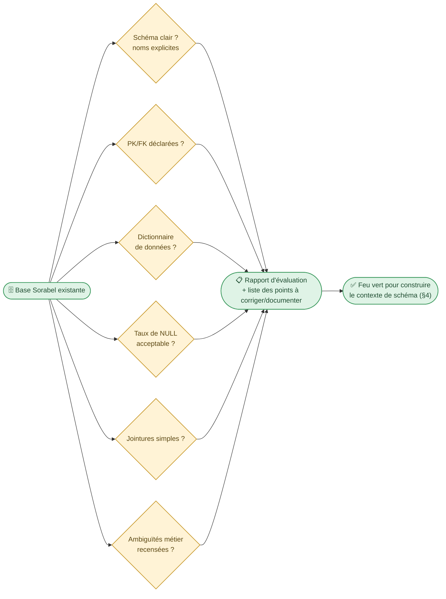
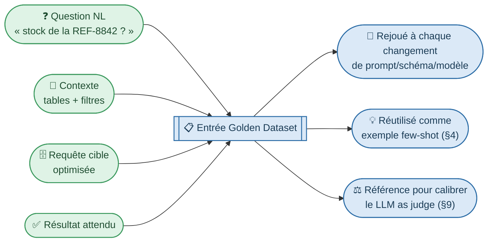
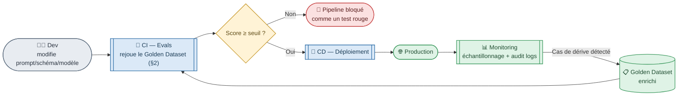
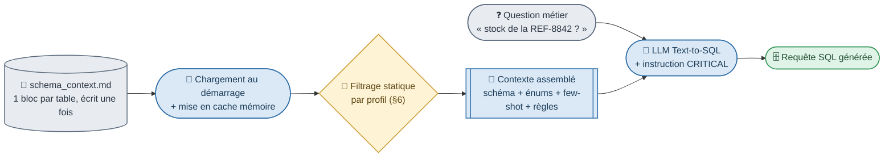
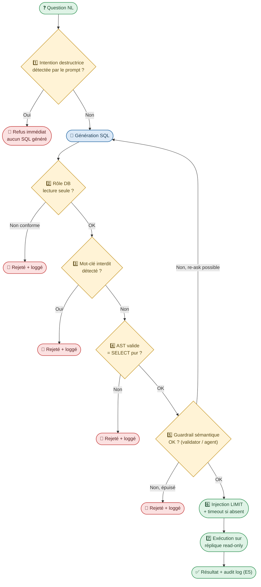
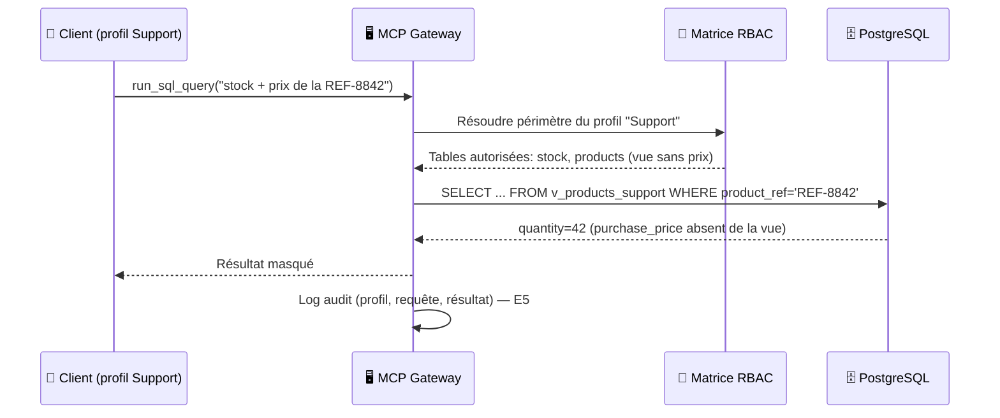
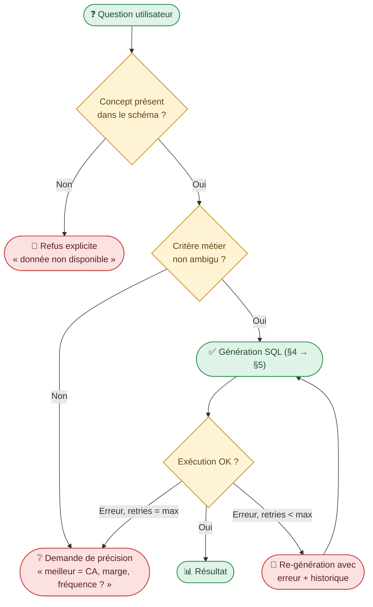
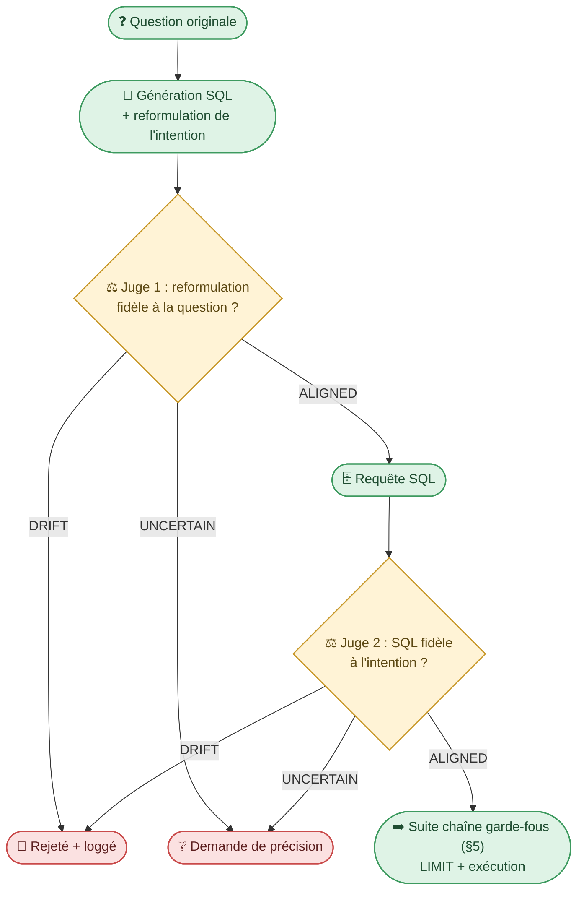
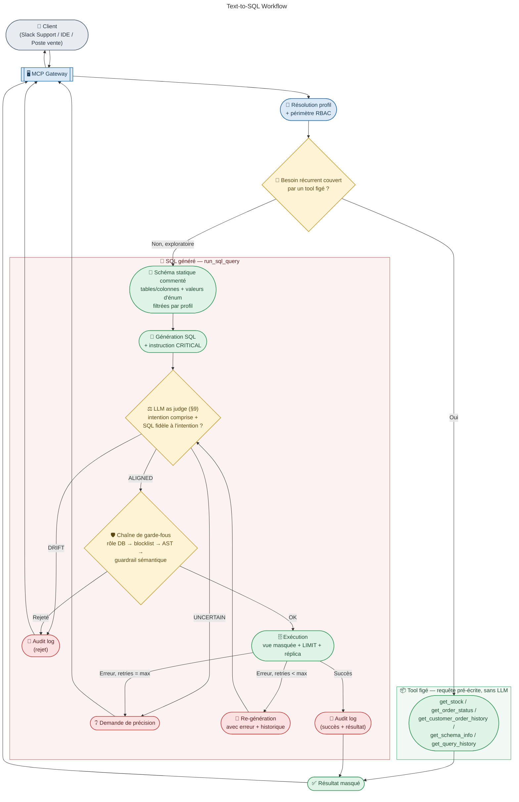

# Text-to-SQL sécurisé : de la question métier à la requête gouvernée

> **Sources** : Building a Smart Text-to-SQL System with RAG and LangChain · Let's Build a Text-to-SQL Project Using LLM · Building Modern Text-to-SQL Systems with GenAI (LinkedIn/Uber/OSS) · I Built a Natural Language SQL Agent With 3 Layers of Safety Guardrails (Horne) · Production-Grade Text-to-SQL Agent with Claude Code, LangGraph, Langfuse, FastAPI and Qdrant (Ulu)
>
> Contexte : Sorabel Data Gateway — module Text-to-SQL (E3, E5)
> Pattern de référence : NL2SQL avec schéma statique commenté injecté au prompt + défense en profondeur + boucle d'auto-correction

---

## 1. Comment évaluer rapidement les données existantes avant de se lancer ?

> **Question posée** : *Comment évaluer facilement les données actuelles (clarté du schéma de la base de données, dictionnaire de données existant le cas échéant, qualité des données — présence de valeurs nulles, déclaration de toutes les clés primaires et étrangères —, jointures, ambiguïtés métier, etc.) ?*

Avant même d'écrire un prompt, il faut un état des lieux : un Text-to-SQL branché sur un schéma flou ou mal documenté hérite de tous ses défauts — le modèle ne peut pas deviner ce qu'un humain lui-même ne sait pas lire. C'est un pré-requis, pas une option : sans cette étape, le contexte de schéma du §4 (même statique) transmet du bruit, pas de la matière utile.

*(Analogie C# : c'est l'équivalent d'auditer une base existante avant de générer un `DbContext` par scaffolding — sans PK/FK déclarées, EF Core ne peut pas inférer les navigations, et le mapping généré est incomplet ou faux.)*

| Axe d'évaluation | Ce qu'on vérifie | Pourquoi c'est bloquant si absent |
|---|---|---|
| **Clarté du schéma** | Noms de tables/colonnes explicites vs cryptiques (`t_ord_dt` vs `orders.order_date`) | Le modèle hallucine des noms de colonnes (cf. §4) d'autant plus que les noms réels sont peu parlants |
| **Dictionnaire de données** | Existe-t-il une doc métier des tables/colonnes (même informelle) ? | Sans lui, il faut le reconstruire avant de rédiger le schéma commenté du §4 — c'est la matière première du contexte injecté |
| **Valeurs nulles** | Taux de `NULL` par colonne critique (ex. `orders.status`, `products.product_ref`) | Un modèle qui ignore qu'une colonne est souvent nulle génère des `WHERE` qui excluent silencieusement des lignes valides |
| **Clés primaires/étrangères déclarées** | Toutes les PK/FK sont-elles présentes en base (pas seulement documentées) ? | Sans FK déclarées, ni un humain ni un LLM ne peut inférer fiablement les jointures — il devine, il se trompe |
| **Jointures** | Les chemins de jointure entre tables métier sont-ils simples (1 clé) ou nécessitent-ils des tables intermédiaires/logique métier ? | Complexité de jointure = risque direct d'erreur de génération, à documenter dans les règles métier (§4) |
| **Ambiguïtés métier** | Termes métier sans définition unique (ex. "meilleur client", "commande active") | Sans clarification en amont, ce sont autant de questions qui finiront en ambiguïté à l'exécution (§8) — mieux vaut les lister avant |



> Cette évaluation nourrit directement les ingrédients du §4 (schéma commenté, valeurs d'énum, règles métier) : plus le score de cet état des lieux est faible, plus il faut investir en amont — quitte à documenter/corriger le schéma avant d'écrire le premier prompt.

---

## 2. Comment démarrer avec un Golden Dataset simple ?

> **Question posée** : *Proposer un Golden Dataset simple composé de : la question (en langage naturel), le contexte (tables et filtres nécessaires, etc.), la requête cible optimisée et le résultat attendu.*

Un Golden Dataset est un petit jeu de référence — questions réelles validées manuellement une fois — servant de **jeu de test de non-régression** : à chaque évolution du prompt, du schéma ou du modèle, on le rejoue pour vérifier qu'aucune question connue ne se met à échouer. Il joue aussi de rôle de banque à few-shot pour le §4.

*(Analogie C# : l'équivalent d'un jeu de tests d'intégration avec données de seed connues — chaque test fixe l'input, l'état de la base et l'output attendu, et sert de filet de sécurité à chaque refactoring.)*

Quatre colonnes suffisent pour démarrer :

| Champ | Rôle | Exemple Sorabel |
|---|---|---|
| **Question (NL)** | Formulation métier réelle, telle qu'un utilisateur la poserait | `"Quel est le stock actuel de la référence REF-8842 ?"` |
| **Contexte** | Tables/colonnes nécessaires + filtres implicites à connaître | Tables : `stock`, `products` · Filtre implicite : `product_ref` est la clé pivot (pas `product_id`) |
| **Requête cible optimisée** | Le SQL de référence, validé et performant (index utilisés, pas de scan complet) | `SELECT quantity FROM stock WHERE product_ref = 'REF-8842'` |
| **Résultat attendu** | La valeur ou le jeu de lignes de référence, figé au moment de la création de l'entrée | `quantity = 42` |



**Pour démarrer simplement** : 15 à 30 entrées suffisent au lancement, couvrant les cas récurrents (§7, candidats aux tools figés), quelques cas ambigus volontaires (§8) et une ou deux questions hors schéma — pas besoin d'un dataset massif pour obtenir un premier filet de sécurité utile.

---


---

## 3. À quoi ressemble le pipeline LLMOps qui encadre tout ça ?

Les chapitres §1-§2 posent les fondations (données, Golden Dataset) ; les chapitres §4 et suivants détaillent le runtime (comment une requête est traitée à l'exécution). Entre les deux, il manque le **pipeline qui fabrique et surveille** ce runtime dans le temps : c'est le pendant MLOps/LLMOps du CI/CD classique — au lieu de tester juste "le code compile", on teste aussi "le modèle répond correctement", en continu.

*(Analogie C# : un pipeline Azure DevOps/GitHub Actions classique build + teste le code à chaque commit ; ici, on ajoute une étape qui rejoue le Golden Dataset (§2) et note les réponses, exactement comme une suite de tests d'intégration bloque le merge en cas de régression.)*

### Les 4 grandes étapes

| Étape | Ce qu'elle fait | Déclencheur |
|---|---|---|
| **1. Dev** | Modification du prompt, du fichier de schéma statique (§4), ou changement de modèle | Un dev pousse une modification |
| **2. CI — Evals** | Le Golden Dataset (§2) est rejoué automatiquement ; chaque requête générée est comparée au résultat attendu, et le LLM as judge (§9) note l'alignement d'intention | Automatique, à chaque pull request |
| **3. CD — Déploiement** | Si le score d'évaluation dépasse un seuil défini, déploiement en prod ; sinon le pipeline bloque, comme un test unitaire rouge | Automatique, si CI vert |
| **4. Monitoring prod** | Les vraies requêtes en production sont échantillonnées et loggées (cf. audit E5) ; les cas de rejet/dérive détectés alimentent de nouvelles entrées du Golden Dataset | Continu |

Le point clé pour des camarades qui connaissent déjà le CI/CD classique : **le Golden Dataset (§2) remplace la suite de tests unitaires**, et **le LLM as judge (§9) remplace l'assertion** — le reste (build, déploiement, rollback) est le même réflexe qu'un pipeline logiciel standard.



> Boucle fermée : le monitoring de prod (étape 4) réinjecte des cas réels dans le Golden Dataset (§2) — le pipeline s'améliore avec l'usage, exactement comme des bugs de prod deviennent des cas de test en développement classique.

---

## 4. Comment passer d'une question métier à une requête juste ?

> **Question posée** : *Comment passer d'une question métier à une requête : que donnez-vous au modèle (schéma commenté, exemples de requêtes, valeurs types) pour qu'il génère juste ?*

Le modèle ne "connaît" pas la base Sorabel. Comme un dev qui arrive sur un projet C# sans le `DbContext` ni la doc, il génère du SQL plausible mais faux s'il ne reçoit que la question. Quatre ingrédients sont injectés dans le prompt à chaque appel :

| Ingrédient | Rôle | Exemple Sorabel |
|---|---|---|
| **Schéma commenté** | Donne la structure ET la sémantique métier (pas juste les noms de colonnes) | `products.product_ref -- clé pivot vers le catalogue` |
| **Valeurs types / distribution des énums** | Évite que le modèle invente une valeur — le cas d'erreur le plus fréquent en pratique | `orders.status IN ('pending','shipped','delivered','cancelled')` écrit **en toutes lettres** dans le schéma, pas seulement le type de colonne |
| **Exemples few-shot** | Ancre le style de requête attendu sur des cas réels validés | `"stock de la REF-8842 ?"` → `SELECT quantity FROM stock WHERE product_ref = 'REF-8842'` |
| **Règles métier documentées** | Certaines questions sont incalculables sans définition métier explicite, même avec un schéma parfait | `"meilleur client" `n'existe pas en colonne ; `"CA du mois"` = `SUM(amount) WHERE status != 'cancelled'` |

Un point issu du retour d'expérience terrain (Ulu) mérite d'être souligné : la **hallucination de noms de colonnes** est l'erreur la plus fréquente et la plus insidieuse (le modèle invente `first_name`/`last_name` alors que la colonne réelle est `full_name`). Deux contre-mesures efficaces et peu coûteuses :

- une instruction de prompt **explicitement marquée comme critique** (ex. préfixe `CRITICAL:`) du type *"utilise uniquement les noms de colonnes exacts listés ci-dessus, n'en invente jamais"* — un LLM suit plus fidèlement une contrainte étiquetée comme critique qu'une formulation neutre ;
- un **contexte de schéma complet et fiable**, quelle que soit sa méthode de construction (cf. ci-dessous) : le modèle ne devine bien que ce qu'on lui donne à lire.

> **RAG de schéma vs schéma statique commenté** : la piste initialement envisagée était un **RAG de schéma** (embedding de la question + recherche vectorielle top-k dans une collection Qdrant/pgvector, pour ne récupérer que les tables/colonnes pertinentes). Écartée comme trop ambitieuse pour le périmètre du stage (infra vectorielle à monter, maintenir, évaluer — pour un gain qui ne se justifie qu'à partir de dizaines de tables). Solution retenue, plus simple : un **schéma statique commenté**, écrit une fois et injecté **en entier** (ou pré-filtré par profil, cf. §6) dans le prompt système à chaque appel — sans embedding ni recherche vectorielle.

**Comment ça marche concrètement :**

1. **Un seul fichier source de vérité** : `schema_context.md` (ou `.yaml`), maintenu à la main dans le repo, un bloc par table — nom, colonnes commentées, PK/FK, valeurs d'énum réelles (matière première : l'audit du §1).
2. **Chargé une fois au démarrage du service**, mis en cache en mémoire (pas relu à chaque requête) — coût de génération nul à l'exécution, contrairement au RAG (pas d'appel d'embedding).
3. **Injecté tel quel dans le prompt système**, avant la question de l'utilisateur, avec les exemples few-shot (§2) et les règles métier — même position que l'aurait occupée le contexte récupéré par un RAG.
4. **Filtrage par profil = statique, pas vectoriel** (cf. §6) : un dictionnaire Python `{profil: [tables_autorisées]}` sélectionne le sous-ensemble de blocs à injecter — un `if`/`in`, pas une recherche par similarité.

*(Analogie C# : c'est l'équivalent d'exposer un `DbContext` avec des `[Comment]` sur chaque colonne et des `enum` explicites, plus un jeu de tests d'intégration servant d'exemples de requêtes LINQ correctes — le fichier de schéma joue le rôle de ce `DbContext` documenté, chargé une fois en mémoire comme un singleton.)*



> Le schéma injecté ne doit exposer que les tables/colonnes déjà autorisées pour le profil appelant (cf. §6) : on ne donne jamais au modèle plus de visibilité que ce que l'utilisateur final aura le droit de voir.

> **Limite de cette approche** : un bon contexte (schéma, énums, few-shot, règles métier) réduit le risque d'erreur mais ne le supprime pas — le modèle reste probabiliste et peut produire une requête plausible mais hors intention (ex. bonne syntaxe, mauvaise période). C'est pourquoi une vérification **a posteriori** de l'alignement question ↔ SQL est nécessaire en complément de ce bon contexte en amont : voir le LLM as judge du §9.

> **Limite propre au schéma statique (vs RAG)** : le prompt grossit avec le nombre de tables — au-delà d'une quinzaine, il devient coûteux en tokens et peut diluer l'attention du modèle. Piste d'évolution si le schéma Sorabel grandit : découper le fichier par domaine métier (`stock.md`, `commandes.md`...) et n'injecter que les domaines pertinents via un routage simple mot-clé → domaine (pas de recherche vectorielle) avant d'envisager un vrai RAG.

---

## 5. Comment garantir la lecture seule (E3) ?

> **Question posée** : *Comment garantir la lecture seule (E3) : droits au niveau de la connexion, validation de la requête générée (liste de mots interdits, analyse), LIMIT par défaut ? Une seule barrière suffit-elle ?*

Non. Se fier à un seul mécanisme, c'est comme valider un formulaire uniquement côté client en JavaScript : ça arrête l'utilisateur poli, pas l'attaquant ni le bug. Deux retours d'expérience concordants (Horne, Ulu) confirment qu'il faut une **défense en profondeur**, chaque barrière couvrant l'échec de la précédente :

| Barrière | Mécanisme | Ce qu'elle bloque |
|---|---|---|
| 1. Instruction système | Le prompt déclare explicitement l'agent "lecture seule" | Couvre ~95 % des cas (Horne) : un "supprime toutes les commandes" est refusé **avant même de générer du SQL** — aucun tool appelé |
| 2. Rôle DB au niveau connexion | Rôle SQL dédié `sorabel_readonly` avec uniquement `GRANT SELECT`, aucun `INSERT/UPDATE/DELETE/DDL` | Toute écriture, même si le SQL généré en contient — barrière déterministe, indépendante du LLM |
| 3. Liste de mots interdits | Blocklist de verbes destructeurs (`INSERT, UPDATE, DELETE, DROP, TRUNCATE, ALTER, CREATE, GRANT, REVOKE`), vérifiée token par token, y compris dans une CTE (`WITH x AS (DELETE FROM orders...)`) | Couvre la quasi-totalité du reste (Horne : ~4,9 %) — déterministe et peu coûteux, mais faux positifs possibles sur un littéral contenant le mot ("update" dans un commentaire client) |
| 4. Validation syntaxique par AST | Parsing de la requête (ex. `sqlglot.parse(sql, dialect="postgres")`) avant tout aller-retour vers la base | Erreurs de syntaxe détectées avant d'atteindre PostgreSQL ; comprend la structure réelle de la requête là où la blocklist ne fait que du pattern matching |
| 5. Guardrail sémantique | Framework de garde-fous applicatifs (ex. **Guardrails AI**, **NeMo Guardrails**), ou un agent validateur dédié type "AgentTool" (Horne) — une seconde passe LLM légère, séparée du générateur, dont le seul rôle est de juger la requête : intention destructrice déguisée, absence de `LIMIT` sur un scan complet, colonnes ambiguës | Couvre le résidu (~0,1 % chez Horne) que ni la blocklist ni l'AST ne peuvent voir : ils sont déterministes et jugent la forme, pas l'intention. Un framework de guardrails packagera aussi ces règles sous forme de *validators* réutilisables avec **re-ask automatique** du LLM si la sortie échoue |

> **Deux notions d'"intention" à ne pas confondre** : la barrière 5 juge l'**intention de sécurité** — la requête est-elle malveillante ou dangereuse, même sous une forme déguisée ? Elle ne dit rien sur la **justesse métier** — la requête répond-elle vraiment à ce que l'utilisateur a demandé ? C'est cette seconde question que traite le LLM as judge dédié du §9, positionné juste avant cette chaîne de garde-fous (cf. diagramme de vue d'ensemble, §10) : un guardrail sémantique peut valider une requête sûre mais hors sujet, le juge d'intention (§9) est la barrière qui couvre spécifiquement ce cas.
| 6. `LIMIT` + `statement_timeout` par défaut | Requête tronquée et bornée en temps si absente du SQL généré (`SET LOCAL statement_timeout`) | Le blocage de prod du vendredi soir (scan complet de table) |
| 7. Réplica dédié | Exécution sur une base réplique, jamais la production | Impact zéro sur la prod même en cas de contournement des barrières précédentes |

**Une seule barrière ne suffit jamais** : l'instruction système échoue sur les cas ambigus (LLM probabiliste), la blocklist échoue sur l'ambiguïté sémantique (elle ne comprend pas l'intention), l'AST ne juge que la syntaxe et pas la sécurité, le guardrail sémantique est plus intelligent mais reste probabiliste (encore un LLM) donc jamais utilisé seul. Chacune couvre l'angle mort de la précédente — retirer une seule couche crée une brèche.

> **Framework vs agent maison** : un framework de guardrails (Guardrails AI, NeMo Guardrails) apporte des *validators* prêts à l'emploi (détection PII, format de sortie structuré, blocklist déclarative) et une boucle de re-ask standardisée — il évite de réimplémenter à la main les barrières 3 et 4. Un agent validateur dédié (comme le `sql_validator` de Horne) est plus flexible mais demande de le construire et de l'évaluer soi-même. Les deux jouent le même rôle de barrière n°5 ; le choix est une question de budget de dev sur les 6 jours du projet Sorabel plutôt qu'une question de sécurité.

*(Analogie C# : le même principe que défense en profondeur en sécurité web — validation côté client **et** côté serveur **et** contraintes en base (`CHECK`, FK) : chaque couche suppose que la précédente a pu échouer.)*



---

## 6. Comment restreindre le périmètre de tables et de colonnes par profil (E5) ?

> **Question posée** : *Comment restreindre le périmètre de tables et de colonnes par profil (le support ne voit jamais prix d'achat ni marges — E5) ?*

Le Support ne doit jamais recevoir `purchase_price` ou `margin`, même si la question ne les demande pas explicitement (le LLM peut faire un `SELECT *`). Deux mécanismes complémentaires, pas exclusifs :

- **Restriction en amont (côté prompt/schéma statique)** : le schéma injecté au modèle (§4) ne contient déjà que les tables/colonnes du profil, sélectionnées via le dictionnaire `{profil: [tables_autorisées]}` — le modèle ne peut pas générer une référence à une colonne qu'il ne connaît pas.
- **Restriction en aval (côté DB, non contournable)** : des **vues SQL par profil** (`v_products_support` sans colonnes sensibles) ou du column-masking, appliquées quel que soit le SQL généré. C'est la barrière qui compte vraiment — le filtrage côté prompt peut être contourné par un prompt injection, pas une vue SQL.

*(Analogie C# : équivalent d'un DTO de projection différent par rôle (`ProductSupportDto` vs `ProductSalesDto`) plutôt que de renvoyer l'entité complète et filtrer côté client.)*



| Profil | Tables visibles | Colonnes masquées |
|---|---|---|
| Support | `stock`, `v_products_support`, `orders` (statut only) | `purchase_price`, `margin` |
| Sales | `stock`, `products`, `orders`, `customers` | — (accès complet lecture) |
| Dev/IDE | `products`, `stock` (schéma only, pas de données prod) | données réelles |

---

## 7. Quels besoins méritent des tools SQL figés plutôt que du SQL généré ?

> **Question posée** : *Quels besoins récurrents méritent des tools SQL figés (requêtes paramétrées écrites par vous : stock d'une référence, statut d'une commande) plutôt que du SQL généré ? Quel est l'intérêt de chaque approche ?*

Tous les besoins ne justifient pas de générer du SQL à la volée. Certains sont récurrents, prévisibles, et gagnent à être des **tools paramétrés figés** (requêtes écrites et validées une fois pour toutes) plutôt que du texte-to-SQL à chaque appel.

| Critère | Tool SQL figé | SQL généré (Text-to-SQL) |
|---|---|---|
| Cas d'usage | Besoin récurrent, prévisible (`get_stock(ref)`, `get_order_status(id)`) | Question exploratoire, ad-hoc, imprévisible |
| Sécurité | Requête paramétrée, zéro risque d'injection, périmètre garanti | Nécessite toute la chaîne de défense du §5 |
| Latence | Faible, requête déjà optimisée/indexée | Variable, dépend de la génération + validation (+ éventuels retries, cf. §8) |
| Flexibilité | Nulle (un tool = un besoin) | Élevée, répond à des questions non anticipées |
| Coût de maintenance | Écrit et testé une fois, stable | Dépend de la qualité du schéma/prompt, dérive possible |

Le projet Ulu illustre bien ce partage des rôles côté MCP : à côté du tool générique `query_tool` (Text-to-SQL complet), il expose aussi `schema_tool` (introspection du schéma par mot-clé) et `history_tool` (historique des dernières requêtes) — des tools figés, paramétrés, sans passage par un LLM, pour des besoins d'observabilité récurrents.

**Recommandation** : exposer d'abord des tools figés pour les besoins connus à haute fréquence (stock, statut commande, historique client), et réserver le SQL généré aux besoins réellement exploratoires — avec toutes les barrières E3/E5 actives. C'est le même arbitrage qu'entre une **stored procedure paramétrée** et un **query builder dynamique** en C# : le premier est prévisible et auditable, le second est flexible mais porte le risque.

---

## 8. Que fait le tool si la question est ambiguë ou hors schéma ?

> **Question posée** : *Que fait le tool si la question est ambiguë ou hors schéma (« quel est le meilleur client ? ») : demander une précision, refuser proprement ?*

Le principe est le même qu'en RAG documentaire (E1) : **refuser proprement plutôt qu'halluciner**. Trois cas distincts appellent trois réponses différentes :

- **Hors schéma** (la donnée n'existe pas dans la base, ex. "quel est le NPS de nos clients ?") → refus explicite et clair, sans tenter une requête approximative sur une colonne qui n'a pas ce sens.
- **Ambiguë** (la donnée existe mais le critère n'est pas défini, ex. "quel est le meilleur client ?" — meilleur en CA ? en fréquence ? en marge ?) → demander une précision plutôt que choisir arbitrairement une interprétation.
- **Erreur d'exécution** (SQL syntaxiquement/structurellement invalide, colonne mal référencée) — cas différent de l'ambiguïté métier : plutôt qu'un refus immédiat, le pattern observé chez Ulu est une **boucle d'auto-correction bornée** : la requête en échec, l'erreur PostgreSQL et l'historique des tentatives précédentes sont réinjectés au modèle pour une nouvelle génération, jusqu'à un nombre maximal de tentatives (ex. 3) — au-delà, on bascule en demande de clarification plutôt que de boucler indéfiniment.



---

## 9. Comment évaluer que l'intention utilisateur est respectée ?

> **Question posée** : *Une notion d'évaluation manque : l'intention utilisateur est-elle bien comprise, et la requête produite correspond-elle à l'intention initiale ?*

Les garde-fous du §5 valident la **sécurité** de la requête (lecture seule, syntaxe, absence de mot interdit) mais aucun ne vérifie sa **justesse sémantique** : une requête peut être 100 % sûre et 100 % hors sujet (ex. "commandes du mois dernier" traduit en `WHERE created_at > NOW() - INTERVAL '7 days'`). C'est un angle mort différent de celui du §8 : le §8 gère l'ambiguïté *déclarée* (le modèle sait qu'il ne sait pas), ici on cherche l'erreur *silencieuse* (le modèle est confiant mais faux).

*(Analogie C# : équivalent d'un test unitaire qui vérifie que le code compile et ne lève pas d'exception, mais ne dit rien sur si le résultat métier est correct — il faut un test d'assertion sur la valeur attendue.)*

### Deux vérifications, un seul juge

Un **LLM as judge** est un second appel LLM, séparé du générateur, dont le seul rôle est de noter — jamais de générer du SQL lui-même. Solution simple en deux temps, ajoutée comme étape de la chaîne de garde-fous (§5, entre la barrière 5 et la barrière 6) :

| Vérification | Ce que le juge reçoit | Ce qu'il évalue |
|---|---|---|
| **1. Compréhension de l'intention** | Question originale + reformulation qu'en a faite le générateur (ex. "je comprends : total des ventes de septembre, commandes annulées exclues") | Le modèle a-t-il capté le bon périmètre métier (période, filtre, entité) avant même de générer du SQL ? |
| **2. Fidélité requête ↔ intention** | Question originale + requête SQL générée (ou sa traduction en langage naturel : "cette requête calcule...") | La requête produite répond-elle réellement à la question, sans dérive (mauvaise colonne, mauvais filtre, périmètre trop large/étroit) ? |

Le juge répond en sortie structurée simple, pas en prose libre — plus fiable à parser et à seuiller :

```json
{"verdict": "ALIGNED | DRIFT | UNCERTAIN", "reason": "..."}
```

- `ALIGNED` → la chaîne continue normalement (barrière 6, `LIMIT`/timeout).
- `DRIFT` → rejeté, comme un échec de garde-fou classique (§5) : logué, pas exécuté.
- `UNCERTAIN` → traité comme une ambiguïté (§8) : demande de clarification plutôt qu'exécution risquée.



### Pourquoi c'est simple à ajouter

- **Pas de nouvelle infra** : un appel LLM de plus (modèle léger/rapide suffit, ce n'est qu'un classifieur à 3 sorties), aucun système de scoring complexe ni jeu de données d'entraînement.
- **S'intègre à la chaîne existante** : même position que la barrière 5 (guardrail sémantique, §5) — c'est en fait une spécialisation de cette barrière, focalisée sur l'intention plutôt que sur la dangerosité.
- **Réutilise le pattern de boucle du §8** : `UNCERTAIN` déclenche exactement le même flux de clarification que l'ambiguïté détectée en amont.
- **Auditable** : le couple `(verdict, reason)` est loggé avec la requête (E5) — utile pour mesurer dans le temps le taux de dérive et affiner le prompt du générateur.

**Limite à connaître** : un juge LLM reste probabiliste — il peut valider une dérive subtile ou rejeter à tort une requête correcte. Il s'ajoute aux barrières déterministes (§5) sans les remplacer, au même titre que le guardrail sémantique.

---

## 10. Livrable intermédiaire

Ce diagramme, **« Text-to-SQL Workflow »**, consolide les mécanismes des §4 à §9 en un seul flux, de la question du client au résultat audité.



> Deux points de journalisation (E5) : à chaque rejet (par le juge d'intention §9 ou la chaîne de garde-fous §5), et à chaque exécution réussie — conformément à E3 ("chaque requête générée et son résultat doivent être journalisés"). Le tool figé n'a pas besoin de cette chaîne : sa requête est déjà validée à l'écriture (§7).

### Outils Text-to-SQL potentiels

"Outil" est à comprendre au sens MCP : une fonction exposée par le serveur Sorabel Data Gateway, appelable par les clients (bot Slack, IDE, poste de vente). Le tableau distingue les tools figés (§7) du tool générique de génération SQL.

| Outil MCP | Paramètres | Description | Exigence servie |
|---|---|---|---|
| `run_sql_query` | `question: str`, `profile: str` | Tool générique Text-to-SQL : schéma statique filtré par profil → génération → chaîne de garde-fous → exécution (§4-§5) | E3, E5 |
| `get_stock` | `product_ref: str` | Tool figé : stock d'une référence produit, requête paramétrée pré-écrite, aucun passage par un LLM | E3 |
| `get_order_status` | `order_id: str` | Tool figé : statut d'une commande | E3 |
| `get_customer_order_history` | `customer_id: str`, `limit: int` | Tool figé : historique des commandes d'un client, périmètre colonnes selon profil (§6) | E3, E5 |
| `get_schema_info` | `profile: str`, `keyword: str` *(optionnel)* | Introspection du schéma (tables/colonnes) réellement visible pour le profil appelant — utile pour cadrer une question avant de l'envoyer à `run_sql_query` | E4, E5 |
| `get_query_history` | `profile: str`, `limit: int` | Retourne les dernières requêtes exécutées (ou rejetées) pour ce profil, à des fins d'audit ou de debug côté client | E5 |

> Chaque outil est indépendant de son implémentation interne (parseur SQL, framework de guardrails, connexion réplica...) : ces briques restent internes au serveur MCP et ne sont jamais exposées directement aux clients — c'est tout l'intérêt de l'architecture MCP unifiée (**E4**).

---

# Glossaire (Text-to-SQL)

### Exigences IT du cahier des charges Sorabel concernées

| ID | Périmètre | Description de l'exigence |
|---|---|---|
| **E3** | Text-to-SQL en lecture seule | Toute requête SQL générée et exécutée doit être strictement en lecture seule, restreinte aux tables autorisées pour le profil demandeur. Chaque requête et son résultat doivent être journalisés. |
| **E5** | Auditabilité & masquage | Tous les appels sont journalisés ; les colonnes sensibles sont masquées pour les profils non autorisés. |

### Concepts Text-to-SQL

| Terme | Définition |
|---|---|
| **Text-to-SQL / NL2SQL** | Génération automatique de requêtes SQL à partir d'une question en langage naturel |
| **Schéma statique commenté** | Fichier de schéma (tables, colonnes commentées, PK/FK, valeurs d'énum) écrit une fois, chargé en mémoire au démarrage et injecté tel quel (ou pré-filtré par profil) dans le prompt à chaque appel — sans embedding ni recherche vectorielle |
| **RAG de schéma** | Alternative plus avancée (écartée pour ce stage, trop ambitieuse) : récupération dynamique par embedding + recherche vectorielle des seules tables/colonnes pertinentes pour une question, utile surtout au-delà d'une quinzaine de tables |
| **Few-shot prompting** | Fournir au modèle des exemples question→requête validés pour guider le style et la structure générés |
| **Distribution de valeurs (énum)** | Liste explicite des valeurs réelles d'une colonne catégorielle (ex. `status`), incluse dans le contexte pour éviter que le modèle en invente |
| **Instruction critique ("CRITICAL:")** | Contrainte de prompt explicitement mise en exergue pour être suivie plus fidèlement qu'une formulation neutre — utile contre l'hallucination de noms de colonnes |
| **AST (Abstract Syntax Tree)** | Représentation structurée d'une requête SQL parsée (ex. via `sqlglot`), permettant une validation syntaxique fiable, complémentaire à une blocklist de mots-clés |
| **Blocklist de mots-clés** | Liste de verbes SQL destructeurs (`INSERT`, `DELETE`, `DROP`...) vérifiés token par token avant exécution, y compris dans les sous-requêtes/CTE |
| **Guardrail (garde-fou applicatif)** | Couche de validation sémantique de la sortie LLM — via un framework dédié (Guardrails AI, NeMo Guardrails) ou un agent validateur — jugeant l'intention et le risque d'une requête plutôt que sa seule forme, avec re-ask automatique du LLM en cas d'échec |
| **Défense en profondeur** | Empilement de plusieurs mécanismes de sécurité indépendants (instruction, rôle DB, blocklist, AST, LIMIT, réplica), chacun supposant que les précédents peuvent échouer |
| **RBAC (Role-Based Access Control)** | Contrôle d'accès basé sur le rôle/profil de l'appelant plutôt que sur son identité individuelle |
| **Column masking** | Occultation ou omission de colonnes sensibles dans le résultat renvoyé à un profil non autorisé |
| **Vue SQL (VIEW)** | Requête stockée exposée comme une pseudo-table, utilisée ici pour restreindre les colonnes visibles par profil |
| **Tool paramétré (figé)** | Fonction MCP exposant une requête SQL pré-écrite et testée, appelée avec des paramètres simples (pas de génération) |
| **Boucle d'auto-correction** | Cycle génération → validation → exécution → (en cas d'erreur) re-génération avec l'erreur en contexte, borné par un nombre maximal de tentatives avant de basculer en demande de clarification |
| **LLM as judge** | Second appel LLM, séparé du générateur, dont le seul rôle est d'évaluer/noter une sortie (jamais d'en produire une nouvelle) — ici utilisé pour juger l'alignement entre l'intention utilisateur et le SQL généré |
| **Dérive d'intention (intent drift)** | Cas où la requête générée est syntaxiquement et sémantiquement valide mais ne répond pas à la question réellement posée (erreur silencieuse, différente de l'ambiguïté déclarée du §8) |
| **Golden Dataset** | Petit jeu de référence de questions validées manuellement (question NL, contexte, requête cible, résultat attendu), rejoué comme test de non-régression à chaque évolution du prompt/schéma/modèle |
| **Dictionnaire de données** | Documentation métier des tables/colonnes d'une base (nom, sens, valeurs possibles) — matière première du schéma commenté injecté au modèle (§4) |
| **Pipeline LLMOps** | Équivalent CI/CD pour un système basé LLM : le Golden Dataset (§2) joue le rôle des tests unitaires, le LLM as judge (§9) celui de l'assertion — build, évaluation automatique, déploiement conditionnel, monitoring en boucle fermée |

### Analogies .NET / C# utilisées dans ce document

| Concept Text-to-SQL | Analogie C# / .NET |
|---|---|
| Schéma commenté + valeurs d'énum + few-shot injectés au modèle | `DbContext` documenté avec `[Comment]` et `enum` explicites, plus tests d'intégration comme exemples |
| Défense en profondeur (E3) | Validation client **et** serveur **et** contraintes SQL (`CHECK`, FK) |
| Vue SQL filtrée par profil (E5) | DTO de projection par rôle (`ProductSupportDto` vs `ProductSalesDto`) |
| Tool figé vs SQL généré | Stored procedure paramétrée vs query builder dynamique |
| Refus si hors schéma / ambigu | Validation stricte des inputs avant d'atteindre la couche métier |
