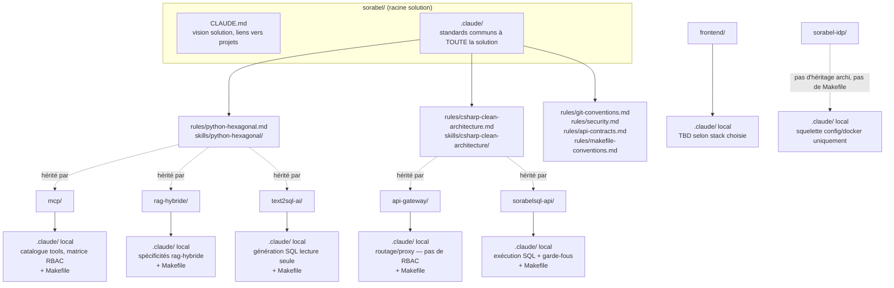

# Organisation du dossier `.claude/` — Solution Sorabel (monorepo, 7 projets)

## 1. Contexte

7 projets, 2 stacks applicatives + 1 composant infra, 1 solution :

| Projet | Stack | Architecture | Makefile |
|---|---|---|---|
| `frontend` | à déterminer | — | — (hors périmètre tant que la stack n'est pas choisie) |
| `sorabel-idp` | Keycloak (conteneurisé) | — (config/infra, pas d'archi applicative) | — (hors périmètre, pas C#/Python) |
| `api-gateway` | C# | Clean Architecture | ✅ |
| `text2sql-ai` | Python | Hexagonale | ✅ |
| `sorabelsql-api` | C# + PostgreSQL | Clean Architecture | ✅ |
| `mcp` | Python | Hexagonale | ✅ |
| `rag-hybride` | Python | Hexagonale | ✅ |

> Renommages / évolutions depuis la version précédente :
> - `identity-provider` → **`sorabel-idp`** (bascule vers Keycloak conteneurisé — n'est plus une app C#/Python custom)
> - `authorization-gateway` → **`api-gateway`** (recentré sur le rôle de hub de routage pur, cf. §6.1 de `MCP.md` : *aucune logique d'autorisation* côté gateway, celle-ci reste portée par le serveur `mcp`)
> - `tools-api` **supprimé**, remplacé par **`sorabelsql-api`** (C# + PostgreSQL — exécution SQL et tools figés : stock, commandes...)
> - **`text2sql-ai`** ajouté (Python — Agent Text-to-SQL dédié, génère du SQL en lecture seule, jamais d'exécution)
> - **Automatisation Makefile** ajoutée pour tous les projets C# et Python (build, tests, Docker) — cf. §5

**Principe retenu** : Claude Code fusionne automatiquement le `CLAUDE.md` racine avec celui du dossier courant (remontée jusqu'à la racine du repo). On exploite cette hiérarchie pour **factoriser le commun à la racine** (`.claude/` solution) et **spécialiser par projet** (`.claude/` local), au lieu de dupliquer les mêmes règles projet par projet.

---

## 2. Hiérarchie et héritage



**Règle de fond** : si une règle s'applique à ≥ 2 projets partageant la même stack/archi → elle vit à la racine. Si elle est propre à un seul projet (domaine métier, endpoints spécifiques) → elle vit dans le `.claude/` local du projet. `sorabel-idp` fait exception : c'est un service Keycloak conteneurisé à configurer, pas une app développée en interne — il n'hérite d'aucune règle d'architecture (ni hexagonale, ni clean archi), ni du Makefile standardisé.

---

## 3. Arborescence complète

```
sorabel/
├── CLAUDE.md                              # Vision solution, liste des projets, conventions transverses
├── .claude/                               # Standards de la SOLUTION (versionné)
│   ├── settings.json                      # Permissions/hooks par défaut, valables partout
│   ├── settings.local.json                # Préférences perso globales (gitignored)
│   │
│   ├── rules/
│   │   ├── git-conventions.md             # Convention de commits, branches, PR
│   │   ├── security.md                    # Secrets, gestion des credentials (commun Python/C#)
│   │   ├── api-contracts.md               # Conventions REST/OpenAPI communes à toutes les API
│   │   ├── python-hexagonal.md            # Archi hexagonale Python (ports/adapters, domain pur)
│   │   ├── csharp-clean-architecture.md   # Clean Architecture C# (couches, dépendances)
│   │   └── makefile-conventions.md        # Cibles standard (build/test/docker-*) — projets C#/Python uniquement
│   │
│   ├── commands/                          # Workflows valables sur tous les projets
│   │   ├── new-service.md                 # /new-service → scaffold un nouveau projet dans la solution
│   │   ├── sync-openapi.md                # /sync-openapi → vérifie cohérence contrats API inter-projets
│   │   └── review-pr.md                   # /review-pr → checklist de revue générique
│   │
│   ├── agents/
│   │   ├── architecture-reviewer.md       # Vérifie le respect hexagonale/clean archi selon le projet
│   │   └── security-auditor.md            # Audit sécurité transverse
│   │
│   ├── hooks/
│   │   └── dispatch-lint.sh               # Route vers ruff (.py) ou dotnet format (.cs) selon extension
│   │
│   └── skills/                            # Compétences packagées, réutilisables inter-projets
│       ├── python-hexagonal/SKILL.md      # Comment structurer domain/ports/adapters en Python
│       ├── csharp-clean-architecture/SKILL.md
│       └── pgvector-migration/SKILL.md    # Utile pour rag-hybride
│
├── frontend/
│   ├── CLAUDE.md                          # @../CLAUDE.md + stack à définir
│   └── .claude/                           # À compléter une fois la stack choisie
│
├── sorabel-idp/
│   ├── CLAUDE.md                          # @../CLAUDE.md + contexte Keycloak (pas de règle d'archi héritée)
│   └── .claude/                           # Squelette minimal — pas de Makefile (hors C#/Python)
│       └── settings.json                  # Permissions/config docker uniquement
│
├── api-gateway/
│   ├── Makefile                           # make build / test / docker-build / docker-up / lint
│   ├── CLAUDE.md                          # @../.claude/rules/csharp-clean-architecture.md + contexte gateway
│   └── .claude/
│       ├── settings.json
│       ├── rules/
│       │   └── routing-proxy.md           # Conventions de routage pur — pas de logique RBAC ici (cf. mcp/)
│       └── commands/
│           └── new-route.md               # /new-route → scaffold une route proxifiée vers un backend
│
├── text2sql-ai/
│   ├── Makefile                           # make build / test / docker-build / docker-up / lint
│   ├── CLAUDE.md                          # @../.claude/rules/python-hexagonal.md + contexte Agent Text-to-SQL
│   └── .claude/
│       ├── settings.json
│       ├── rules/
│       │   └── sql-generation-readonly.md # Génération SQL depuis schéma commenté filtré par profil, jamais d'exécution
│       └── commands/
│           └── new-schema-mapping.md      # /new-schema-mapping → ajoute une table au schéma exposé au LLM
│
├── sorabelsql-api/
│   ├── Makefile                           # make build / test / docker-build / docker-up / lint
│   ├── CLAUDE.md                          # @../.claude/rules/csharp-clean-architecture.md + contexte sorabelsql-api
│   └── .claude/
│       ├── settings.json
│       ├── rules/
│       │   └── sql-execution-guardrails.md # Chaîne de garde-fous exécution (run_sql_query), tools figés, PostgreSQL
│       └── commands/
│           └── new-fixed-tool.md          # /new-fixed-tool → scaffold un tool figé (ex: get_stock)
│
├── mcp/
│   ├── Makefile                           # make build / test / docker-build / docker-up / lint
│   ├── CLAUDE.md                          # @../.claude/rules/python-hexagonal.md + contexte MCP server
│   └── .claude/
│       ├── settings.json
│       ├── rules/
│       │   └── mcp-primitives.md          # Catalogue tools, matrice d'accès (profil × tool × ressources)
│       └── commands/
│           └── new-tool.md                # /new-tool → scaffold un tool MCP + entrée matrice RBAC
│
└── rag-hybride/
    ├── Makefile                           # make build / test / docker-build / docker-up / lint
    ├── CLAUDE.md                          # @../.claude/rules/python-hexagonal.md + contexte RAG
    └── .claude/
        ├── settings.json
        ├── rules/
        │   ├── rag-architecture.md        # retrieval/, ingestion/, generation/
        │   └── testing-pytest.md
        └── commands/
            ├── eval-retrieval.md
            └── new-endpoint.md
```

---

## 4. Ce qui est mutualisé vs local

| Élément | Racine `sorabel/.claude/` | Local `<projet>/.claude/` |
|---|---|---|
| Conventions Git, sécurité, contrats API | ✅ | — |
| Règles d'architecture (hexagonale / clean archi) | ✅ (1 fichier par archi, pas par projet) | référencé via `@../.claude/rules/...` — sauf `sorabel-idp` (aucune) |
| Convention Makefile (cibles standard) | ✅ (`rules/makefile-conventions.md`) | `Makefile` à la racine du projet, cibles conformes à la convention |
| Règles métier / domaine | — | ✅ (propre à chaque projet) |
| Commands génériques (revue de code, scaffolding solution) | ✅ | — |
| Commands spécifiques au projet (ex: `/new-fixed-tool`, `/eval-retrieval`) | — | ✅ |
| Settings (permissions d'outils) | Valeurs par défaut | Override si besoins spécifiques (ex: accès PostgreSQL pour `sorabelsql-api`) |
| Skills réutilisables (patterns d'archi, migration pgvector) | ✅ | référencées, pas dupliquées |

---

## 5. Automatisation Makefile (C# / Python uniquement)

**Portée** : `api-gateway`, `sorabelsql-api` (C#), `text2sql-ai`, `mcp`, `rag-hybride` (Python). **Exclus** : `frontend` (stack non choisie), `sorabel-idp` (config Keycloak, pas de code applicatif).

Un `Makefile` à la racine de chaque projet concerné, avec un jeu de cibles **identiques dans leur nom** (même si l'implémentation diffère C#/Python) pour une expérience développeur homogène sur tout le monorepo :

| Cible | C# (`dotnet`) | Python |
|---|---|---|
| `make build` | `dotnet build` | `pip install -e .` / `poetry install` |
| `make test` | `dotnet test` | `pytest` |
| `make lint` | `dotnet format --verify-no-changes` | `ruff check .` |
| `make docker-build` | `docker build -t <projet> .` | `docker build -t <projet> .` |
| `make docker-up` | `docker compose up` | `docker compose up` |
| `make docker-down` | `docker compose down` | `docker compose down` |
| `make clean` | `dotnet clean` | suppression `__pycache__`, `.venv`, etc. |

La convention (noms de cibles, structure minimale attendue) est décrite une seule fois à la racine (`@.claude/rules/makefile-conventions.md`) et référencée par chaque `CLAUDE.md` de projet C#/Python — cohérent avec le principe "factoriser le commun, spécialiser le local" du §1. Le hook `dispatch-lint.sh` peut s'appuyer sur `make lint` plutôt que d'invoquer `ruff`/`dotnet format` directement, pour rester agnostique de la stack.

Un `Makefile` racine (`sorabel/Makefile`) peut en complément dispatcher vers les sous-projets (ex: `make test-all` → boucle sur les 5 projets C#/Python), mais ce n'est pas couvert par ce cadrage `.claude/` — à voir en fonction du besoin CI.

---

## 6. Exemple — `CLAUDE.md` racine

```markdown
# Sorabel — Vision solution

Solution composée de 7 projets :
- frontend (stack à déterminer)
- sorabel-idp (Keycloak conteneurisé, authn/JWT)
- api-gateway (C#, clean architecture — hub de routage, pas de RBAC)
- text2sql-ai (Python, hexagonale — génération SQL lecture seule)
- sorabelsql-api (C# + PostgreSQL, clean architecture — exécution SQL, tools figés)
- mcp (Python, hexagonale — catalogue de tools, matrice RBAC)
- rag-hybride (Python, hexagonale)

## Règles transverses
@.claude/rules/git-conventions.md
@.claude/rules/security.md
@.claude/rules/api-contracts.md
@.claude/rules/makefile-conventions.md

## Règles d'architecture par stack
- Projets Python hexagonaux → @.claude/rules/python-hexagonal.md
- Projets C# clean architecture → @.claude/rules/csharp-clean-architecture.md

`sorabel-idp` n'hérite d'aucune règle d'architecture ni du Makefile standard (service Keycloak à configurer, pas une app développée en interne).

Chaque projet a son propre CLAUDE.md pour le contexte métier local.
```

## 7. Exemple — `CLAUDE.md` d'un projet (text2sql-ai)

```markdown
# text2sql-ai

@../CLAUDE.md
@../.claude/rules/python-hexagonal.md
@../.claude/rules/makefile-conventions.md

## Contexte spécifique
Agent Text-to-SQL, exposé via FastAPI. Génère une requête SQL en lecture seule
à partir d'une question en langage naturel + schéma statique commenté filtré
par profil. N'exécute jamais de SQL lui-même — accessible uniquement via
l'API Gateway (aucun accès direct depuis mcp/ ni les clients).

## Règles locales
@.claude/rules/sql-generation-readonly.md
```

---

## 8. Point d'attention

- Le projet `frontend` n'a pas encore de stack définie : sa section `.claude/` reste un squelette tant que le choix n'est pas fait — pas de règles à inventer prématurément, et pas de Makefile tant que l'outillage (npm/yarn/pnpm...) n'est pas fixé.
- `sorabel-idp` est un **service Keycloak conteneurisé à configurer**, pas une application développée dans la solution : son `.claude/` local reste un squelette minimal (config/docker), sans `rules/` métier, sans `commands/` de scaffolding applicatif, et sans Makefile standardisé (son cycle de vie est piloté par `docker compose`, pas par `make build`/`make test`).
- `api-gateway` ne porte **aucune logique d'autorisation** (cf. §6.1 de `MCP.md`) : c'est un hub de routage pur (analogie YARP/Ocelot). La matrice d'accès (profil × tool × ressources) reste entièrement portée par `mcp/` — à ne pas dupliquer côté gateway.
- `text2sql-ai` et `sorabelsql-api` se partagent la responsabilité SQL en deux étapes distinctes : génération (lecture seule, jamais d'exécution) vs exécution (chaîne de garde-fous, PostgreSQL). Cette séparation doit se refléter dans des règles locales distinctes, pas fusionnées.
- Le Makefile normalise les **noms de cibles**, pas l'implémentation : chaque projet garde son outillage natif (`dotnet` vs `pip`/`poetry`/`pytest`/`ruff`) derrière une interface commune.
- Si `mcp` et `rag-hybride` finissent par partager des patterns très spécifiques (au-delà de l'hexagonale générique), ça vaut le coup de créer une règle dédiée à la racine plutôt que de la dupliquer.
