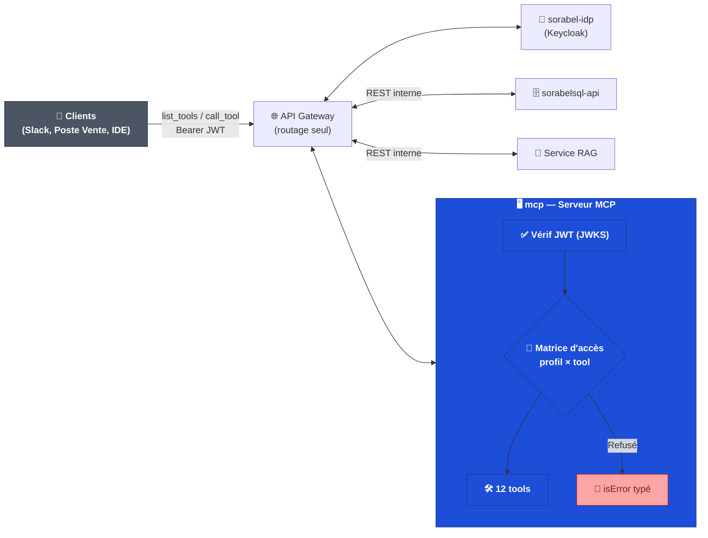

# mcp — Sorabel Data Gateway (serveur MCP)

> Serveur MCP unifié exposant en **Tools** l'accès gouverné aux documents (RAG) et aux données (Text-to-SQL) de Sorabel, pour plusieurs clients (bot Slack Support, poste de vente, IDE développeur).

## 1. Rôle

Ce serveur est le **point d'orchestration unique** du système : il ne stocke ni n'indexe rien lui-même, il expose un catalogue de tools, vérifie l'identité et les droits (via [`sorabel-idp`](../sorabel-idp/README.md)), applique la matrice d'accès, puis délègue l'exécution aux backends (`sorabelsql-api` pour le SQL, service RAG pour la recherche documentaire).

> Analogie .NET : un contrôleur d'API qui n'implémente aucune logique métier — il valide l'`[Authorize]`, résout la policy, puis appelle les services applicatifs injectés.

## 2. Architecture

*Convention couleurs reprise dans tous les docs Sorabel : gris = agents/clients, bleu = composants MCP, vert = flux légitime, rouge = friction/risque.*

## 3. Catalogue des tools

| Tool | Type | Entrées | Backend appelé |
|---|---|---|---|
| `answer_question` | Composite (RAG) | `query` | Service RAG (via 3 briques) |
| `search_documents` | Brique (RAG) | `query`, `top_k` | Service RAG |
| `lookup_by_reference` | Brique (RAG) | `product_ref` | Service RAG |
| `get_document_metadata` | Brique (RAG) | `doc_id` | Service RAG |
| `check_answer_confidence` | Brique (RAG) | `query` | Service RAG |
| `list_document_types` | Brique (RAG) | — | Service RAG |
| `run_sql_query` | Génératif (SQL) | `question`, `profile` | `sorabelsql-api` |
| `get_stock` | Figé (SQL) | `product_ref` | `sorabelsql-api` |
| `get_order_status` | Figé (SQL) | `order_id` | `sorabelsql-api` |
| `get_customer_order_history` | Figé (SQL) | `customer_id`, `limit` | `sorabelsql-api` |
| `get_schema_info` | Introspection (SQL) | `profile`, `keyword?` | `sorabelsql-api` |
| `get_query_history` | Audit (SQL) | `profile`, `limit` | `sorabelsql-api` |

`answer_question` orchestre en interne 3 briques mais **ne génère aucun texte** : c'est le LLM du client qui rédige la réponse à partir du résultat agrégé (chunks + métadonnées + catalogue).

## 4. Sécurité — défense en profondeur

1. **Entrée du serveur** : `list_tools()` ne renvoie que les tools autorisés pour le profil du token (`sorabel_profile`) — un tool absent du catalogue ne peut pas être appelé, ni halluciné.
2. **Dans chaque tool** : contrôle fin (tables réellement interrogées, masquage de colonnes), délégué au backend concerné.

| Profil | Tools autorisés |
|---|---|
| `support` | `search_documents`, `lookup_by_reference`, `get_stock`, `get_order_status` |
| `sales` | tous les tools RAG + `run_sql_query`, `get_stock`, `get_order_status`, `get_customer_order_history` |
| `dev` | `search_documents`, `get_document_metadata`, `check_answer_confidence`, `list_document_types`, `get_schema_info`, `get_query_history` |

## 5. Primitives MCP utilisées

Seule la primitive **Tools** est exposée. Pas de **Resources** (toute lecture doit passer par la matrice d'accès + audit, que les Resources ne portent pas nativement) ni de **Prompts** (candidat futur : template guidant `run_sql_query` vs tools figés).

## 6. Gestion des erreurs

Chaque refus/échec renvoie un `CallToolResult` avec `isError: true` + un code stable (`UNAUTHORIZED_TOOL`, `UNAUTHORIZED_TABLE`, `NOT_FOUND_IN_CORPUS`, `SCHEMA_MISMATCH`) — jamais un texte que le LLM client pourrait paraphraser comme une réponse valide.

## 7. Dépendances

- [`sorabel-idp`](../sorabel-idp/README.md) — authentification et profil (claim `sorabel_profile`)
- [`sorabelsql-api`](../sorabelsql-api/README.md) — exécution SQL gouvernée
- Service RAG (ingestion + hybrid retrieval, hors périmètre de ce dépôt)

## 8. Stack technique

- Python, convention `@mcp.tool()` (FastMCP)
- Vérification JWT via JWKS (cache local)
- Matrice d'accès versionnée (YAML/JSON), résolue par profil

## 9. Glossaire

| Terme | Définition |
|---|---|
| Tool composite | Tool orchestrant plusieurs briques sans générer de texte lui-même |
| Brique | Tool élémentaire, appelable seul ou via un composite |
| Matrice d'accès | Table profil × tool × collections/tables, appliquée en deux points |
| `isError` | Champ du résultat de tool signalant un échec, à traiter avant toute rédaction LLM |

---
*Document généré à partir des fiches de cadrage `MCP.md`, `Advanced_RAG.md`, `Text2SQL_Sorabel.md`.*
