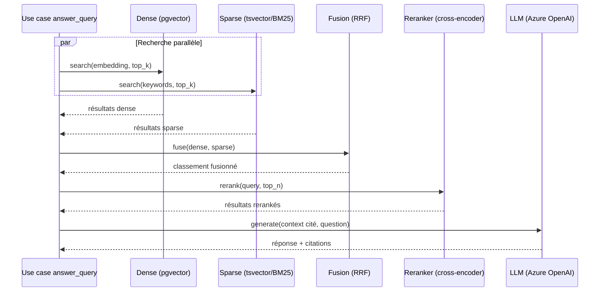

# Architecture RAG hybride — rag-hybride

## Structure du domaine

```
app/
├── domain/
│   ├── models.py           # Document, Chunk, RetrievalResult
│   └── ports.py             # VectorStorePort, LexicalSearchPort, EmbeddingPort, LLMPort
├── application/
│   └── use_cases/
│       ├── ingest_document.py
│       └── answer_query.py   # orchestre retrieval + fusion + génération citée
├── infrastructure/
│   ├── postgres/
│   │   ├── pgvector_repository.py   # implémente VectorStorePort
│   │   └── bm25_repository.py       # implémente LexicalSearchPort (tsvector)
│   └── azure_openai/
│       ├── embedding_client.py      # implémente EmbeddingPort
│       └── llm_client.py            # implémente LLMPort
└── api/
    └── routes/
        ├── query.py          # POST /api/v1/query
        └── ingest.py          # POST /api/v1/ingest
```

## Pipeline d'ingestion

1. **Normalisation** : chaque format source (PDF, HTML, Markdown) converge vers un schéma pivot commun (texte + métadonnées).
2. **Chunking** : **par section, taille adaptative** — pas de découpage classique 500-1000 tokens. Le corpus Sorabel est composé de documents courts (fiches produit, procédures) ; un chunk trop large dilue le signal, un découpage fixe casse les sections logiques.
3. **Métadonnées obligatoires par chunk** : `document_id`, `document_type`, `title`, `version`, `date`, et surtout **`product_ref`** — métadonnée décisive car une référence produit exacte (`REF-8842`) doit être retrouvable par lookup exact, pas seulement par similarité sémantique.
4. **Déduplication/versioning** : une nouvelle version d'une fiche remplace l'ancienne dans l'index (pas d'accumulation de doublons).
5. **Double indexation** : embedding (pgvector) **et** indexation lexicale (`tsvector`/BM25) sur le même chunk.

## Pipeline de retrieval (hybride)



- **Fusion** : Reciprocal Rank Fusion — `score = Σ 1/(k + rank_i)`. Pas de pondération manuelle à ce stade (plus simple, sans tuning).
- **Reranking** : cross-encoder appliqué post-fusion sur le top-N, avant génération.
- **Pourquoi l'hybride** : la recherche dense seule rate les lookups exacts par référence (`REF-8842` n'a pas de proximité sémantique particulière) ; BM25 les rattrape par matching lexical exact. Le pattern inverse est vrai pour les questions en langage naturel complet.

## Garantie E1 (citations + refus)

- Toute réponse générée est une **sortie structurée** (pas du texte libre) : `{ answer, sources: [{title, reference, date}] }`.
- Le prompt de génération interdit explicitement de répondre sans source, et impose un refus explicite (`"Je ne trouve pas cette information dans le corpus"`) si le score de pertinence post-reranking est sous un seuil défini.
- Ne jamais laisser le LLM "compléter" une réponse partielle avec ses connaissances générales.

## Évaluation (E6)

- Jeu de test dédié (`questions_rag.jsonl`), avec une métrique par catégorie de question (lookup exact vs langage naturel).
- Protocole avant/après : comparer retrieval hybride + reranking vs dense seul, sur le même jeu de test, avant chaque changement significatif du pipeline.
