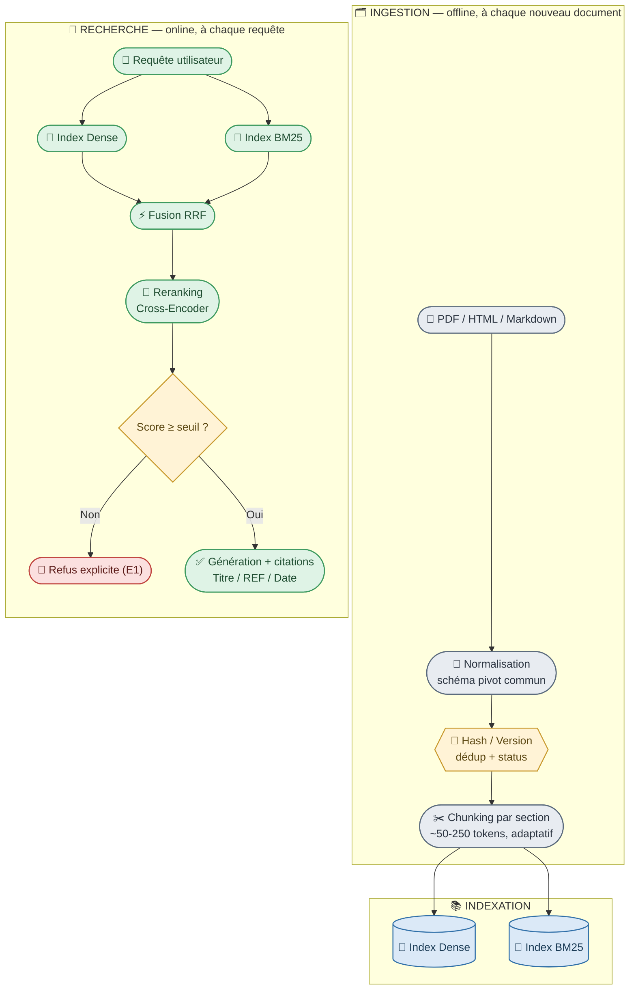
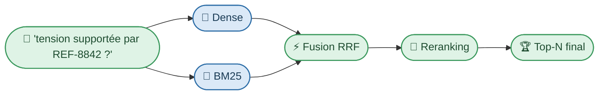
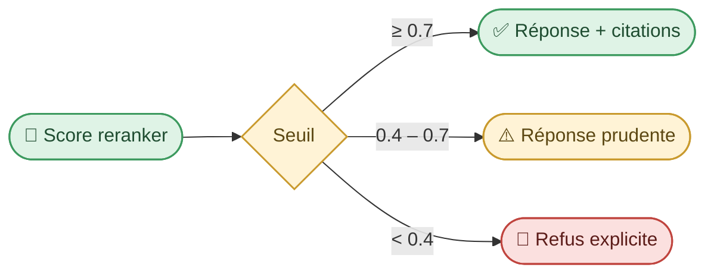
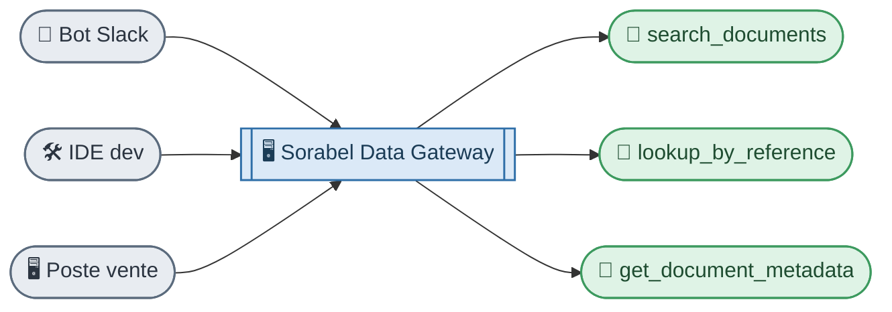

# RAG Hybride — Sorabel Data Gateway

Module documentaire du serveur MCP **Sorabel Data Gateway**. Il répond aux requêtes sur le corpus technique (datasheets, manuels, procédures SAV) avec **recherche exacte + langage naturel**, **citations obligatoires** et **refus si incertain**.

> Analogie C# : le pendant documentaire du module Text-to-SQL — même serveur MCP, mêmes principes de gouvernance (E4/E5), mais sur un corpus non structuré plutôt qu'une base relationnelle.

---

## 1. Exigences couvertes

| ID | Exigence | Mécanisme |
|---|---|---|
| **E1** | Citation systématique (Titre + Référence + Date) ou refus si absent du corpus | Sortie structurée + seuil de reranking |
| **E2** | Lookup exact (`REF-8842`) **et** requête en langage naturel | Hybride Dense + BM25 |
| **E6** | Mesurer le gain du hybride+reranking vs recherche vectorielle seule | Benchmark A/B sur `questions_rag.jsonl` |

---

## 2. Architecture du pipeline



| Étape | Rôle | Exigence |
|---|---|---|
| Normalisation multi-format | Schéma pivot commun (`IDocumentParser` → DTO normalisé) | E1, E2 |
| Dédup / versioning | `content_hash` = ETag ; ancienne version → `deprecated` | E1 |
| Index Dense + BM25 | Sens vs correspondance exacte | E2 |
| Fusion RRF + Reranking | Classement final fiable | E1, E2, E6 |
| Décision réponse/refus | Porte de confiance | E1 |

---

## 3. Pourquoi hybride (et pas dense seul) ?

Un embedding dense capture le **sens**, pas les tokens exacts. `REF-8842` est un identifiant arbitraire (comme un `Guid`) : le dense search peut confondre `REF-8842` et `REF-8843`.

| Moteur | Force | Faiblesse |
|---|---|---|
| **Dense** | Comprend l'intention (« tension supportée » ≈ « tension nominale ») | Confond les identifiants proches |
| **BM25** | Exact sur les termes rares (`REF-8842`) | Ignore les reformulations |
| **Hybride (RRF)** | Combine les deux, sans arbitrage a priori | Score de fusion approximatif |
| **+ Reranking (cross-encoder)** | Juge requête+document ensemble → score de pertinence fiable | Plus coûteux, appliqué seulement au top-K |



---

## 4. Chunking & métadonnées

**Constat corpus Sorabel** : documents courts (notices, procédures SAV) → granularité classique (500-1000 tokens) inadaptée.

- **~50-250 tokens** par chunk, découpage par **section logique** (pas par nombre de tokens fixe)
- Document < ~150 tokens → **1 chunk = le document entier**
- **1 tableau = 1 chunk entier**, jamais scindé
- Overlap ~10-15% au-delà de 50 tokens

| Métadonnée | Rôle |
|---|---|
| `doc_id` / `product_ref` | Identifiant logique + **clé pivot vers le SQL** |
| `version` / `status` | `active` / `deprecated`, filtré **avant** retrieval |
| `content_hash` | Déduplication exacte (SHA-256) |
| `published_date` | Citation (E1), arbitrage de version |
| `document_type` | `datasheet` / `manuel` / `procedure_sav` |
| `content_type` | `text` / `table` |
| `url` / `source_path` | Citation cliquable (E1), audit (E5) |

> `product_ref` est **décisive** : filtre structuré avant recherche vectorielle, regroupe les chunks épars d'une même fiche, et sert de clé de jointure avec le module Text-to-SQL (« specs de REF-8842 » → RAG, « en stock ? » → SQL).

---

## 5. Garantir E1 : citation ou refus



- **Citation** = extraite mécaniquement des métadonnées des chunks utilisés (jamais inventée par le LLM) via une sortie structurée (Pydantic : `answer` + `citations[]` obligatoire).
- **Refus** = porte de décision basée sur le score du **cross-encoder** (le seul signal qui évalue requête+document conjointement), pas sur le score brut dense ou BM25.
- Pas de fallback web (contrairement à CRAG complet) : hors corpus → refus, conformément à E1.

---

## 6. Évaluation E6

Jeu de test `questions_rag.jsonl` (13 questions, 3 catégories — ensemble MVP) → une **métrique par catégorie** :

| Catégorie | Teste | Métrique | Ce que l'hybride améliore |
|---|---|---|---|
| `reference_exacte` (4 q.) | Bon `doc_id` pour une REF exacte | **Hit Rate@1** | BM25 rattrape le semantic gap |
| `couverte` (5 q.) | Bon type de doc en langage naturel | **Recall@5** + **MRR** | Reranking affine le classement |
| `hors_corpus` (4 q.) | Refus correct plutôt qu'hallucination | **Taux de refus correct** | Score reranker = signal de confiance exploitable |

**Protocole** : mêmes 13 questions sur **Pipeline A** (dense seul, baseline « standard vector search ») vs **Pipeline B** (Dense + BM25 + RRF + reranking) → delta documenté par catégorie.

---

## 7. Outils MCP exposés



| Outil | Paramètres | Description | Exigence |
|---|---|---|---|
| `search_documents` | `query`, `top_k` | Recherche hybride en langage naturel | E1, E2, E6 |
| `lookup_by_reference` | `product_ref` | Lookup exact par référence produit | E2 |
| `get_document_metadata` | `doc_id` | Titre, version, date, statut (sans contenu) | E1 |
| `check_answer_confidence` | `query` | Score de reranking max, sans générer de réponse | E1 |
| `list_document_types` | — | Catégories de documents disponibles | E2 |

Les briques internes (parseurs PDF, index vectoriel, moteur BM25, reranker) restent cachées derrière ces outils — c'est le principe d'architecture MCP unifiée (**E4**).

---

## 8. Analogies .NET

| Concept RAG | Équivalent C# / .NET |
|---|---|
| Schéma pivot multi-format | Interface `IDocumentParser` → DTO normalisé |
| `content_hash` (dédup) | `ETag` sur un `Dictionary<string, DocumentRecord>` |
| Filtre exact `product_ref` | Lookup par clé primaire dans un `Dictionary<string, Product>` |
| Granularité de chunk = fiche produit | Aggregate Root (DDD) |
| Recherche dense sur identifiant | `Equals()` approximatif vs recherche par clé exacte |
| Benchmark E6 avant/après | Suite de tests de non-régression |
| `hors_corpus` dans le jeu de test | Cas d'erreur métier attendu (exception contrôlée) |

## 9. Base de données locale (Docker + migrations)

La base vectorielle tourne dans un conteneur ; le schéma n'est jamais créé à la main,
uniquement par migration Alembic.

```bash
cp .env.example .env          # puis renseigner POSTGRES_PASSWORD
docker compose up -d --wait postgres
alembic upgrade head          # initialise le schéma
```

`--wait` s'appuie sur le `healthcheck` (`pg_isready`) du service : la commande ne rend
la main que lorsque Postgres accepte réellement les connexions.

Faire évoluer le schéma :

```bash
alembic revision --autogenerate -m "description"   # génère la révision
alembic check                                       # modèles ↔ base : aucun écart ?
alembic upgrade head                                # applique
alembic downgrade -1                                # annule la dernière
```

> `--autogenerate` ne détecte pas fiablement les colonnes `Computed` ni les options
> d'index HNSW (`m`, `ef_construction`) : toute révision qui y touche doit être relue
> à la main.

### Schéma indexé

| Colonne | Index | Rôle |
|---|---|---|
| `chunks.search_vector` | GIN | Recherche lexicale (BM25) — colonne générée `STORED` par Postgres depuis `content` |
| `chunks.embedding` | HNSW `vector_cosine_ops` | Recherche dense — même métrique que `cosine_distance()` côté repository |
| `chunks.document_id` | FK → `documents.id` (`ON DELETE CASCADE`) | Rattache chaque chunk à la **version** de document dont il provient |

### Versionnement des documents

`documents` est identifiée par une clé de substitution `id`, propre à une version
(`make_document_id(product_ref, document_type, version)` dans `domain/versioning.py`),
sous contrainte d'unicité `(product_ref, document_type, version)`.

Conséquence : réingérer une nouvelle version **n'écrase pas** l'ancienne — celle-ci
reste en base avec `status = 'deprecated'`, ses chunks aussi. C'est ce qui rend
l'exigence d'auditabilité tenable ; une clé `(product_ref, document_type)` ne pouvait
héberger que la version courante.

Le retrieval ne filtre que sur `status = 'active'`, les versions périmées restent donc
invisibles des réponses tout en étant conservées.

Les tests d'intégration (`tests/integration/test_migrations.py`) exécutent réellement
`alembic upgrade head` sur un conteneur pgvector : une révision cassée fait échouer la
suite, ce que la création de schéma via `Base.metadata.create_all` ne détecterait pas.
