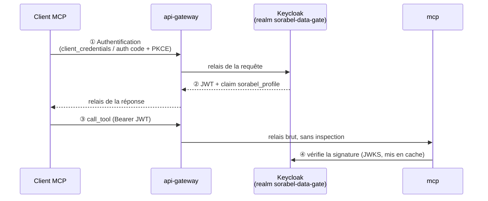

# sorabel-idp | Context v1.1 | Updated: 2026-09-06

@../CLAUDE.md

## Contexte spécifique
Service Keycloak conteneurisé (authn/JWT) — pas d'application développée en interne.
Cycle de vie piloté par `docker compose`, pas par `make build`/`make test`.
Réalise **uniquement** l'authentification et le profil grossier ; la matrice fine
(profil × tool × ressources) n'est jamais ici, elle vit dans `mcp/`.

**Analogie .NET** : équivalent d'un `IdentityServer`/Azure AD classique — consommé
en aval par `mcp/` via `AddJwtBearer()`, jamais directement par les clients.

## Configuration Keycloak retenue

| Élément | Valeur |
|---|---|
| Realm | `sorabel-data-gate` |
| Rôles de realm | `role-support`, `role-sales`, `role-dev` (un par profil) |
| Clients OAuth | `bot-slack-support`, `poste-vente`, `ide-dev` (un client Keycloak par client MCP) |
| Protocol Mapper | Injecte le claim custom `sorabel_profile` depuis le rôle attribué |
| Endpoint JWKS | `GET /realms/sorabel-data-gate/protocol/openid-connect/certs` |

## Flux d'émission du JWT

`api-gateway` est le **seul** point d'accès à Keycloak (relais pur, aucune lecture
du token). C'est `mcp/` qui valide signature, `iss`, `aud`, expiration, puis lit
`sorabel_profile` pour appliquer sa propre matrice.

## Non-négociables
- Déployé exclusivement via `docker compose up` (image Keycloak officielle, jamais de fork custom)
- Aucune règle d'architecture (hexagonale/clean archi) ni Makefile standard hérité
- Les realms/clients Keycloak sont versionnés (export JSON), jamais modifiés uniquement en base
- Le realm reste `sorabel-data-gate` — un renommage impacte `mcp/` et `api-gateway`, jamais isolé
- Un nouveau client MCP ⇒ un nouveau client OAuth Keycloak dédié (jamais de partage de client entre profils)
- La matrice fine (profil × tool × ressources) ne doit jamais être répliquée ici — elle reste dans `mcp/`

## Fallback
- Si une demande porte sur la matrice d'accès fine (tool × collection × table) → rediriger vers `mcp/`, ne pas l'implémenter ici
- Si un rôle/claim non prévu (`role-support`/`role-sales`/`role-dev`) est demandé → ne pas créer de rôle ad hoc, faire confirmer le profil métier avant modification du realm

## Règles locales
@.claude/settings.json (permissions/config docker uniquement)
