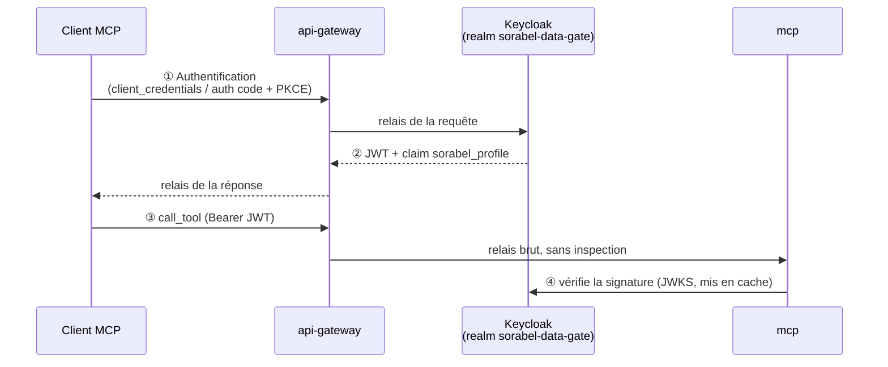

# sorabel-idp | Context v1.2 | Updated: 2026-09-09

@../CLAUDE.md

## Contexte spécifique
Service Keycloak conteneurisé (authn/JWT) — pas d'application développée en interne.
Cycle de vie piloté par `docker compose`, pas par `make build`/`make test`.
Réalise **uniquement** l'authentification et le profil grossier ; la matrice fine
(profil × tool × ressources) n'est jamais ici, elle vit dans `mcp/`.

**Analogie .NET** : équivalent d'un `IdentityServer`/Azure AD classique — consommé
en aval par `mcp/` via `AddJwtBearer()`, jamais directement par les clients.

## Configuration Keycloak retenue

| Élément | Valeur |
|---|---|
| Realm | `sorabel-data-gate` |
| Rôles de realm | `role-support`, `role-sales`, `role-dev` (un par profil) |
| Clients OAuth | `bot-slack-support`, `poste-vente`, `ide-dev` (un client Keycloak par client MCP) |
| Protocol Mapper | Injecte le claim custom `sorabel_profile` depuis le rôle attribué |
| Endpoint JWKS | `GET /realms/sorabel-data-gate/protocol/openid-connect/certs` |

## Flux d'émission du JWT

```mermaid
sequenceDiagram
    participant C as Client MCP
    participant GW as api-gateway
    participant KC as Keycloak<br/>(realm sorabel-data-gate)
    participant M as mcp

    C->>GW: ① Authentification<br/>(client_credentials / auth code + PKCE)
    GW->>KC: relais de la requête
    KC-->>GW: ② JWT + claim sorabel_profile
    GW-->>C: relais de la réponse
    C->>GW: ③ call_tool (Bearer JWT)
    GW->>M: relais brut, sans inspection
    M->>KC: ④ vérifie la signature (JWKS, mis en cache)
```

`api-gateway` est le **seul** point d'accès à Keycloak (relais pur, aucune lecture
du token). C'est `mcp/` qui valide signature, `iss`, `aud`, expiration, puis lit
`sorabel_profile` pour appliquer sa propre matrice.

## Non-négociables
- Déployé exclusivement via `docker compose up` (image Keycloak officielle, jamais de fork/build custom)
- Aucune règle d'architecture (hexagonale/clean archi) ni Makefile standard hérité — sans objet ici
- Les realms/clients/rôles/mappers Keycloak sont versionnés via export JSON
  (`realm-export/sorabel-data-gate.json`), jamais modifiés uniquement en base
- Le realm reste `sorabel-data-gate` — un renommage impacte `mcp/` et `api-gateway`, jamais isolé
- Un nouveau client MCP ⇒ un nouveau client OAuth Keycloak dédié (jamais de partage de client entre profils)
- La matrice fine (profil × tool × ressources) ne doit jamais être répliquée ici — elle reste dans `mcp/`
- Aucun accès direct client → `sorabel-idp` : seul `api-gateway` relaie les requêtes d'authentification

## Anti-patterns
- Ne jamais ajouter de logique d'autorisation fine dans un Protocol Mapper ou un rôle Keycloak — le claim `sorabel_profile` reste grossier, la granularité est décidée par `mcp/`
- Ne jamais committer d'identifiants admin Keycloak ou de secrets client OAuth en clair dans `docker-compose.yml` (cf. `scripts/bootstrap-secrets.sh`)
- Ne jamais exposer le port d'admin Keycloak publiquement sans passer par `api-gateway`

## Fallback
- Si une demande porte sur la matrice d'accès fine (tool × collection × table) → rediriger vers `mcp/`, ne pas l'implémenter ici
- Si un rôle/claim non prévu (`role-support`/`role-sales`/`role-dev`) est demandé → ne pas créer de rôle ad hoc, faire confirmer le profil métier avant modification du realm
- Si une demande implique de coder une logique métier ici (endpoint custom, service applicatif) → refuser et rediriger vers `mcp/` ou `api-gateway/` : ce projet reste de la configuration pure

## Critères de succès
- `docker compose up` démarre le realm `sorabel-data-gate` sans erreur
- L'endpoint JWKS (`/realms/sorabel-data-gate/protocol/openid-connect/certs`) répond
- L'export `realm-export/sorabel-data-gate.json` reflète l'état réel du realm (pas de dérive)

## Règles locales
`.claude/settings.json` — permissions/config docker uniquement (pas une règle : fichier de configuration, non chargé comme contexte)
