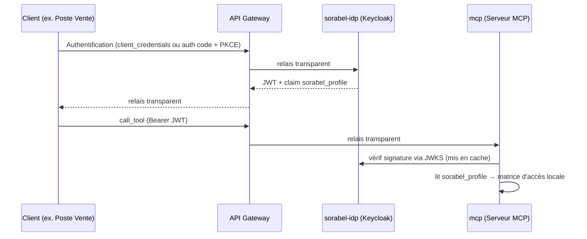

# sorabel-idp — Fournisseur d'identité (Keycloak)

> Configuration Keycloak servant l'authentification et le **profil grossier** des clients du [serveur MCP](../mcp/README.md) `mcp`. Ne porte **pas** le détail fin de la matrice d'accès (tool × collection × table) : trop coûteux à maintenir dans des attributs Keycloak — cette logique reste dans `mcp`.

## 1. Rôle

`sorabel-idp` répond à une seule question : *qui est ce client, et à quel profil métier appartient-il ?* Tout le reste (quels tools, quelles tables) est résolu ailleurs, côté `mcp`.

> Analogie .NET : équivalent d'un `IdentityServer`/Azure AD classique, consommé via `AddJwtBearer()` — le détail `[Authorize(Roles="...")]` par table SQL n'y est jamais porté.

## 2. Configuration du realm

| Élément | Valeur |
|---|---|
| Realm | `sorabel-data-gate` |
| Rôles de realm | `role-support`, `role-sales`, `role-dev` |
| Clients OAuth | `bot-slack-support`, `poste-vente`, `ide-dev` |

Un client Keycloak par client MCP, un rôle par profil.

## 3. Grant types

| Client | Grant type | Contexte |
|---|---|---|
| `bot-slack-support` | `client_credentials` | Machine-à-machine, sans utilisateur humain |
| `poste-vente` | `authorization_code` + PKCE | Utilisateur humain interactif |
| `ide-dev` | `authorization_code` + PKCE | Utilisateur humain interactif |

## 4. Claim custom `sorabel_profile`

Un **Protocol Mapper** transforme le rôle Keycloak attribué au client en claim JWT `sorabel_profile` (ex. `"sales"`), lu ensuite par `mcp` pour résoudre sa matrice d'accès locale.

## 5. Flux d'authentification

## 6. Validation du token

| Élément | Détail |
|---|---|
| Endpoint JWKS | `GET /realms/sorabel-data-gate/protocol/openid-connect/certs` |
| Vérifié par | Le **serveur MCP** (`mcp`), jamais l'API Gateway |
| Contrôles | Signature, `iss`, `aud`, expiration |
| Cache | Clés publiques mises en cache pour éviter un appel synchrone à chaque requête |

## 7. Ce que `sorabel-idp` ne fait pas

- Pas de logique d'autorisation fine (tool/table/colonne) — portée par `mcp`
- Pas de routage/proxy — porté par l'API Gateway
- Pas d'inspection des appels `call_tool` — l'API Gateway relaie sans lire le JWT

## 8. Glossaire

| Terme | Définition |
|---|---|
| Realm | Espace de configuration isolé regroupant utilisateurs, clients et rôles d'un même périmètre |
| Client OAuth | Application enregistrée dans Keycloak, un par client MCP |
| Protocol Mapper | Règle transformant un rôle/attribut en claim JWT à l'émission du token |
| JWKS | Endpoint publiant les clés publiques de vérification de signature |
| Claim | Paire clé/valeur portée par le JWT (ex. `sorabel_profile`) |

---
*Document généré à partir de la fiche de cadrage `MCP.md` (§3).*
