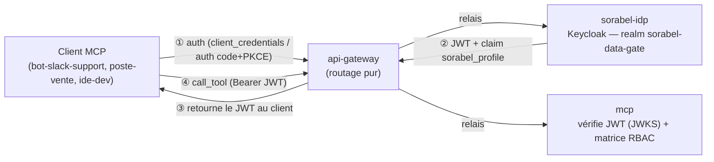

# sorabel-idp

Fournisseur d'identité (IdP) de la solution **Sorabel Data Gateway**, basé sur **Keycloak** (image officielle conteneurisée). Aucun code applicatif custom : ce projet est de la **configuration**, pas du développement.

> Analogie .NET : équivalent d'un `IdentityServer`/Azure AD pour la solution — sauf qu'ici on **configure** un produit existant au lieu d'en coder un.

---

## 1. Rôle dans la solution

`sorabel-idp` porte **uniquement** l'authentification et le profil grossier de l'appelant. Il ne connaît pas la matrice fine (profil × tool × ressource) : celle-ci vit dans `mcp/`.


```mermaid
flowchart LR
    Client["Client MCP<br/>(bot-slack-support, poste-vente, ide-dev)"]
    GW["api-gateway<br/>(routage pur)"]
    IDP["sorabel-idp<br/>Keycloak — realm sorabel-data-gate"]
    MCP["mcp<br/>vérifie JWT (JWKS) + matrice RBAC"]

    Client -->|"① auth (client_credentials / auth code+PKCE)"| GW
    GW -->|"relais"| IDP
    IDP -->|"② JWT + claim sorabel_profile"| GW
    GW -->|"③ retourne le JWT au client"| Client
    Client -->|"④ call_tool (Bearer JWT)"| GW
    GW -->|"relais"| MCP
```

**Points clés** :
- `sorabel-idp` n'est **jamais** appelé directement par un client : seul `api-gateway` y accède.
- `sorabel-idp` ne vérifie pas les autorisations fines : il émet un JWT avec un claim de profil, point final.
- La vérification de signature (JWKS) et la décision d'autorisation sont portées par `mcp/`, pas ici.

---

## 2. Configuration Keycloak retenue

| Élément | Valeur |
|---|---|
| Realm | `sorabel-data-gate` |
| Rôles de realm | `role-support`, `role-sales`, `role-dev` — **ne pilotent pas** le claim `sorabel_profile` (cf. note ci-dessous) |
| Clients OAuth | `bot-slack-support`, `poste-vente`, `ide-dev` (un client Keycloak par client MCP) |
| Protocol Mapper | Injecte le claim custom `sorabel_profile` dans le JWT (chaîne : `support`, `sales`, `dev`), à partir de **l'identité du client OAuth** appelant |
| Endpoint JWKS | `GET /realms/sorabel-data-gate/protocol/openid-connect/certs` |

> **Le profil vient du client, pas du rôle.** Un client Keycloak par client MCP
> (`bot-slack-support` → `support`, `poste-vente` → `sales`, `ide-dev` → `dev`) : la valeur
> du claim est portée par la configuration du client, via un mapper `hardcoded-claim`.
> Modifier les rôles d'un client ne change donc **pas** le claim émis. Deux raisons à ce
> choix : le mapper de rôles natif produit un tableau préfixé (`["role-sales"]`) là où `mcp`
> attend une chaîne, et `bot-slack-support` s'authentifie en `client_credentials` — sans
> utilisateur, donc sans rôle utilisateur à lire. Les rôles de realm restent définis comme
> point d'extension, mais ne sont aujourd'hui lus par personne.

> Analogie .NET : le Protocol Mapper joue le rôle d'un `ClaimsTransformation` custom exécuté côté IdP plutôt que côté API — le claim `sorabel_profile` arrive déjà prêt dans le JWT, `mcp/` n'a plus qu'à le lire.

---

## 3. Démarrage

```bash
docker compose up -d
```

Pas de `Makefile`, pas de `make build`/`make test` : le cycle de vie est intégralement piloté par `docker compose` (image officielle, pas de build custom).

Console d'admin Keycloak : `http://localhost:<port>` (cf. `docker-compose.yml` pour le port exposé et les identifiants admin, jamais commités en clair).

---

## 4. Arborescence

```
sorabel-idp/
├── README.md
├── CLAUDE.md
├── docker-compose.yml         # Image Keycloak officielle
├── realm-export/
│   └── sorabel-data-gate.json # Export versionné du realm (source de vérité)
└── .claude/
    └── settings.json          # Permissions/config docker uniquement
```

---

## 5. Règle de gouvernance

Le realm est **versionné via export JSON** (`realm-export/sorabel-data-gate.json`). Toute modification (rôle, client, mapper) doit être répercutée dans cet export — **jamais** de modification silencieuse uniquement en base, sous peine de dérive entre environnements.

---

## 6. Hors périmètre

- Pas d'architecture applicative (ni hexagonale, ni clean architecture) : ce n'est pas une app développée en interne.
- Pas de matrice RBAC fine ici (→ `mcp/`).
- Pas de logique de routage (→ `api-gateway/`).

Pour le détail du flux d'authentification et la matrice d'accès complète, voir `mcp/MCP.md` (§3).
