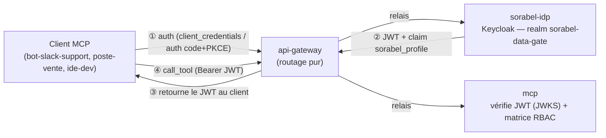

# sorabel-idp

Fournisseur d'identité (IdP) de la solution **Sorabel Data Gateway**, basé sur **Keycloak** (image officielle conteneurisée). Aucun code applicatif custom : ce projet est de la **configuration**, pas du développement.

> Analogie .NET : équivalent d'un `IdentityServer`/Azure AD pour la solution — sauf qu'ici on **configure** un produit existant au lieu d'en coder un.

---

## 1. Rôle dans la solution

`sorabel-idp` porte **uniquement** l'authentification et le profil grossier de l'appelant. Il ne connaît pas la matrice fine (profil × tool × ressource) : celle-ci vit dans `mcp/`.


```mermaid
flowchart LR
    Client["Client MCP<br/>(bot-slack-support, poste-vente, ide-dev)"]
    GW["api-gateway<br/>(routage pur)"]
    IDP["sorabel-idp<br/>Keycloak — realm sorabel-data-gate"]
    MCP["mcp<br/>vérifie JWT (JWKS) + matrice RBAC"]

    Client -->|"① auth (client_credentials / auth code+PKCE)"| GW
    GW -->|"relais"| IDP
    IDP -->|"② JWT + claim sorabel_profile"| GW
    GW -->|"③ retourne le JWT au client"| Client
    Client -->|"④ call_tool (Bearer JWT)"| GW
    GW -->|"relais"| MCP
```

**Points clés** :
- `sorabel-idp` n'est **jamais** appelé directement par un client : seul `api-gateway` y accède.
- `sorabel-idp` ne vérifie pas les autorisations fines : il émet un JWT avec un claim de profil, point final.
- La vérification de signature (JWKS) et la décision d'autorisation sont portées par `mcp/`, pas ici.

---

## 2. Configuration Keycloak retenue

| Élément | Valeur |
|---|---|
| Realm | `sorabel-data-gate` |
| Rôles de realm | `role-support`, `role-sales`, `role-dev` — **ne pilotent pas** le claim `sorabel_profile` (cf. note ci-dessous) |
| Clients OAuth | `bot-slack-support`, `poste-vente`, `ide-dev` (un client Keycloak par client MCP) |
| Protocol Mapper | Injecte le claim custom `sorabel_profile` dans le JWT (chaîne : `support`, `sales`, `dev`), à partir de **l'identité du client OAuth** appelant |
| Endpoint JWKS | `GET /realms/sorabel-data-gate/protocol/openid-connect/certs` |

> **Le profil vient du client, pas du rôle.** Un client Keycloak par client MCP
> (`bot-slack-support` → `support`, `poste-vente` → `sales`, `ide-dev` → `dev`) : la valeur
> du claim est portée par la configuration du client, via un mapper `hardcoded-claim`.
> Modifier les rôles d'un client ne change donc **pas** le claim émis. Deux raisons à ce
> choix : le mapper de rôles natif produit un tableau préfixé (`["role-sales"]`) là où `mcp`
> attend une chaîne, et `bot-slack-support` s'authentifie en `client_credentials` — sans
> utilisateur, donc sans rôle utilisateur à lire. Les rôles de realm restent définis comme
> point d'extension : ils **ne pilotent pas** le claim et ne sont lus par aucun service
> (ni `mcp`, ni `api-gateway`). `scripts/smoke.sh` vérifie leur présence dans
> `realm_access.roles` du token — pas parce qu'un service les consomme, mais comme preuve
> que le câblage du service account (§5.3 de la spec) fonctionne.

> Analogie .NET : le Protocol Mapper joue le rôle d'un `ClaimsTransformation` custom exécuté côté IdP plutôt que côté API — le claim `sorabel_profile` arrive déjà prêt dans le JWT, `mcp/` n'a plus qu'à le lire.

---

## 3. Démarrage

### Prérequis, une seule fois

Le service est attaché à un réseau Docker partagé entre les composes de la solution :

```bash
docker network create sorabel
```

### Configuration locale

```bash
cp .env.example .env
# puis renseigner KC_BOOTSTRAP_ADMIN_PASSWORD, SORABEL_IDP_BOT_CLIENT_SECRET
# et SORABEL_IDP_DEV_USER_PASSWORD
```

`.env` n'est jamais commité. Aucun secret n'a de valeur par défaut : un `.env` absent
ou incomplet fait échouer `docker compose up` avec un message explicite, plutôt que de
démarrer sur une valeur faible. Ceci vaut aussi pour les utilisateurs de dev : l'export
de realm ne leur attribue **aucun mot de passe** (voir plus bas), donc tant que
`./scripts/bootstrap-secrets.sh` n'a pas tourné, `u-sales`/`u-dev` ne peuvent tout
simplement pas s'authentifier — l'état par défaut est fermé, jamais un mot de passe
connu.

### Démarrage et vérification

```bash
docker compose up -d --wait          # attend que le healthcheck passe
./scripts/bootstrap-secrets.sh       # applique le secret client et les mots de passe de dev
./scripts/smoke.sh                   # prouve JWKS, émission du token, claim, aud et iss
```

Sur cette version de Keycloak (26.7.3), la substitution `${env.…}` de l'export de realm
ne fonctionne pas. L'export en tient compte : il ne porte **aucun emplacement de secret**
nulle part — ni `${env.…}` ni valeur en clair. Le client `bot-slack-support` n'a pas de
champ `secret` du tout (Keycloak lui en génère un aléatoire à l'import), et les
utilisateurs `u-sales`/`u-dev` n'ont pas de bloc `credentials` (donc pas de mot de passe
tant que le bootstrap n'a pas tourné, cf. §3). `./scripts/bootstrap-secrets.sh` applique
après coup, via `kcadm.sh`, le secret du client `bot-slack-support` et les mots de passe
des utilisateurs de dev `u-sales`/`u-dev` — c'est une étape **obligatoire** du démarrage,
pas un repli optionnel.

**La base étant éphémère**, Keycloak régénère un secret client aléatoire à chaque import
et n'affecte aucun mot de passe aux utilisateurs de dev : `./scripts/bootstrap-secrets.sh`
doit donc être rejoué après **chaque** `docker compose down`/`up`, pas seulement au tout
premier démarrage.

Pas de `Makefile`, pas de `make build`/`make test` : le cycle de vie est intégralement
piloté par `docker compose` (image officielle, aucun build custom).

La base est **éphémère** (`start-dev`, H2 en mémoire, aucun volume de données) : c'est
délibéré. `realm-export/sorabel-data-gate.json` est ainsi la seule source de vérité du
realm, et la dérive entre la base et l'export est structurellement impossible. En
contrepartie, **rien de ce qui est modifié dans la console d'admin ne survit à un
`docker compose down`** — tout changement doit passer par l'export.

Un changement dans l'export ne prend effet qu'au **démarrage** : `docker compose down &&
docker compose up -d --wait`, pas un simple `restart` — puis rejouer
`./scripts/bootstrap-secrets.sh`.

Console d'admin : `http://localhost:8080` (identifiants issus du `.env`). En `start-dev`,
la console partage le port applicatif : ce compose est destiné au développement local,
pas à un déploiement exposé.

---

## 4. Arborescence

```
sorabel-idp/
├── README.md
├── CLAUDE.md
├── docker-compose.yml          # Image Keycloak officielle 26.7.3, aucun build
├── .env.example                # Variables attendues (sans valeurs)
├── realm-export/
│   └── sorabel-data-gate.json  # Export versionné du realm (source de vérité)
├── scripts/
│   ├── smoke.sh                 # Vérification : JWKS, token, claim, aud, iss
│   └── bootstrap-secrets.sh     # Applique secret client + mots de passe de dev après boot
├── docs/superpowers/
│   ├── specs/                   # Design de la solution Docker
│   └── plans/                   # Plan d'implémentation
└── .claude/
    └── settings.json           # Permissions/config docker uniquement
```

Ni `Makefile`, ni `Dockerfile`, ni code applicatif : ce projet est de la configuration.

---

## 5. Règle de gouvernance

Le realm est **versionné via export JSON** (`realm-export/sorabel-data-gate.json`). Toute modification (rôle, client, mapper) doit être répercutée dans cet export — **jamais** de modification silencieuse uniquement en base, sous peine de dérive entre environnements.

Cet export est **dev-scopé** (`sslRequired: none`, redirections `http://localhost` sur
tout port/chemin, `webOrigins: ["+"]`) — c'est ce que documente le `displayName` du
realm. Un déploiement réel ne doit **jamais** l'importer tel quel : il exige a minima
`sslRequired: external`, des `redirectUris` réelles (pas de wildcard), et des
`webOrigins` restreintes aux origines effectives des clients.

---

## 6. Hors périmètre

- Pas d'architecture applicative (ni hexagonale, ni clean architecture) : ce n'est pas une app développée en interne.
- Pas de matrice RBAC fine ici (→ `mcp/`).
- Pas de logique de routage (→ `api-gateway/`).

Pour le détail du flux d'authentification et la matrice d'accès complète, voir `mcp/MCP.md` (§3).
