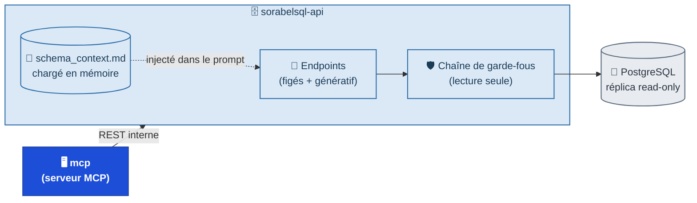
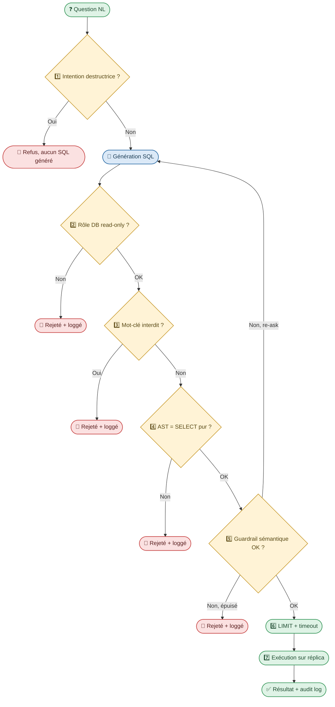

# sorabelsql-api

> Microservice API exposant un accès **gouverné et en lecture seule** à la base **PostgreSQL** Sorabel. Consommé par [`mcp`](../mcp/README.md) via REST interne — jamais appelé directement par un client final.

## 1. Rôle

`sorabelsql-api` est la seule porte d'entrée vers la base de données. Elle expose des endpoints paramétrés (requêtes pré-écrites) et un endpoint générique Text-to-SQL, tous exécutés sur un **réplica PostgreSQL en lecture seule**.

> Analogie .NET : un service applicatif qui encapsule un `DbContext` en lecture seule (`AsNoTracking`, connexion à un réplica) — jamais de `SaveChanges`, jamais d'accès direct à la base depuis l'extérieur du service.

## 2. Architecture

## 3. Endpoints exposés

| Endpoint | Type | Paramètres | Requête sous-jacente |
|---|---|---|---|
| `GET /stock/{product_ref}` | Figé | `product_ref` | `SELECT` paramétré, pré-écrit |
| `GET /orders/{order_id}` | Figé | `order_id` | `SELECT` paramétré, pré-écrit |
| `GET /customers/{customer_id}/orders` | Figé | `customer_id`, `limit` | `SELECT` paramétré, colonnes filtrées par profil |
| `GET /schema` | Introspection | `profile`, `keyword?` | Lecture du `schema_context.md`, filtré par profil |
| `GET /query-history` | Audit | `profile`, `limit` | Lecture du journal d'appels |
| `POST /query` | Génératif | `question` (NL), `profile` | Text-to-SQL → chaîne de garde-fous → exécution |

Les endpoints figés n'appellent **aucun LLM** : requête pré-écrite, paramètres injectés, exécution directe. `POST /query` est le seul chemin passant par une génération SQL, à n'utiliser que si aucun endpoint figé ne couvre le besoin.

## 4. Accès à PostgreSQL

| Élément | Configuration |
|---|---|
| Cible | Réplica PostgreSQL dédié, jamais la base de production |
| Rôle DB | `sorabel_readonly` — `GRANT SELECT` uniquement, aucun `INSERT/UPDATE/DELETE/DDL` |
| Limites par défaut | `LIMIT` injecté si absent + `statement_timeout` (`SET LOCAL`) |
| Masquage | Vue SQL filtrée par profil, ou masquage du résultat avant retour (`purchase_price`, `margin` jamais visibles hors profil `sales`) |

## 5. Chaîne de garde-fous (`POST /query` uniquement)

Aucune barrière ne suffit seule — chacune couvre l'angle mort de la précédente :

| # | Barrière | Bloque |
|---|---|---|
| 1 | Instruction système "lecture seule" | ~95 % des cas, avant génération SQL |
| 2 | Rôle DB `sorabel_readonly` | Toute écriture, indépendamment du LLM |
| 3 | Blocklist de mots-clés | `INSERT/UPDATE/DELETE/DROP...`, y compris en CTE |
| 4 | Validation AST (`sqlglot`) | Syntaxe + structure réelle de la requête |
| 5 | Guardrail sémantique (re-ask possible) | Intention destructrice déguisée, `LIMIT` absent |
| 6 | `LIMIT` + `statement_timeout` | Scan complet non borné |
| 7 | Exécution sur réplica dédié | Impact zéro sur la prod, même en cas de contournement |

## 6. Contexte de schéma injecté (`POST /query`)

Un fichier source de vérité unique, `schema_context.md`, chargé une fois au démarrage et mis en cache mémoire (pas de RAG de schéma — écarté comme trop coûteux pour ce périmètre) :

| Ingrédient | Rôle |
|---|---|
| Schéma commenté | Structure + sémantique métier de chaque table/colonne |
| Valeurs d'énum en toutes lettres | Évite l'invention de valeurs (`orders.status IN (...)`) |
| Exemples few-shot | Style de requête ancré sur des cas validés (Golden Dataset) |
| Règles métier documentées | Traduisent une notion floue (`"meilleur client"`) en logique calculable |
| Instruction `CRITICAL:` | *N'invente jamais un nom de colonne* |

Le schéma injecté est déjà filtré par profil (`{profil: [tables_autorisées]}`) — le modèle ne voit jamais une table hors périmètre.

## 7. Configuration attendue

| Variable | Rôle |
|---|---|
| `POSTGRES_REPLICA_DSN` | Chaîne de connexion au réplica read-only |
| `POSTGRES_ROLE` | Rôle DB utilisé (`sorabel_readonly`) |
| `STATEMENT_TIMEOUT_MS` | Timeout appliqué par défaut aux requêtes |
| `DEFAULT_ROW_LIMIT` | `LIMIT` injecté si absent du SQL généré |
| `SCHEMA_CONTEXT_PATH` | Chemin vers `schema_context.md` |
| `LLM_API_KEY` | Utilisée uniquement par `POST /query` |

## 8. Audit (E5)

Chaque appel (autorisé ou refusé) est journalisé : horodatage + ID de corrélation, identité appelante, endpoint + paramètres, décision, SQL exécuté (si `POST /query`), nombre de lignes retournées (jamais le contenu en clair), latence. Journal append-only, exposé via `GET /query-history`.

## 9. Golden Dataset et CI

Un jeu de référence (15–30 entrées au démarrage) rejoué automatiquement à chaque modification du prompt/schéma : question NL, contexte, requête cible, résultat attendu. Sert de test de non-régression, de banque à few-shot, et de référence pour le LLM as judge qui évalue l'alignement intention ↔ SQL avant la chaîne de garde-fous.

## 10. Glossaire

| Terme | Définition |
|---|---|
| Endpoint figé | Requête SQL pré-écrite, sans passage par un LLM |
| Schéma statique commenté | Fichier de schéma écrit une fois, injecté tel quel dans le prompt |
| AST | Représentation structurée d'une requête SQL parsée, pour validation syntaxique |
| Guardrail sémantique | Couche de validation jugeant l'intention/risque d'une requête |
| LLM as judge | Second appel LLM, séparé du générateur, jugeant l'alignement intention ↔ SQL |
| Golden Dataset | Jeu de référence rejoué comme test de non-régression |

---
*Document généré à partir de la fiche de cadrage `Text2SQL_Sorabel.md`.*
