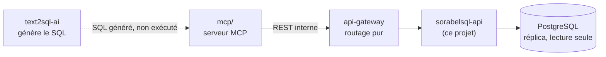
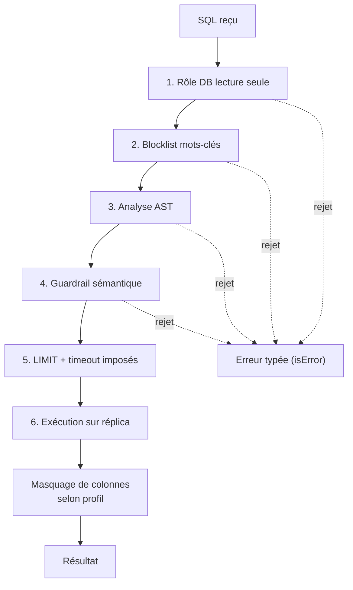

# sorabelsql-api

Service C# (Clean Architecture) d'**exécution SQL en lecture seule** sur PostgreSQL, pour la solution Sorabel Data Gateway. Porte aussi les **tools figés** (stock, commandes, historique) — requêtes paramétrées pré-écrites, sans passage par un LLM.

> Analogie .NET : voyez ce service comme une **API de données interne** exposant des endpoints REST typés (comparable à un repository pattern exposé en HTTP), jamais appelée directement par un client — toujours via l'`api-gateway`, comme un microservice derrière un reverse-proxy YARP.

---

## Rôle dans la solution



- **Ne génère jamais de SQL** — cette responsabilité appartient à `text2sql-ai/`.
- **Exécute** un SQL déjà écrit (par `text2sql-ai` ou fourni tel quel par un client `dev`), après passage systématique par la chaîne de garde-fous.
- **Aucun accès direct** : ni `mcp/` ni un client externe ne parlent à ce service sans passer par l'`api-gateway`.

---

## Tools exposés

| Tool / Endpoint | Type | Description |
|---|---|---|
| `get_stock` | figé | Stock d'une référence produit, requête paramétrée pré-écrite |
| `get_order_status` | figé | Statut d'une commande |
| `get_customer_order_history` | figé | Historique des commandes d'un client (colonnes filtrées par profil) |
| `get_schema_info` | figé | Schéma statique commenté, filtré par profil |
| `get_query_history` | figé | Historique des requêtes exécutées (audit) |
| `run_sql_query` | dynamique | Exécute un SQL déjà écrit, après validation par la chaîne de garde-fous |

**Priorité** : les tools figés sont toujours préférés à `run_sql_query` — déterministes, moins coûteux, pas de dépendance à un LLM en amont.

---

## Chaîne de garde-fous (`run_sql_query` uniquement)



Chaque étape peut rejeter la requête : la réponse est alors une erreur structurée et typée — jamais une tentative de correction automatique du SQL reçu.

---

## Stack technique

| Aspect | Choix |
|---|---|
| Langage / Framework | C# / ASP.NET Core |
| Architecture | Clean Architecture (Domain → Application → Infrastructure → API) |
| Base de données | PostgreSQL, réplica dédié en lecture seule |
| Conteneurisation | `Dockerfile` + `docker compose` (API + PostgreSQL) |
| Build/test | `Makefile` — cibles standardisées communes au monorepo |

---

## Démarrage rapide

```bash
make build          # dotnet build
make test           # dotnet test
make lint           # dotnet format --verify-no-changes
make docker-build   # docker build -t sorabelsql-api .
make docker-up      # docker compose up (API + PostgreSQL dédié)
make docker-down    # docker compose down
```

---

## Sécurité

- Rôle DB **lecture seule strict** — aucun droit `INSERT`/`UPDATE`/`DELETE`/DDL.
- Exécution exclusivement sur un **réplica**, jamais sur la base primaire.
- **Masquage de colonnes** (ex: `purchase_price`, `margin`) appliqué avant retour, selon le profil appelant.
- PostgreSQL dans un conteneur **dédié**, jamais partagé avec un autre projet, même en dev.
- Aucun secret en clair dans le code, les logs ou l'image Docker.

---

## Projets liés

- [`text2sql-ai`](../text2sql-ai) — génère le SQL en lecture seule, ne l'exécute jamais
- [`mcp`](../mcp) — serveur MCP, catalogue de tools et matrice RBAC
- [`api-gateway`](../api-gateway) — seul point d'accès à ce service (routage pur, aucune logique métier)
