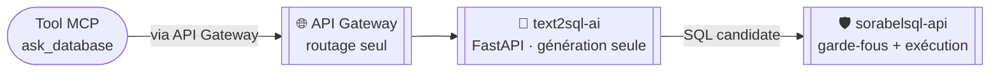

# text2sql-ai

> Agent Text-to-SQL dédié : **génération seule** d'une requête SQL en lecture seule à
> partir d'une question en langage naturel et d'un schéma statique commenté filtré par
> profil. N'exécute jamais de SQL lui-même — l'exécution est déléguée à
> [`sorabelsql-api`](../sorabelsql-api/README.md).

## 1. Rôle

`text2sql-ai` reçoit une question en langage naturel + le profil de l'appelant, génère
une requête SQL candidate, et la retourne telle quelle sans l'exécuter. Cette séparation
génération/exécution donne un point d'inspection entre l'étape probabiliste (LLM) et
l'étape gouvernée (chaîne de garde-fous de `sorabelsql-api`).

Ce rôle correspond à l'**Agent Text-to-SQL** cadré dans [`Text2SQL_Sorabel.md`](../docs/architecture/Text2SQL_Sorabel.md)
(évaluation du schéma, prompt, garde-fous, boucle d'auto-correction), et il est appelé
exclusivement par le tool MCP `ask_database`, documenté dans [`MCP.md`](../docs/architecture/MCP.md) (§2 et
§6.3 du catalogue de tools).

## 2. Ce que `text2sql-ai` ne fait pas

- Pas d'exécution SQL — jamais de connexion à PostgreSQL.
- Pas de garde-fous d'exécution (rôle DB read-only, AST, `LIMIT`, timeout) — portés par
  [`sorabelsql-api`](../sorabelsql-api/README.md), détaillés au §5 de
  [`Text2SQL_Sorabel.md`](../docs/architecture/Text2SQL_Sorabel.md).

## 3. Stack technique

- Python, architecture hexagonale (cf. `.claude/rules/python-hexagonal.md` à la racine
  de la solution)
- Exposé via une interface **FastAPI**, accessible uniquement via l'API Gateway —
  jamais appelé directement par un client MCP (cf. glossaire de
  [`MCP.md`](../docs/architecture/MCP.md), entrée « Agent Text-to-SQL »)

## 4. Exigences servies

E3 (Text-to-SQL lecture seule) — pour la partie génération uniquement ; l'exécution
gouvernée est portée par `sorabelsql-api`.

## 5. Documents liés

| Document | Contenu |
|---|---|
| [`Text2SQL_Sorabel.md`](../docs/architecture/Text2SQL_Sorabel.md) | Cadrage complet du module Text-to-SQL (E3, E5) : évaluation du schéma, prompt, garde-fous, auto-correction |
| [`MCP.md`](../docs/architecture/MCP.md) | Cadrage du serveur MCP Sorabel Data Gateway ; §2 et §6.3 documentent le tool `ask_database`, seul appelant de cet agent |
| [`sorabelsql-api`](../sorabelsql-api/README.md) | Service d'exécution SQL gouvernée, destinataire du SQL généré ici |

---
*Projet en cours de mise en place — voir `../CLAUDE.md` pour le contexte de la solution
Sorabel et la répartition des responsabilités entre projets.*
