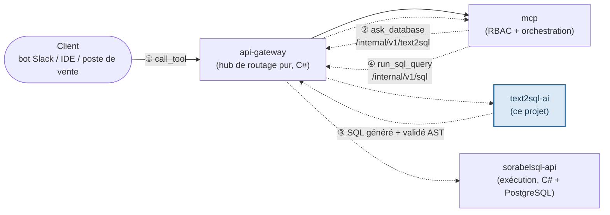
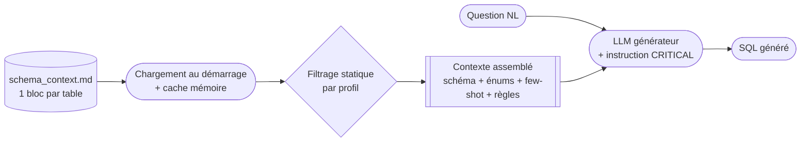

# text2sql-ai

Agent Text-to-SQL du **Sorabel Data Gateway**. Traduit une question métier en
langage naturel en une requête SQL PostgreSQL **lecture seule**. Ne l'exécute
jamais — l'exécution est la responsabilité exclusive de `sorabelsql-api`.

> Analogie C# : ce service joue le rôle d'un générateur de requêtes LINQ à
> partir d'un `DbContext` documenté — il produit la requête, il ne l'exécute
> jamais lui-même.

## Stack

| | |
|---|---|
| Langage | Python |
| Framework API | FastAPI |
| Architecture | Hexagonale (domain / ports / adapters) |
| Parsing SQL | `sqlglot` (dialect `postgres`) |
| Build/Test | `make build`, `make test`, `make lint` |
| Déploiement | Docker (`make docker-build`, `make docker-up`) |

## Rôle dans la solution


```mermaid
flowchart LR
    Client(["Client<br/>bot Slack / IDE / poste de vente"]) -->|"① call_tool"| GW
    GW["api-gateway<br/>(hub de routage pur, C#)"] --> MCP["mcp<br/>(RBAC + orchestration)"]
    MCP -.->|"② ask_database<br/>/internal/v1/text2sql"| GW
    GW -.-> T2S["text2sql-ai<br/>(ce projet)"]
    T2S -.->|"③ SQL généré + validé AST"| GW
    GW -.-> MCP
    MCP -.->|"④ run_sql_query<br/>/internal/v1/sql"| GW
    GW -.-> SQLAPI["sorabelsql-api<br/>(exécution, C# + PostgreSQL)"]

    classDef here fill:#dbe9f7,stroke:#2f6fa8,stroke-width:2px,color:#1b3c56
    class T2S here
```

`text2sql-ai` ne parle jamais directement à un client, ni à `mcp`, ni à
`sorabelsql-api`. **Tout flux, y compris interne, transite par `api-gateway`** :
il n'existe aucun lien direct `mcp` ↔ `text2sql-ai` (cf. `../CLAUDE.md`,
§ Anti-patterns). C'est `mcp` qui décide et orchestre, mais chacun de ses appels
sort par la gateway, sur la route `/internal/v1/text2sql`.

## Comment ça marche

### 1. Schéma statique commenté

Pas de RAG vectoriel (écarté : trop coûteux à monter/maintenir pour < 15
tables). Un seul fichier source de vérité, chargé une fois au démarrage et
mis en cache mémoire :


```mermaid
flowchart LR
    Src[("schema_context.md<br/>1 bloc par table")] --> Load(["Chargement au démarrage<br/>+ cache mémoire"])
    Load --> Filter{"Filtrage statique<br/>par profil"}
    Filter --> Ctx[["Contexte assemblé<br/>schéma + énums + few-shot + règles"]]
    Q(["Question NL"]) --> LLM
    Ctx --> LLM(["LLM générateur<br/>+ instruction CRITICAL"])
    LLM --> SQL(["SQL généré"])
```

Chaque bloc contient : nom de table, colonnes **commentées** (sémantique
métier, pas juste le nom), PK/FK, et les **valeurs d'énum réelles** en
toutes lettres (ex. `status IN ('pending','shipped','delivered','cancelled')`)
— l'omission des valeurs d'énum est la cause d'erreur la plus fréquente.

> Analogie C# : équivalent d'un `DbContext` documenté avec `[Comment]` sur
> chaque colonne et des `enum` explicites, chargé une fois comme un singleton.

### 2. Défense en profondeur (barrières 1 à 4, côté génération)

Ce service ne porte que les premières barrières ; l'exécution (barrières 5 à
7 : guardrail sémantique, `LIMIT`/timeout, réplica) est portée par `mcp` et
`sorabelsql-api`.

| # | Barrière | Ce qu'elle fait ici |
|---|---|---|
| 1 | Instruction système | Le prompt déclare l'agent "lecture seule" — refuse toute demande destructrice avant génération |
| 2 | Rôle DB | N/A dans ce service (pas de connexion DB — porté par `sorabelsql-api`) |
| 3 | Blocklist de mots-clés | `INSERT/UPDATE/DELETE/DROP/TRUNCATE/ALTER/CREATE/GRANT/REVOKE`, vérifiés y compris dans les CTE |
| 4 | Validation AST | `sqlglot.parse(sql, dialect="postgres")` — rejette tout ce qui n'est pas un `SELECT` pur |

Une seule barrière ne suffit jamais : chacune couvre l'angle mort de la
précédente.

### 3. Filtrage par profil (RBAC)

Le schéma injecté au modèle ne contient **que** les tables/colonnes du
profil appelant, via un dictionnaire statique `{profil: [tables_autorisées]}`
— pas de recherche vectorielle. Le modèle ne peut pas halluciner une
référence à une colonne qu'il n'a jamais vue (ex. Support ne voit jamais
`purchase_price` ni `margin`).

### 4. Golden Dataset & évaluation

15 à 30 questions de référence (question NL, contexte, SQL cible, résultat
attendu) dans `tests/eval/golden_dataset.jsonl`, rejouées à chaque changement de
prompt/schéma/modèle — équivalent d'une suite de tests d'intégration avec
données de seed connues.

Le rejeu est un **harnais manuel**, pas un niveau de la pyramide de tests : il
appelle le vrai Azure OpenAI et n'est donc pas branché sur `make test`.

```bash
python -m tests.eval.run_eval
```

## Tool MCP servi par ce projet

Ce service est le backend du tool **`ask_database`** — le tool de *génération*.
Il n'est **pas** derrière `run_sql_query`, qui est le tool d'*exécution*, servi
par `sorabelsql-api` (cf. `mcp/app/domain/catalog.py`). Confondre les deux
reviendrait à effacer la séparation génération/exécution exigée par E3.

| Tool MCP | Backend | Paramètres | Ce que fait ce projet |
|---|---|---|---|
| `ask_database` | `text2sql` (**ce projet**) | `question: str`, `profile: str` | Schéma filtré par profil → génération SQL → barrières 1‑4 → renvoi du SQL validé à `mcp` |
| `run_sql_query` | `sqlapi` | `sql: str`, `profile: str` | Rien — l'exécution appartient à `sorabelsql-api` |

## Démarrage

```bash
make build           # cd .. && pip install -e ".[dev]" (pyproject partagé à la racine)
make test            # pytest, niveaux 1 à 3, sans Docker
make test-e2e        # niveau 4 : construit l'image, démarre le conteneur, l'arrête
make lint            # ruff check .
make docker-build    # construit l'image
make docker-up       # démarre le conteneur
```

`pytest` se lance **depuis ce répertoire**, jamais depuis la racine du dépôt
(collision du paquet `app` entre projets Python — cf. `../CLAUDE.md` § Commandes).

## Ce que ce projet ne fait pas

- Il n'exécute **jamais** de SQL (→ `sorabelsql-api`)
- Il ne porte **pas** la matrice RBAC (→ `mcp`)
- Il n'expose **jamais** le schéma complet, seulement le sous-ensemble filtré par profil

## Documentation liée

- `Text2SQL_Sorabel.md` (racine solution) — pipeline complet, LLMOps, LLM as judge, glossaire
- `MCP.md` (racine solution) — architecture MCP, RBAC, séparation génération/exécution
- `CLAUDE.md` (ce dossier) — non-négociables et règles pour Claude Code
